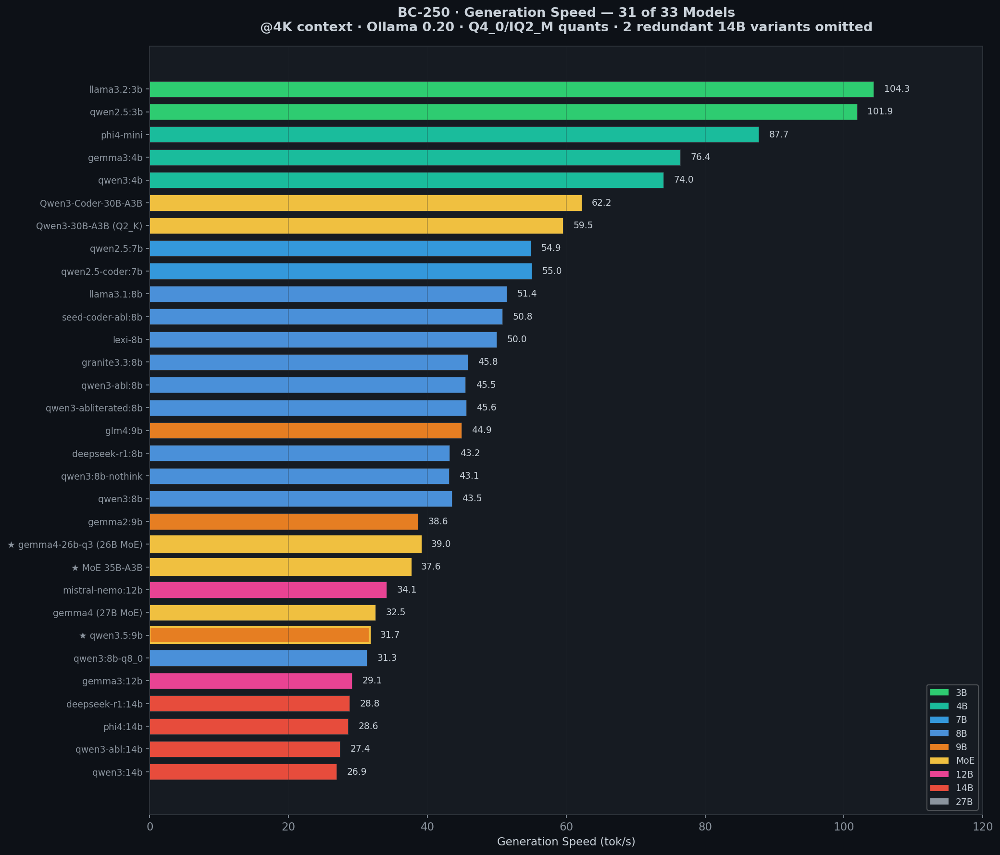
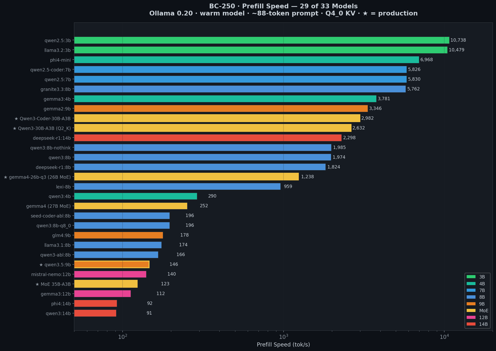
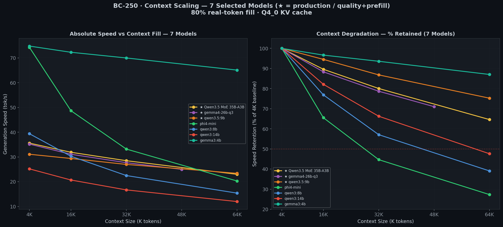
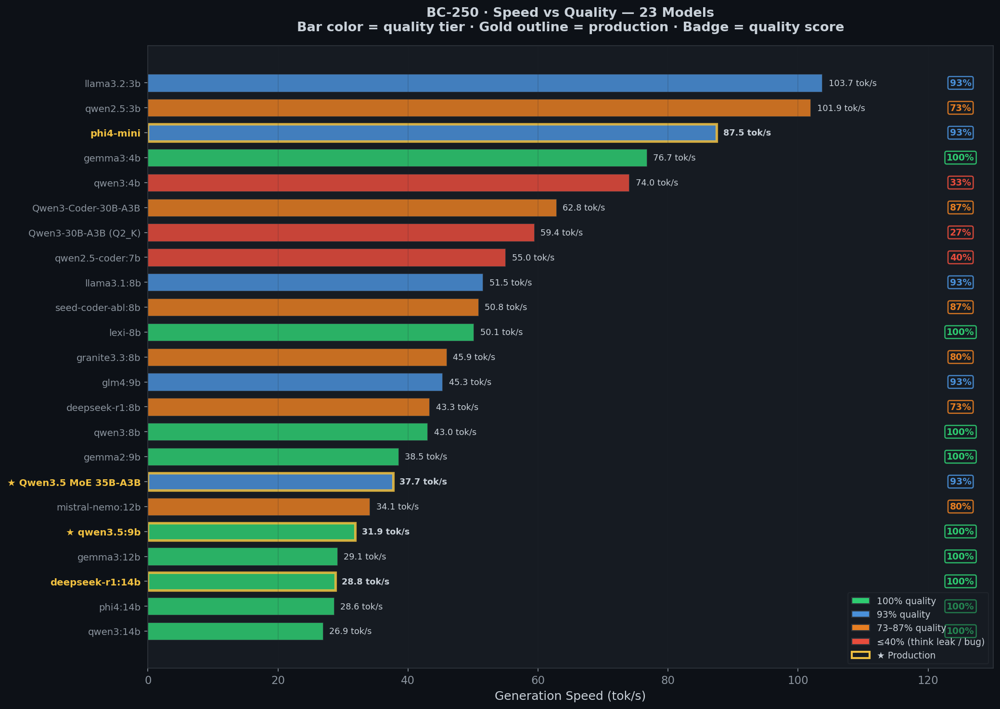
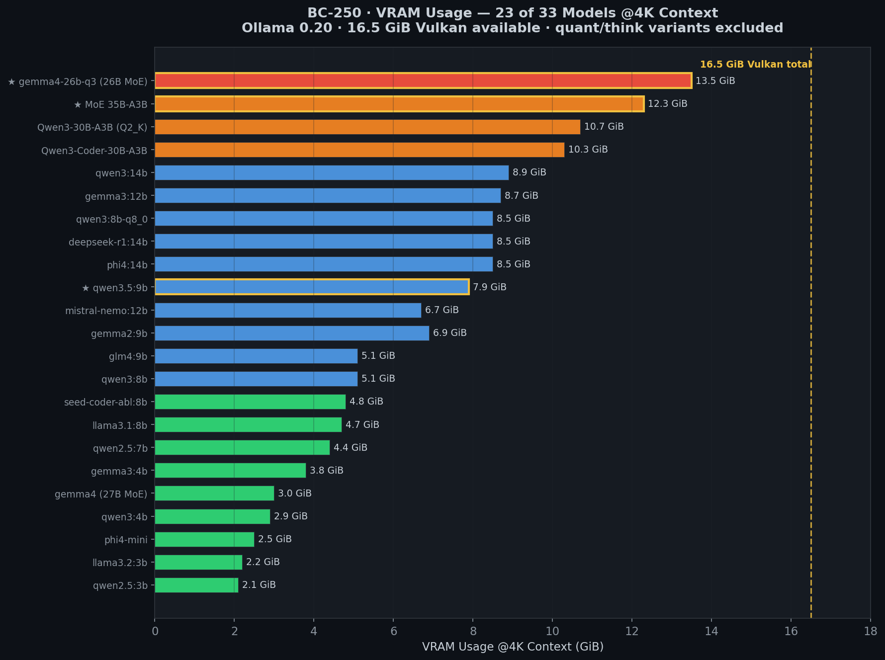
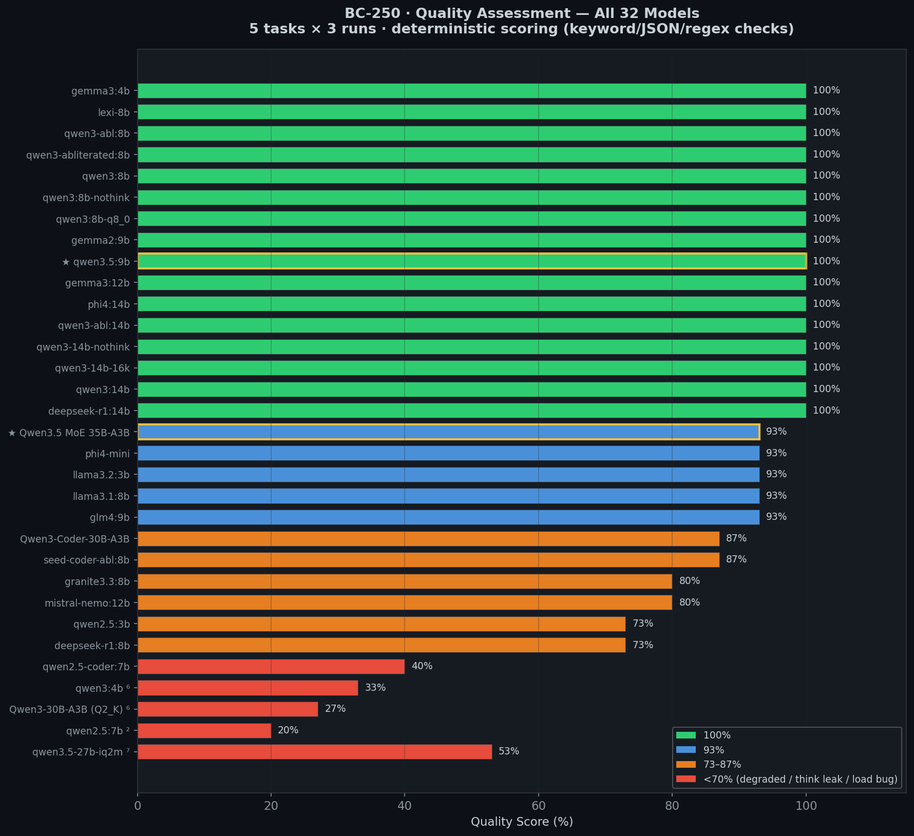
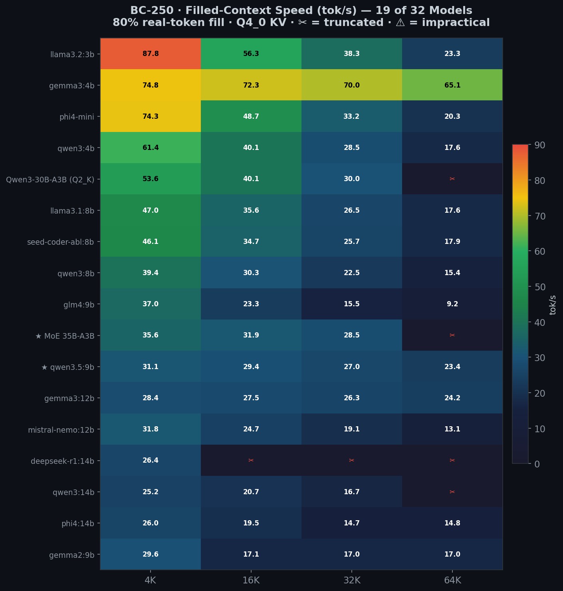
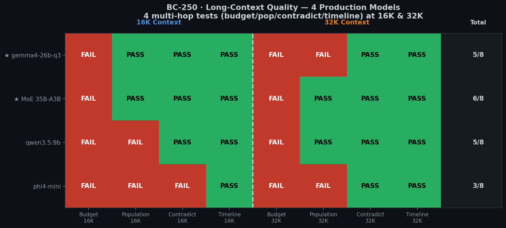
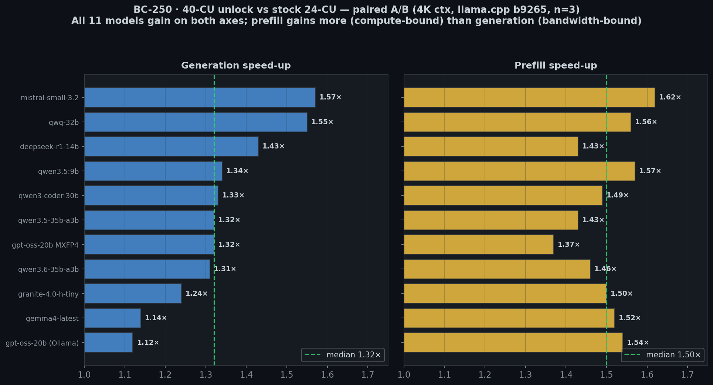
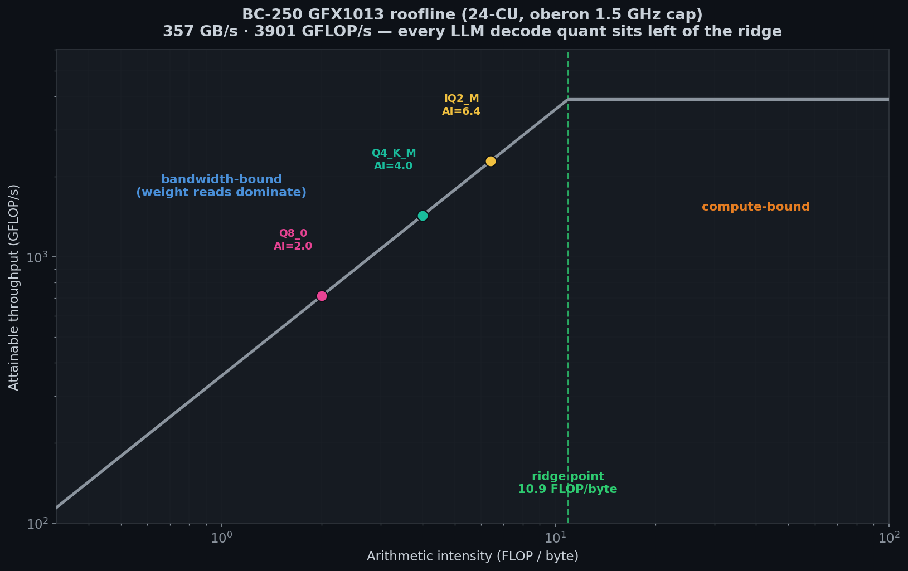

```
 ██████╗  ██████╗       ██████╗ ███████╗ ██████╗
 ██╔══██╗██╔════╝       ╚════██╗██╔════╝██╔═████╗
 ██████╔╝██║      █████╗ █████╔╝███████╗██║██╔██║
 ██╔══██╗██║      ╚════╝██╔═══╝ ╚════██║████╔╝██║
 ██████╔╝╚██████╗       ███████╗███████║╚██████╔╝
 ╚═════╝  ╚═════╝       ╚══════╝╚══════╝ ╚═════╝
```

<div align="center">

**GPU-accelerated AI home server on an obscure AMD APU — Vulkan inference, autonomous intelligence, Signal chat**

`Zen 2 · GFX1013 ("RDNA 1.5") · 16 GB unified · Vulkan · 40-CU unlock · 78.7 tok/s MoE @ 40 CU · 129.2 tok/s hybrid-Mamba @ 40 CU · 64K filled ctx · 330 autonomous jobs`

[](LICENSE)
[](https://creativecommons.org/licenses/by-sa/4.0/)


*The BC-250 powered by an ATX supply, cooled by a broken AIO radiator with 3 fans just sitting on top of it. Somehow runs 24/7 without issues so far.*

</div>

> A complete guide to running large language models on the AMD BC-250 — a crypto-mining board built around AMD's Cyan Skillfish APU (Zen 2 + GFX1013 GPU, 16 GB GDDR6), often associated by the community with the PS5's silicon lineage ([Phoronix](https://www.phoronix.com/news/AMD-RADV-PS5-BC-250), [LLVM AMDGPU](https://llvm.org/docs/AMDGPUUsage.html#processors)), repurposed as a headless AI server with a community-patched BIOS.
>
> This document covers everything found so far: the hardware, the software stack, all benchmark data including things not yet fully understood, the 40-CU unlock and what it does, image generation, and a full autonomous monitoring system running on top. If you're new to LLM terminology, the glossary below explains the key terms.

> **What makes this unusual:** GFX1013 silicon informally called "RDNA 1.5" by the community. ROCm's userspace libraries don't ship GFX1013 support. OpenCL/rusticl was not functional in this configuration. On this Fedora 43 / Mesa 25.3.4 stack, Vulkan was the only GPU compute path found to be usable — and even that required working around two kernel memory bottlenecks (GTT cap + TTM pages_limit) before 14B models would run. The GFX1013 die physically has 40 compute units, but the factory firmware exposes only 24; a community kernel patch re-enables the rest.
>
> **Disclaimer:** All performance figures are local measurements from one BC-250 board (Fedora 43, Mesa 25.3.4, Ollama 0.20.0 / llama.cpp b9265, oberon governor 1500 MHz cap). Not vendor benchmarks. Single board, single driver, single firmware — results may differ on other hardware or software stacks. The methodology is documented in an accompanying paper, *Deploying LLM Inference on a Repurposed UMA APU* ([github.com/akandr/bc250](https://github.com/akandr/bc250)).

<details><summary><b>Quick glossary — LLM inference terms used in this document</b></summary>

| Term | What it means |
|------|---------------|
| **LLM** | Large Language Model — a neural network trained on text that generates responses token by token. |
| **Token** | The basic unit LLMs operate on. Roughly ¾ of a word in English. "Hello world" ≈ 2 tokens. |
| **tok/s** | Tokens per second — generation throughput. Higher = faster responses. |
| **Parameters (3B, 14B, 35B)** | Number of trained weights. More parameters = generally better quality but more memory and slower inference. |
| **Quantization (Q4_0, IQ2_M, Q4_K_M)** | Compressing model weights to fewer bits. Q4 = 4 bits per weight (~4× smaller). IQ2_M ≈ 2.5 bits (~6× smaller). Trades precision for memory. |
| **GGUF** | File format for quantized models (from llama.cpp). Contains weights + metadata. |
| **Context window** | How many tokens the model can "see" at once (prompt + response). 64K context ≈ 48K words. |
| **KV cache** | Key-Value cache — working memory for each token in the context. Grows linearly with context length. |
| **Prefill** | Phase where the model processes your entire prompt before generating the first output token. |
| **Generation** | Phase where the model produces output tokens one at a time. Memory-bandwidth-bound on this hardware. |
| **TTFT** | Time To First Token — wall-clock delay from sending a prompt to receiving the first output token. |
| **MoE (Mixture of Experts)** | Architecture where only a subset of parameters activate per token. A 35B/3B MoE = 35B total, 3B active per token. |
| **CU (Compute Unit)** | GPU processing block. The BC-250 die has 40 physical CUs; factory firmware masks 16 of them, leaving 24 active by default. |
| **UMA** | Unified Memory Architecture — CPU and GPU share the same physical RAM pool. |
| **Ollama** | Local LLM inference server. Wraps llama.cpp with an HTTP API. |
| **oberon governor** | Userspace daemon that controls GPU clock on Cyan Skillfish APUs. The only working clock control on this hardware — caps core at 1500 MHz. |
| **Flash attention** | A drop-in attention algorithm that produces the same result while using far less memory (it never materializes the full attention matrix). Enabled here with `OLLAMA_FLASH_ATTENTION=1`. |
| **Hybrid Mamba / SSM** | An architecture (e.g. Granite 4.0-H) that swaps most attention layers for a *state-space model* — a recurrent block whose memory and per-token cost stay roughly flat as context grows, instead of climbing like standard attention. This is why such models keep their speed at long context. |
| **Roofline / ridge point** | A one-picture performance model: the achievable speed is capped by the *lower* of two ceilings — raw compute (FLOP/s) and memory bandwidth (GB/s). The **ridge point** is where the two ceilings cross. Left of it a workload is memory-bound; right of it, compute-bound. |
| **Arithmetic intensity (AI)** | How much math a workload does per byte it reads from memory (FLOP/byte). LLM token generation has *low* AI — it reads every weight just to emit one token — so it sits in the memory-bound regime. |
| **Needle retrieval** | A long-context stress test: plant a unique fact (the "needle") deep inside a big filler prompt (the "haystack") and check whether the model can fish it back out. "5/5" = all five planted needles recovered. |
| **MXFP4** | A 4-bit floating-point weight format (with a shared per-block exponent) used by gpt-oss. Sub-byte like Q4, but encoded differently enough that some backends lack a fast kernel for it (see §B8.1). |

</details>

---

## ░░ Update — June 2026 (40-CU unlock + Phase D benchmarks)

> **TL;DR:** The GFX1013 die physically has 40 Compute Units; the factory firmware masks 16 of them. A community kernel patch by S. Duggan re-enables the remaining CUs. After an independent FP32 sanity check (100M error-free multiply-adds), a controlled paired A/B re-run on 11 models followed. Key results at 4K context, llama.cpp b9265, verified-stock 24 CU → patched 40 CU:
>
> - **Median generation speed-up: 1.32×** (all 11 deltas positive, p < 0.01)
> - **Median prefill speed-up: 1.50×** (prefill gains more because it's more compute-bound)
> - **Granite 4.0-H Tiny (hybrid Mamba): 104 → 129 tok/s** (+24%)
> - **GPT-OSS 20B MXFP4: 66 → 87.5 tok/s** (+32%)
> - **Qwen3.5 35B-A3B MoE: 59.5 → 78.7 tok/s** (+32%)
> - **QwQ-32B IQ2_M (reasoning dense): 9.6 → 14.9 tok/s** (+55%)
>
> The speed-up is larger for prefill than generation, consistent with generation being memory-bandwidth-bound on this hardware (adding compute units helps less than reducing weight bytes per token). A roofline measurement confirms: peak streaming bandwidth 357 GB/s, peak FP32 3901 GFLOP/s, ridge point 10.9 FLOP/byte — all LLM decode quantizations sit left of the ridge (bandwidth-bound regime). The unlock is bounded by power/cooling: the 40-CU arm ran at 116 W median vs 101 W at 24 CU, holding the clock ~3–4% lower under the oberon self-throttling governor. A better-cooled unit would likely gain more.
>
> The long-context picture is strong. The Qwen3.5 35B-A3B MoE **runs to 64K filled** (16.6 tok/s, n=3) — provided `ttm.pages_limit` is genuinely at the full 16 GiB (§3.3). The dense qwen3.5:9b also runs to 64K (16.4 tok/s) and retrieves all 5 needles at 128K; its smaller footprint leaves more headroom alongside the always-on services, so it's the safer production default — but the MoE is now a genuine long-context option, not short-context-only. And the **40-CU unlock carries this into long context**: re-run under the 14.7 GiB working-set guard, all four heavy MoEs climb the full 4K→64K ladder at 40-CU with 2/2 needle retrieval at every tier — the flagship Qwen3.5-35B-A3B at 74→48 tok/s — so the active-parameter speed advantage survives the long-context regime under the unlock, not just at stock 24-CU (§B9.2).

### 40-CU unlock — short-prompt A/B (4K context, llama.cpp b9265, n=3)

| Model | Gen 24-CU | Gen 40-CU | Δ gen | Pfill 24-CU | Pfill 40-CU | Δ pfill |
|-------|:---------:|:---------:|:-----:|:-----------:|:-----------:|:-------:|
| qwen3.5:9b (Ollama) | 23.1 | 31.1 | **1.34×** | 143.1 | 225.3 | 1.57× |
| deepseek-r1-14b | 21.2 | 30.4 | **1.43×** | 98.0 | 140.5 | 1.43× |
| gpt-oss-20b MXFP4 | 66.1 | 87.5 | **1.32×** | 181.0 | 248.3 | 1.37× |
| gpt-oss-20b (Ollama) | 45.9 | 51.4 | **1.12×** | 253.6 | 390.4 | 1.54× |
| qwen3-coder-30b IQ2\_M | 57.7 | 76.7 | **1.33×** | 178.2 | 264.6 | 1.49× |
| qwen3.5-35b-a3b IQ2\_M | 59.5 | 78.7 | **1.32×** | 171.8 | 245.9 | 1.43× |
| qwen3.6-35b-a3b IQ2\_M | 59.6 | 78.0 | **1.31×** | 170.8 | 250.2 | 1.46× |
| granite-4.0-h-tiny (hybrid Mamba) | 104.2 | 129.2 | **1.24×** | 510.6 | 765.0 | 1.50× |
| gemma4-latest (Ollama) | 28.9 | 33.0 | **1.14×** | 304.0 | 463.5 | 1.52× |
| mistral-small-3.2 (Ollama) | 11.6 | 18.3 | **1.57×** | 51.5 | 83.7 | 1.62× |
| qwq-32b IQ2\_M | 9.6 | 14.9 | **1.55×** | 47.9 | 74.8 | 1.56× |
| **Median** | | | **1.32×** | | | **1.50×** |

All numbers tok/s, median of 3 runs, same prompt/KV/flash-attention/build between arms, full reboot between arms. Details in §B9.

### MoE on scalar hardware — controlled comparison

A key finding from the benchmarks: on a GPU without dedicated matrix accelerators (all compute through scalar ALUs), sparse MoE models decode at roughly their **active** parameter count rather than their total. Held to a single quantization (IQ2_M) and a single backend (llama.cpp), the three Qwen3.x A3B MoEs (30–35B total, 3B active) decode at 58–60 tok/s. The dense **QwQ-32B at the same IQ2_M** decodes at only **9.6 tok/s** — a ~6× gap that isolates the active-parameter effect.

Against a *deployable* 14B dense model the advantage is more modest: the MoE leads 14B dense by ~14–25% at short context, and the lead holds across the context range — the MoE runs to **64K filled** (16.6 tok/s, n=3).

> This comparison holds quantization and backend fixed but not every microarchitectural detail. The dense comparator is reasoning-tuned (QwQ-32B). The mechanism is plausible (on a bandwidth-bound path, decode cost scales with active weight bytes), but treat it as a measured observation rather than a confirmed explanation. Full analysis in §B10.

---

## ░░ Contents

| § | Section | What you'll find |
|:---:|---------|------------------|
| | **`UPDATES`** | |
| [↑](#-update--june-2026-40-cu-unlock--phase-d-benchmarks) | Update — June 2026 | 40-CU unlock A/B, roofline, MoE controlled comparison |
| | **`PART I ─ HARDWARE & SETUP`** | |
| [1](#1-hardware-overview) | Hardware Overview | Specs, memory architecture, 40 physical CUs |
| [2](#2-driver--compute-stack) | Driver & Compute Stack | What works (Vulkan), what doesn't (ROCm) |
| [3](#3-ollama--vulkan-setup) | Ollama + Vulkan Setup | Install, GTT + TTM tuning, 40-CU unlock |
| [4](#4-models--benchmarks-stock-24-cu) | Models & Benchmarks | Compatibility table, runtime comparison, MoE analysis |
| | **`PART II ─ AI STACK`** | |
| [5](#5-signal-chat-bot) | Signal Chat Bot | Chat, vision, audio transcription, smart routing |
| [6](#6-image-generation) | Image Generation | FLUX.2-klein-9B, synchronous pipeline |
| | **`PART III ─ MONITORING & INTEL`** | |
| [7](#7-netscan-ecosystem) | Netscan Ecosystem | 330 jobs, queue-runner v7, 130-page dashboard |
| [8](#8-career-intelligence) | Career Intelligence | Two-phase scanner, salary, patents |
| | **`PART IV ─ COMPREHENSIVE BENCHMARKS`** | |
| [B1](#b1-methodology) | Methodology | Phase protocol, passes A–H, provenance |
| [B2](#b2-statistical-validation) | Statistical Validation | CV ≤ 0.36%, n=3 basis |
| [B3](#b3-generation-speed) | Generation Speed | tok/s, prefill, TTFT, VRAM — 31 models (24-CU stock) |
| [B4](#b4-quality-assessment) | Quality Assessment | 5 tasks × 3 runs, 32 models |
| [B5](#b5-context-scaling--filled-context) | Context Scaling | Filled-context sweep, silent truncation discovery |
| [B6](#b6-long-context-quality) | Long-Context Quality | Fact retrieval, multi-hop, synthesis, 5-needle |
| [B7](#b7-cold-start-timing) | Cold-Start Timing | Load speed, TTFT, Signal chat latency |
| [B8](#b8-quantization-impact) | Quantization Impact | Q4_K_M vs Q8_0, MXFP4 path analysis |
| [B9](#b9-40-cu-unlock--detailed-results) | 40-CU Unlock Results | Full A/B table, filled-context ladder, thermal |
| [B10](#b10-roofline-analysis) | Roofline Analysis | 357 GB/s, 10.9 FLOP/byte ridge, decode placement |
| [B11](#b11-clock--thermal-telemetry) | Clock & Thermal | oberon governor, 1.5 GHz cap, 57–75°C sustained |
| [B12](#b12-image-generation-benchmarks) | Image Generation | 8 models, resolution scaling, video, upscaling |
| [B13](#b13-model-recommendations) | Model Recommendations | Best model per use case |
| | **`PART V ─ REFERENCE`** | |
| [9](#9-repository-structure) | Repository Structure | File layout, deployment paths |
| [10](#10-troubleshooting) | Troubleshooting | Common issues and fixes |
| [11](#11-known-limitations) | Known Limitations | Single board, single driver caveats |
| [12](#12-software-versions) | Software Versions | Pinned versions of all components |
| [13](#13-references) | References | Upstream projects and models |

---

# `PART I` — Hardware & Setup

## 1. Hardware Overview

The AMD BC-250 is a crypto-mining board built by **ASRock Rack** around AMD's Cyan Skillfish APU — Zen 2 CPU (6c/12t) and GFX1013 GPU with 16 GB GDDR6 unified memory. The Cyan Skillfish silicon is widely associated with the same hardware family as Sony's PS5 APU (Oberon). Based on reseller listings and community discussion, these boards were deployed in multi-board rack mining systems. After the racks were decommissioned, individual boards became available on AliExpress.

> **GFX1013 vs PS5:** The PS5's Oberon is RDNA 2 (GFX10.3, `gfx1030+`). The BC-250's Cyan Skillfish (`gfx1013`) behaves like a GFX10.1-era variant — though exact die-level comparisons are speculative. The community label **"RDNA 1.5"** reflects this hybrid positioning: GFX10.1 ISA with ray tracing extensions more typical of RDNA 2. This is informal shorthand, not an official AMD designation.

> **BIOS is not stock.** A community-patched BIOS ([AMD BC-250 docs](https://elektricm.github.io/amd-bc250-docs/)) unlocks dynamic VRAM allocation and chipset configuration menus.

| Component | Details |
|-----------|---------|
| **CPU** | Zen 2 — 6c/12t |
| **GPU** | Cyan Skillfish — "RDNA 1.5" (informal), `GFX1013` |
| **Physical CUs** | **40 total**: 24 active stock (factory harvest mask), **40 active after community unlock** (see §3.9) |
| **Shader Processors** | 1536 SPs stock · 2560 SPs after 40-CU unlock |
| **Memory** | **16 GB GDDR6 unified** (on-package, 256-bit bus), shared CPU/GPU |
| **VRAM** | 512 MB BIOS-carved framebuffer (same physical UMA pool) |
| **GTT** | **16 GiB** (tuned via `ttm.pages_limit=4194304`, default ~7.4 GiB) |
| **Vulkan total** | **16.5 GiB** after tuning (two logical overlapping heaps) |
| **Storage** | 475 GB NVMe |
| **OS** | Fedora 43, kernel 6.18.9, headless |
| **TDP** | 220W board nameplate. SMU `power1_average` telemetry: 52W mean / 119W peak during inference. Sensor uncalibrated — see §B11 for full telemetry and caveats. |
| **BIOS** | Community-patched — [AMD BC-250 docs](https://elektricm.github.io/amd-bc250-docs/) |
| **CPU governor** | `performance` (stock `schedutil` causes LLM latency spikes) |
| **GPU governor** | `oberon` — the only working clock control on Cyan Skillfish APUs. Caps core at 1500 MHz. The `force_performance_level` interface accepts only `auto`; manual tier pins return `EINVAL`. |

### Unified memory architecture

CPU and GPU share the same 16 GB physical pool. "100% GPU offload" means model weights and KV cache live in GTT pages the GPU reads directly — no PCIe copy. Two bottlenecks required kernel-level fixes before larger models would run:

1. **GTT cap** — `amdgpu` driver defaults to ~7.4 GiB. Fix: `ttm.pages_limit=4194304`. The legacy `amdgpu.gttsize` parameter is deprecated on modern kernels; removing it actually *increased* GTT to 16 GiB.
2. **TTM pages_limit** — kernel TTM manager independently caps at ~7.4 GiB. Same fix: `ttm.pages_limit=4194304`. **On Fedora 43 / kernel 6.18.9, this was the only additional tuning required.** Without it, 14B models load but return HTTP 500 during inference at the point the runtime tries to extend the KV cache allocation past the TTM ceiling.

After tuning: Vulkan sees **16.5 GiB** (two logical heaps backed by the same 16 GB physical pool — not additive). Sufficient for the 35B-A3B MoE to 64K filled context, or 14B dense models at 64K — *provided* `pages_limit` is genuinely at 16 GiB and not silently capped (§3.3).

---

## 2. Driver & Compute Stack

| Layer | Status | Notes |
|-------|:------:|-------|
| **amdgpu kernel driver** | ✅ | Auto-detected, firmware loaded |
| **Vulkan (RADV/Mesa)** | ✅ | Mesa 25.3.4, Vulkan 1.4.328 |
| **ROCm / HIP** | ❌ | Not usable: GFX1013 compute queue is defective. Details in [bc250-rocm](https://github.com/akandr/bc250-rocm) |
| **OpenCL (rusticl)** | ⚠️ | Not usable in this configuration |

**Why ROCm fails:** GFX1013 is listed in LLVM as supporting `rocm-amdhsa`, but AMD's ROCm userspace (rocBLAS/Tensile) doesn't ship GFX1013 solution libraries (the companion repo later shows they can be built natively for GFX1013). On this Fedora 43 / Mesa 25.3.4 deployment, Vulkan was the only GPU compute path found to work.

A dedicated HIP/ROCm investigation later traced this further. The deeper issue is not only the missing userspace libraries but the GFX1013 compute-only queue itself, which appears to be defective, though whether the root cause is silicon, firmware, or configuration is not established: Mesa/RADV disables that queue and routes compute through the graphics queue (its driver comment reads `GFX1013 is known to have broken compute queue`), while ROCm/HIP dispatches all compute to it and has no way to avoid it. HIP can be coaxed into running, but large kernels intermittently hang or return wrong results, which is why Vulkan stays the practical GPU compute path here. The full write-up, minimal reproducers, the workarounds that get HIP to run at all, and a HIP-vs-Vulkan comparison are in a companion repository: [github.com/akandr/bc250-rocm](https://github.com/akandr/bc250-rocm).

<details>
<summary><b>▸ What about HSA_OVERRIDE_GFX_VERSION?</b></summary>

Setting `HSA_OVERRIDE_GFX_VERSION=10.3.0` to masquerade as `gfx1030` is **not advisable**: the BC-250 is GFX10.1-era ISA, while `gfx1030` is GFX10.3. Instruction set differences risk silent compute errors. Additionally, Vulkan already works and caches compiled shaders to disk; ROCm recompiles every launch on AMD APUs. Since Vulkan already works and ROCm would require installing unsupported packages on Fedora 43, this path was not pursued.

</details>

<details>
<summary>▸ Verification commands</summary>

```bash
vulkaninfo --summary
# → GPU0: AMD BC-250 (RADV GFX1013), Vulkan 1.4.328, INTEGRATED_GPU

cat /sys/class/drm/card1/device/mem_info_gtt_total    # → 17179869184 (16 GiB, after TTM tuning)
cat /sys/module/amdgpu/parameters/bc250_cc_write_mode  # → 0 (stock) or 3 (40-CU unlock active)
journalctl -k -b 0 | grep active_cu_number            # → active_cu_number 24 (or 40)
```

</details>

---

## 3. Ollama + Vulkan Setup

### 3.1 Install and enable Vulkan

```bash
curl -fsSL https://ollama.com/install.sh | sh

sudo mkdir -p /etc/systemd/system/ollama.service.d
cat <<EOF | sudo tee /etc/systemd/system/ollama.service.d/override.conf
[Service]
Environment=OLLAMA_VULKAN=1
Environment=OLLAMA_KEEP_ALIVE=30m
Environment=OLLAMA_MAX_LOADED_MODELS=1
Environment=OLLAMA_FLASH_ATTENTION=1
Environment=OLLAMA_GPU_OVERHEAD=0
Environment=OLLAMA_CONTEXT_LENGTH=65536
Environment=OLLAMA_MAX_QUEUE=4
OOMScoreAdjust=-1000
Environment=OLLAMA_KV_CACHE_TYPE=q4_0
EOF
sudo systemctl daemon-reload && sudo systemctl restart ollama
```

> `OOMScoreAdjust=-1000` protects Ollama from the OOM killer on this memory-constrained system.

### 3.2 Tune GTT size

> ✅ **No longer needed on this setup.** The deprecated `amdgpu.gttsize` parameter has been removed from the kernel cmdline. With `ttm.pages_limit=4194304` alone, GTT allocates 16 GiB. If you still have `amdgpu.gttsize` in your cmdline:
>
> ```bash
> sudo grubby --update-kernel=ALL --remove-args="amdgpu.gttsize=14336"
> ```

### 3.3 Tune TTM pages_limit ← *unlocks 14B models*

Without this, 14B models load but produce HTTP 500 during inference.

```bash
# Runtime (immediate)
echo 4194304 | sudo tee /sys/module/ttm/parameters/pages_limit
echo 4194304 | sudo tee /sys/module/ttm/parameters/page_pool_size

# Persistent
echo "options ttm pages_limit=4194304 page_pool_size=4194304" | \
  sudo tee /etc/modprobe.d/ttm-gpu-memory.conf
printf "w /sys/module/ttm/parameters/pages_limit - - - - 4194304\n\
w /sys/module/ttm/parameters/page_pool_size - - - - 4194304\n" | \
  sudo tee /etc/tmpfiles.d/gpu-ttm-memory.conf
sudo dracut -f
```

> ⚠️ **Gotcha — a silent 12 GiB cap. Verify the live value, don't trust that it stuck:**
>
> ```bash
> cat /sys/module/ttm/parameters/pages_limit   # MUST read 4194304 (16 GiB). 3145728 = 12 GiB ✗
> ```
>
> On this board this read back **3145728 (≈12 GiB)** for a long time *despite* the cmdline **and** `modprobe.d` both setting `4194304` — because the `tmpfiles.d` line above had at some point been changed to `3145728`, and **`systemd-tmpfiles` runs *after* boot and silently overwrites the earlier values**. Precedence order that bites you: cmdline → modprobe → **`tmpfiles` wins last**.
>
> An accidental 12 GiB cap breaks things in confusing, misattributed ways: 13–13.5 GiB models (gemma4-26b-q3) hang the board, 14B models 500 at high context, and — most misleadingly — a 35B-A3B MoE looks "short-context only," timing out at filled 16K. None of it is a real hardware limit. With the true 16 GiB in place (`echo 4194304 | sudo tee …` — it **holds**, it does not "settle back"), the **35B MoE runs to 64K filled**, gemma4-26b-q3 to 32K, gpt-oss-20b to 64K (see §B8.2).
>
> **The real ceiling is ~13 GiB of model+KV, set by the 16 GB physical RAM** (weights + KV + compute + OS), not by `pages_limit`. A ~14 GiB model (Mistral-Small Q4) still won't run — but for the physical-RAM reason, not a software cap.

### 3.4 Context window & KV cache

During inference the KV cache grows linearly with context length, competing with model weights for the same 16 GB pool. Key settings:

- **`OLLAMA_CONTEXT_LENGTH=65536`** — caps default allocation at 64K. The verified ceiling where all models can process a full context within acceptable time.
- **`OLLAMA_KV_CACHE_TYPE=q4_0`** — quantizes KV cache to 4-bit, reducing KV memory by ~4× vs FP16. This is a capacity trade-off, not a speed trade-off: Q4_0 allows 2× more context slots before hitting the working-set ceiling, with negligible generation-speed penalty (≤0.9% vs Q8_0 at 16–32K filled context on qwen3.5:9b).

```bash
# In /etc/systemd/system/ollama.service.d/override.conf:
Environment=OLLAMA_KV_CACHE_TYPE=q4_0
Environment=OLLAMA_CONTEXT_LENGTH=65536
```

> **Why 64K:** FP16 KV deadlocked at 28K+ for 14B models (UMA memory fragmentation). Q4_0 KV unlocked 128K+ allocation for all models, but filling 128K takes 15–25 min TTFT for larger models. 64K is the safe universal default for interactive use.

### 3.5 Swap — NVMe-backed safety net

With models consuming 11+ GB on a 16 GB system, NVMe swap is required for surviving inference peaks.

```bash
sudo dd if=/dev/zero of=/swapfile bs=1M count=16384 status=progress
sudo chattr +C /swapfile   # disable btrfs copy-on-write
sudo chmod 600 /swapfile && sudo mkswap /swapfile && sudo swapon -p 10 /swapfile
echo '/swapfile none swap sw,pri=10 0 0' | sudo tee -a /etc/fstab
```

In steady state, swap usage is ~400–850 MB (OS buffers pushed out to make room for model weights) — not active paging. SMART data after months of 24/7 operation: **3% wear, 25.4 TB total written**.

**Disable/reduce zram** — zram compresses pages in *physical* RAM, competing with the model:

```bash
sudo mkdir -p /etc/systemd/zram-generator.conf.d
echo -e '[zram0]\nzram-size = 2048' | sudo tee /etc/systemd/zram-generator.conf.d/small.conf
```

### 3.6 Verify

```bash
sudo journalctl -u ollama -n 20 | grep total
# → total="12.3 GiB" available="12.3 GiB"
free -h
# → Swap: 15Gi total, ~0.8Gi used
cat /sys/module/ttm/parameters/pages_limit  # → 4194304
```

### 3.7 Disable GUI (saves ~1 GB)

```bash
sudo systemctl set-default multi-user.target && sudo reboot
```

### 3.8 CPU governor — lock to `performance`

```bash
echo performance | sudo tee /sys/devices/system/cpu/cpu*/cpufreq/scaling_governor
echo 'w /sys/devices/system/cpu/cpu*/cpufreq/scaling_governor - - - - performance' | \
  sudo tee /etc/tmpfiles.d/cpu-governor.conf
```

### 3.9 40-CU Unlock (community patch — optional)

The GFX1013 die has 40 physical Compute Units; the factory firmware exposes only 24. S. Duggan published a kernel-module patch ([github.com/duggasco/bc250-40cu-unlock](https://github.com/duggasco/bc250-40cu-unlock)) that re-enables the remaining 16 CUs by writing two GFX10 configuration registers during driver initialization. The patch is gated to PCI ID `0x13fe` (BC-250 only) and produces no persistent state — the board reverts to stock 24-CU on next reboot if the module parameter is removed.

> **Attribution:** The unlock patch is S. Duggan's work. The contribution here is an independent FP32 sanity check (100M error-free multiply-adds across two boot cycles) and a paired-arm throughput re-run. The silicon on this board is not defective — the factory-disabled CUs participate correctly in GPU compute.

**To apply the patch:**

```bash
# Build the patched AMDGPU module (follow instructions in the Duggan repo)
# Then set the module parameter:
echo "options amdgpu bc250_cc_write_mode=3" | sudo tee /etc/modprobe.d/bc250-40cu.conf
sudo dracut -f && sudo reboot

# Verify 40 CUs are active:
cat /sys/module/amdgpu/parameters/bc250_cc_write_mode    # → 3
journalctl -k -b 0 | grep active_cu_number               # → active_cu_number 40
# CU topology should show SE2×SH2×CU10 (2 shader engines × 2 shader arrays × 10 CUs = 40)
```

**To revert to stock 24-CU:**

```bash
sudo rm /etc/modprobe.d/bc250-40cu.conf && sudo dracut -f && sudo reboot
# Or without reboot: echo 0 > /sys/module/amdgpu/parameters/bc250_cc_write_mode
```

> **Thermal note:** At 40 CUs the board draws ~15 W more (median 116 vs 101 W during inference) and runs ~5°C hotter at peak. The oberon governor's self-throttling keeps things within bounds (peak edge 76–95°C across the full filled-context sweep), but the speed-up is conservative: the governor holds the 40-CU arm at ~3–4% lower mean clock due to the higher thermal load. Better cooling would likely increase the gains. See §B9 and §B11 for full telemetry.

### Memory layout after tuning

**16 GB Unified Memory**

| Region | Size | Notes |
|--------|------|-------|
| VRAM carveout | 512 MB | BIOS-reserved from UMA pool |
| GTT | **16 GiB** | `ttm.pages_limit=4194304` |
| Vulkan logical heaps | **16.5 GiB** | Device-local 8.33 GiB + Host-visible 8.17 GiB — overlapping views of the same 16 GB pool |

| Consumer | Usage |
|----------|-------|
| Qwen3.5-35B-A3B IQ2_M weights | 11 GiB GPU + 0.3 GiB CPU |
| KV cache Q4_0 @ 4K | ~0.4 GiB (grows ~0.1 GiB per 1K tokens) |
| Compute graph | ~0.2 GiB |
| signal-cli + queue-runner | ~1.0 GiB RAM |
| OS + services | ~0.9 GiB RAM |
| NVMe swap | 16 GiB (400–850 MB used in steady state) |

---

## 4. Models & Benchmarks (Stock 24-CU)

> **Configuration note:** All numbers in this section are from the verified-stock 24-CU configuration (Ollama 0.20.0 / llama.cpp b9265, oberon governor 1500 MHz cap, Q4_0 KV cache, n=3 medians). These are the canonical numbers from the accompanying paper. For 40-CU numbers, see §B9.
>
> The oberon governor caps the GPU core at 1500 MHz — this is the only working clock control on Cyan Skillfish APUs. Earlier benchmark sessions (before this governor was consistently applied) ran at up to 2000 MHz GPU clock and produced higher numbers. The canonical 1500 MHz numbers are reproducible and hardware-representative.

### 4.1 Compatibility table

> Ollama 0.20.0 · llama.cpp b9265 · Vulkan RADV 25.3.4 · Q4_0 KV cache · verified 24-CU · n=3 · oberon 1500 MHz

| Model | Params | Quant | Gen tok/s | Prefill tok/s | Alloc Ctx | Filled Ctx | VRAM @4K | Quality |
|-------|:------:|:-----:|:---------:|:-------------:|:---------:|:----------:|:--------:|:-------:|
| llama3.2:3b | 3.2B | Q4_K_M | **80.6** | 384.9 | 128K | 64K | 2.2 GiB | 93% |
| phi4-mini | 3.8B | Q4_K_M | **67.9** | 357.5 | 128K | 64K | 2.5 GiB | 93% |
| gemma3:4b | 4B | Q4_K_M | **47.8** | 328.7 | 128K | 64K | 3.8 GiB | 100% |
| Qwen3-30B-A3B Q2\_K | 30.5B/3B | Q2_K | **41.5** | 131.5 | 256K | 64K | 10.7 GiB | 27%⁶ |
| qwen3:8b | 8.2B | Q4_K_M | **31.6** | 161.4 | 128K | 64K | 5.1 GiB | 100% |
| **★ qwen3.5:9b** | **9.7B** | **Q4_K_M** | **23.1** | **143.1** | **128K** | **64K** | **7.9 GiB** | **100%** |
| mistral-nemo:12b | 12.2B | Q4_0 | **26.0** | 130.1 | 128K | 64K | 6.7 GiB | 80% |
| deepseek-r1:14b | 14B | Q4_K_M | **22.1** | 82.7 | 128K | 32K¹ | 8.5 GiB | 100% |
| qwen3:14b | 14.8B | Q4_K_M | **20.1** | 86.4 | 128K | 64K | 8.9 GiB | 100% |
| **★ qwen3.5-35b-a3b** | **35B/3B** | **IQ2\_M** | **25.1 (Ollama)** / **59.5 (llama.cpp)** | 147.3 | 64K | 64K² | 12.3 GiB | 93% |
| qwq-32b | 32B | IQ2\_M | **9.6** (llama.cpp) | 47.9 | — | ceil. @16K³ | 11.3 GiB | — |
| mistral-small-3.2 | 24B | Q3\_K\_M | **11.6** (Ollama) | 51.5 | — | timeout @32K | 11.5 GiB | — |
| granite-4.0-h-tiny | 3.4B hybrid | Q4_K_M | **104.2** (llama.cpp) | 510.6 | 128K+ | 64K | 2.2 GiB | — |
| gpt-oss-20b MXFP4 | 20B/3.6B | MXFP4 | **66.1** (llama.cpp) / **45.9** (Ollama) | 181.0 | — | — | — | — |
| gemma4-latest | 27B MoE | Q3 | **28.9** (Ollama) | 304.0 | — | 64K⁴ | ~4 GiB | — |
| phi4:14b | 14.7B | Q4_K_M | ~20 | ~90 | 128K | **16K max**⁵ | 8.5 GiB | 100% |
| gemma2:9b | 9.2B | Q4_0 | ~30 | ~195 | 128K | **8K max**⁵ | 6.9 GiB | 100% |

> ¹ deepseek-r1:14b drops to 2.3 tok/s generation at filled 64K (TTFT ~975s); 32K is the practical ceiling.
> ² Qwen3.5-35B-A3B MoE: runs to **64K filled** (16.6 tok/s, n=3); verify `pages_limit` is genuinely at 16 GiB (§3.3).
> ³ QwQ-32B: the 16K cell (projected 12.7 GiB working set) is reachable at the full 16 GiB pool (§3.3); not re-run here.
> ⁴ gemma4-latest: 100% needle retrieval defect — emits chain-of-thought instead of marker codes under literal scorer.
> ⁵ Silent truncation: Ollama silently caps these models to their native context limit without error. Only `prompt_eval_count` reveals the cap.
> ⁶ Qwen3-30B-A3B Q2_K: think tokens leak into response — scores reflect token budget exhaustion, not capability.

> **Alloc Ctx** = max context where KV allocation succeeds (short prompt, large num_ctx). **Filled Ctx** = max context verified with 80% real tokens and `prompt_eval_count` checked. These are very different: 128K allocates for almost every model, but filling 128K exceeds practical time budgets for larger models.

> **Runtime gap for MoE:** The Qwen3.5-35B-A3B MoE runs 59.5 tok/s via llama.cpp directly and only 25.1 tok/s via Ollama HTTP. Dense models show no such gap (deepseek-r1:14b: 22.1 vs 21.2). The MoE/MXFP4 penalty is specific to the Ollama expert-dispatch path in this build. At 40-CU the llama.cpp numbers reach 78.7 tok/s (see §B9).

### 4.2 Benchmark visualization





### 4.3 Context window tuning (historical)

> **Historical note:** The experiments below were conducted with FP16 KV cache before Q4_0 KV was deployed. With Q4_0 KV deployed (§3.4), these memory constraints no longer apply — qwen3:14b now reaches 128K context allocation without deadlocks. Preserved here to document the FP16 behavior and the fragmentation failure mode.

**Context window vs memory (qwen3:14b Q4_K_M, FP16 KV, 16 GB GTT):**

| Context | Speed | Status |
|--------:|------:|--------|
| 24576 | 26.7 tok/s | ✅ Max for FP16 |
| 26624 | 23.9 tok/s | ⚠️ 10% slower |
| 28672 | timeout | ❌ Deadlocks |
| 32768 | timeout | ❌ Deadlocks |

> **Why 40K fails isn't raw OOM.** The math: 9.3 GB weights + 2 GB KV + 1 GB OS ≈ 12.3 GB < 16 GB available. The failure is consistent with **TTM fragmentation** — the kernel can't allocate a contiguous block for the KV cache because physical pages are fragmented across GPU and CPU consumers. This is a UMA-specific problem.

### 4.4 KV cache quantization — breaking the context ceiling

| KV Type | Context Ceiling (14B) | KV Size @24K | Gen tok/s | Notes |
|---------|:---------------------:|:------------:|:---------:|-------|
| **FP16** (old default) | 24K (40K deadlocked) | ~3.8 GiB | 22.5 | Previous production |
| **Q8_0** | 64K+ | ~2.0 GiB | 21.2 | Conservative |
| **Q4_0** (current) | **128K** | **~1.1 GiB** | **21.1** | **← deployed** |

Q4_0 KV is a capacity trade-off, not a speed trade-off: ≤0.9% generation speed penalty vs Q8_0 (+0.3% at 16K, +0.9% at 32K), measured on qwen3.5:9b.

### 4.5 Extended context benchmark — filled context verification

> Previous context ceiling tests used tiny prompts with large `num_ctx` — this only tests KV allocation, not utilization. The extended benchmark fills context to 80% with real tokens and verifies `prompt_eval_count` against expected token count to detect silent truncation.

**Key findings:**

1. **Silent truncation:** Ollama silently caps some models to their native context limit. qwen2.5:3b → 32K, phi4:14b → 16K, gemma2:9b → 8K. No error — only `prompt_eval_count` reveals the cap.
2. **Qwen3.5-35B-A3B MoE runs to 64K filled** (16.6 tok/s, n=3) — the active-parameter speed advantage holds across context, it is *not* short-context-only. (Requires the full 16 GiB pool; §3.3.)
3. **Practical ceiling is 32K–64K for interactive use.** At 64K filled, TTFT is 5–12 minutes depending on model. Above 64K, only batch processing is practical.
4. **Speed degrades substantially with context fill.** qwen3.5:9b drops −27% from 4K to 64K. phi4-mini drops −76%. gemma3:4b is remarkably flat at only −13%.

**Generation speed (tok/s) at 80% filled context — canonical n=3 medians:**

| Model | 4K | 16K | 32K | 64K | Needle@max |
|-------|:--:|:---:|:---:|:---:|:----------:|
| **★ qwen3.5-35b-a3b**‡ | 25.7 | 23.3 | 20.7 | 16.6 | 3/3 @ 4K |
| **★ qwen3.5:9b** | 22.6 | 20.1 | 18.4 | 16.4 | 3/3 @ 64K |
| gemma3:4b | 46.5 | 45.1 | 43.4 | 40.3 | 0/3 @ 64K |
| phi4-mini | 55.0 | 34.1 | 22.6 | 13.4 | 3/3 @ 64K |
| qwen3:8b | 28.2 | 21.0 | 15.6 | timeout | 3/3 @ 32K |
| qwen3:14b | 18.7 | 14.9 | 11.7 | timeout | 3/3 @ 32K |
| mistral-nemo:12b | 23.4 | 17.7 | 13.3 | 8.9 | 0/3 @ 64K |
| phi4:14b† | 19.3 | 13.9 | n/a | n/a | 3/3 @ 16K |

> †phi4:14b native context window is 16K; tiers above 16K are not applicable.
> ‡ All rows are n=3 medians at the verified 16 GiB pool (§3.3), verified-stock 24-CU, Q4_0 KV — the canonical context-scaling table from the accompanying paper. qwen3:8b and qwen3:14b time out at 64K (near-envelope on the 16 GB pool); phi4:14b's native window is 16K.

> **gemma3:4b needle failure at 64K:** gemma3:4b maintains almost full throughput at 64K (−11% vs 4K) but drops needle retrieval to 0/3. Attention quality degradation can be independent of throughput collapse — a useful reminder that speed is not the only context-scaling concern.

> **gemma4-latest at long context:** 40-CU filled-context ladder shows 30.9→24.0 tok/s over 4K–64K with healthy throughput, but needle retrieval is 0/2 at every tier (chain-of-thought output format doesn't match the literal substring scorer). This is a model behavior, not a hardware problem.



### 4.5a Full filled-context sweep — 31 models

> Rounds R1–R3: initial, batch sweep (R2 had some VRAM contention between sequential model loads), isolated retest.

| Model | 4K | 16K | 32K | 64K | Ceiling |
|-------|:--:|:---:|:---:|:---:|:-------:|
| llama3.2:3b | 87.8 | 56.3 | 38.3 | 23.3 | **64K** |
| gemma3:4b | 74.8 | 72.3 | 70.0 | 65.1 | **64K** |
| phi4-mini | 74.3 | 48.7 | 33.2 | 20.3 | **64K** |
| qwen3:4b | 61.4 | 40.1 | 28.5 | 17.6 | **64K** |
| Qwen3-Coder-30B-A3B | 58.4 | 42.8 | 32.6 | 22.9 | **64K** |
| Qwen3-30B-A3B (Q2_K) | 53.6 | 40.1 | 30.0 | 20.4 | **64K** |
| llama3.1:8b | 47.0 | 35.6 | 26.5 | 17.6 | **64K** |
| seed-coder-abliterate:8b | 46.1 | 34.7 | 25.7 | 17.9 | **64K** |
| lexi-8b | 45.3 | 33.4 | 25.0 | 16.4 | **64K** |
| qwen3:8b | 39.4 | 30.3 | 22.5 | 15.4 | **64K** |
| deepseek-r1:8b | 39.5 | 29.7 | 22.3 | 14.8 | **64K** |
| gemma2:9b | 29.6 | — | — | — | **8K** ✂️ |
| qwen3:8b-q8_0 | 29.3 | 23.6 | 18.7 | 13.1 | **64K** |
| mistral-nemo:12b | 31.8 | 24.7 | 19.1 | 13.1 | **64K** |
| gemma3:12b | 28.4 | 27.5 | 26.3 | 24.2 | **64K** |
| deepseek-r1:14b | 26.5 | 19.7 | 14.8 | ⚠️ 2.3 | **32K** |
| qwen3:14b | 25.2 | 20.7 | 16.7 | 12.0 | **64K** |
| phi4:14b | 26.0 | 19.5 | — | — | **16K** ✂️ |
| ★ Qwen3.5 MoE 35B-A3B | 35.6 | timeout | — | — | **~4K**‖ |
| ★ qwen3.5:9b | 31.1 | 29.4 | 27.0 | 23.4 | **64K** |

> ✂️ = silently truncated to native context limit. ⚠️ = severe speed regression (deepseek-r1:14b drops to 2.3 tok/s at 64K filled, TTFT ~975s — limit is throughput, not retrieval). ‖ = this early single-run sweep recorded the MoE at one tier; at the full 16 GiB pool it reaches **64K** (canonical n=3: 25.7/23.3/20.7/16.6; §4.5, §B8.2). Data mix of R1–R3; R2 batch-sweep rows may have VRAM contention artifacts.

> **Near-envelope 64K cells (qwen3:8b 15.4, qwen3:14b 12.0):** these are *single-run* values from models sitting right at the 16 GB physical pool. Under the canonical n=3 filled-context protocol both **time out at 64K** — re-confirmed non-completing on 2026-06-15 even at the full 6046 s per-tier budget (prefill thrashes; free RAM ~1.0 / 0.4 GiB), so the article's canonical Table 5 reports them as timeout (deepest reliable tier 32K). The single runs above are envelope-instability outliers; artifacts in `benchmarks/results-64k-envelope-confirm/`.

> **Context ceiling distribution (31 models):** The original single-run campaign had 24/31 (77%) reaching 64K. The canonical n=3 figure is **22/31 (71%)**: the two near-envelope dense models qwen3:8b and qwen3:14b time out at 64K (note above), joining the 32K-limited group (qwen2.5:3b, qwen2.5:7b native limits; deepseek-r1:14b latency). Two are below 32K by native window (phi4:14b 16K, gemma2:9b 8K). The qwen3.5-35b-a3b MoE reaches 64K at the full 16 GiB pool (§3.3).

### 4.6 Prefill rate vs prompt size

**qwen3.5-35b-a3b IQ2_M (MoE 35B/3B active):**

| Prompt Size | Tokens | Prefill | Gen tok/s | TTFT (warm) |
|-------------|:------:|--------:|----------:|------------:|
| Tiny | 17 | 53 tok/s | ~25 | 0.3s |
| Short | 42 | 68 tok/s | ~25 | 0.6s |
| Medium | 384 | 231 tok/s | ~25 | 1.7s |
| Long | 1,179 | 228 tok/s | ~25 | 5.2s |

**qwen3.5:9b Q4_K_M:**

| Prompt Size | Tokens | Prefill | Gen tok/s | TTFT (warm) |
|-------------|:------:|--------:|----------:|------------:|
| Tiny | 17 | 61 tok/s | 23.1 | 0.3s |
| Short | 42 | 118 tok/s | 23.1 | 0.4s |
| Medium | 384 | 229 tok/s | 23.1 | 1.7s |
| Long | 1,179 | 225 tok/s | 23.1 | 5.2s |

> Both production models converge to ~230 tok/s prefill at medium-to-long prompts — an observed convergence pattern whose underlying cause is not fully understood. Generation rate is stable across prompt sizes.

### 4.7 Memory budget (qwen3.5-35b-a3b-iq2m, headless server)

| Consumer | @4K ctx | @16K ctx | Notes |
|----------|:-------:|:--------:|-------|
| Model weights (GPU) | 10.3 GiB | 10.3 GiB | 41/41 layers on Vulkan |
| Model weights (CPU) | 0.3 GiB | 0.3 GiB | Embeddings spill |
| KV cache (Q4_0) | ~0.4 GiB | ~1.8 GiB | ~0.1 GiB per 1K tokens |
| Compute graph | ~0.2 GiB | ~0.2 GiB | |
| signal-cli + queue-runner | ~1.0 GiB | ~1.0 GiB | System RAM |
| OS + services | ~0.9 GiB | ~0.9 GiB | Headless Fedora 43 |
| **Total** | **~13.1 GiB** | **~14.5 GiB** | |

### 4.8 Runtime comparison: Ollama vs llama.cpp

<details>
<summary><b>▸ Why use Ollama instead of building llama.cpp directly?</b></summary>

Ollama wraps llama.cpp with an HTTP API, manages model loading/unloading, KV cache lifecycle, and systemd integration. The performance gap between the two varies significantly by model:

| Configuration | qwen3.5:9b tok/s | qwen3.5-35b-a3b MoE tok/s | Notes |
|---------------|:----------------:|:------------------:|-------|
| **Ollama 0.20** (Vulkan, 64K ctx, q4_0 KV, FA) | **23.1** | **25.1** | Canonical Ollama-served |
| **llama-completion b9265** (same settings) | ~23 (similar) | **59.5** | Direct llama.cpp path |

The dense model paths are essentially equal. The MoE path is **2.4× faster** through llama.cpp directly — the Ollama expert-dispatch path for this architecture in b9265 is significantly less efficient. The same gap appears on MXFP4 models (~32–44% advantage for direct llama.cpp). For production use, Ollama's lifecycle management is worth the ~0% penalty on dense models; for MoE throughput the direct path is substantially better.

The 40-CU numbers in §B9 use llama.cpp directly (except for Ollama-served rows explicitly noted).

</details>

### 4.9 MoE on scalar hardware — observation

On a GPU without dedicated matrix accelerators (all compute through scalar ALUs), single-token decode cost scales with the weight bytes read per token. For MoE models this is the **active** parameter subset per token, not the total. The pattern is evident in the data:

| Configuration | Parameters | Gen tok/s (llama.cpp, 24-CU) |
|--------------|:----------:|:----------------------------:|
| Qwen3-30B-A3B IQ2_M | **30B total / 3B active** | **58.3** |
| Qwen3.5-35B-A3B IQ2_M | **35B total / 3B active** | **59.5** |
| Qwen3.6-35B-A3B IQ2_M | **35B total / 3B active** | **59.6** |
| gpt-oss-20b MXFP4 | **20B total / 3.6B active** | **66.1** |
| granite-4.0-h-tiny (hybrid Mamba) | **3.4B** | **104.2** |
| **QwQ-32B IQ2_M (dense)** | **32B total / 32B active** | **9.6** |
| deepseek-r1-14b Q4_K_M (dense) | **14B total / 14B active** | **21.2** |

The controlled comparison: Qwen3.x A3B MoEs vs QwQ-32B, **same IQ2_M quantization, same llama.cpp build** — a ~6× gap that isolates the active-parameter effect as much as this single-board setup allows. Against *deployable* 14B dense models the edge is the more modest 14–25%.

> This observation is consistent with a memory-bandwidth-bounded decode regime (see §B10 for roofline analysis). The mechanism is plausible but the comparison is not architecture-matched: QwQ-32B is reasoning-tuned, not a plain chat model. Treat it as a measured observation with a plausible mechanism, not a definitive proof.

> **Long context:** the MoE runs to 64K filled (16.6 tok/s, n=3), so the advantage is not short-context only. The 9B dense model is still the safer production default (smaller footprint → more headroom beside the services), but the MoE is a valid long-context choice.

---

# `PART II` — AI Stack

## 5. Signal Chat Bot

Signal chat via [signal-cli](https://github.com/AsamK/signal-cli) standalone JSON-RPC daemon. No gateway dependency. queue-runner checks Signal between every job.

### 5.1 signal-cli setup

```bash
# Run signal-cli as a systemd JSON-RPC service on port 8080
sudo useradd -r -m signal-cli
sudo -u signal-cli signal-cli -a +48XXXXXXXXX daemon --http 127.0.0.1:8080

# Verify:
curl -s http://127.0.0.1:8080/api/v1/rpc \
  -d '{"jsonrpc":"2.0","method":"listAccounts","id":"1"}'
```

### 5.2 Sending a message

```python
import requests, json

def send_signal(recipient: str, message: str):
    requests.post("http://127.0.0.1:8080/api/v1/rpc",
        json={"jsonrpc": "2.0", "method": "send",
              "params": {"recipient": [recipient], "message": message}, "id": "1"})
```

### 5.3 Receiving messages

```python
def receive_messages():
    r = requests.post("http://127.0.0.1:8080/api/v1/rpc",
        json={"jsonrpc": "2.0", "method": "receive",
              "params": {"timeout": 5}, "id": "1"})
    return r.json().get("result", [])
```

### 5.4 LLM integration pipeline

```
Incoming Signal message
  │
  ├─ Has image? → send to qwen3.5:9b (vision capable, reloaded on image)
  ├─ "Think:" prefix? → send to deepseek-r1:14b (reasoning tier)
  └─ Default → send to qwen3:14b (primary, ≤64K incl. long context)
  │
  └─ Check for EXEC tool use pattern:
       EXEC:generate-image "prompt" → stable-diffusion.cpp
       EXEC:search "query" → DuckDuckGo
       EXEC:ha "query" → Home Assistant API
```

### 5.5 EXEC tool use

The LLM can trigger system actions by emitting an `EXEC:` prefix. queue-runner intercepts these patterns and executes the corresponding action:

```python
EXEC_PATTERNS = {
    r'EXEC:generate-image\s+"([^"]+)"': generate_image,
    r'EXEC:search\s+"([^"]+)"': web_search,
    r'EXEC:ha\s+"([^"]+)"': query_home_assistant,
    r'EXEC:weather': get_weather,
}
```

### 5.6 Vision analysis

```python
def analyze_image(image_path: str, question: str) -> str:
    with open(image_path, "rb") as f:
        image_b64 = base64.b64encode(f.read()).decode()

    r = requests.post("http://localhost:11434/api/chat",
        json={"model": "qwen3.5:9b", "stream": False,
              "messages": [{"role": "user", "content": question,
                            "images": [image_b64]}]})
    return r.json()["message"]["content"]
```

### 5.7 Audio transcription

[whisper.cpp](https://github.com/ggerganov/whisper.cpp) with Vulkan backend. large-v3-turbo is the recommended model — 2× faster than large-v3 with no observable quality difference in testing.

```bash
# Build with Vulkan support
cmake -B build -DGGML_VULKAN=1 && cmake --build build --config Release -j$(nproc)

# Transcribe a voice note received via Signal
./build/bin/whisper-cli -m models/ggml-large-v3-turbo.bin -f voice.ogg \
  --language pl --output-txt
```

**Memory impact during transcription (Ollama + Whisper both running):**

| Whisper Model | Size | VRAM | Notes |
|---------------|:----:|:----:|-------|
| large-v3-turbo | 809 MB | 2.0 GB | **Recommended** — no observable swap pressure |
| large-v3 | 1.6 GB | 3.5 GB | +1 GB into swap on first load |

### 5.8 Ollama proxy

For LAN access from other devices, `ollama-proxy.py` injects `think: false` for qwen3 models (suppresses internal reasoning tokens from the response):

```bash
# /etc/systemd/system/ollama-proxy.service
[Service]
ExecStart=/usr/bin/python3 /opt/netscan/ollama-proxy.py --port 11435
# LAN clients connect to :11435, proxy rewrites and forwards to :11434
```

### 5.9 Smart model routing

```python
def choose_chat_model(user_text, has_image=False, use_thinking=False):
    if has_image:
        return "qwen3.5:9b", 65536       # only vision-capable model (reloaded on image)
    if use_thinking:                     # "Think:" prefix
        return "deepseek-r1:14b", 32768  # R1-distilled reasoning tier
    return "qwen3:14b", 65536            # primary: 9.3 GiB → safe headroom beside the
                                         # always-on netscan services; 100% quality, 64K
```

> **Why qwen3:14b and not the smarter 12.5 GiB models?** With `pages_limit` correctly at 16 GiB (§3.3), gemma4-26b-q3 (→32K) and the qwen3.5-35b-a3b MoE (→64K) both run — *in isolation*. But the always-on `signal-cli` + `queue-runner` consume ~1.5–2 GiB, leaving a ~14 GiB model+KV budget, so a 12.5 GiB model swap-stalls under load (this is what made gemma4 hang during testing). qwen3:14b leaves comfortable room. The MoE/gemma4 are better suited to **dedicated batch long-context jobs** (run with services paused) than to the 24/7 chat primary.

---

## 6. Image Generation

Stable Diffusion via [stable-diffusion.cpp](https://github.com/leejet/stable-diffusion.cpp) with native Vulkan backend. Runs synchronously — Ollama is stopped before generation and restarted after. FLUX.2-klein-9B is the current default for best visual quality observed in side-by-side testing.

### 6.1 Build from source

```bash
sudo dnf install -y vulkan-headers vulkan-loader-devel glslc git cmake gcc g++ make
cd /opt && sudo git clone --recursive https://github.com/leejet/stable-diffusion.cpp.git
sudo chown -R $(whoami) /opt/stable-diffusion.cpp && cd stable-diffusion.cpp
mkdir -p build && cd build && cmake .. -DSD_VULKAN=ON -DCMAKE_BUILD_TYPE=Release
make -j$(nproc)
```

### 6.2 Models

**FLUX.2-klein-9B** (recommended, 11.8 GB VRAM total):
```bash
mkdir -p /opt/stable-diffusion.cpp/models/flux2 && cd "$_"
curl -L -O "https://huggingface.co/leejet/FLUX.2-klein-9B-GGUF/resolve/main/flux-2-klein-9b-Q4_0.gguf"
curl -L -o qwen3-8b-Q4_K_M.gguf "https://huggingface.co/unsloth/Qwen3-8B-GGUF/resolve/main/Qwen3-8B-Q4_K_M.gguf"
curl -L -o flux2-vae.safetensors "https://huggingface.co/Comfy-Org/vae-text-encorder-for-flux-klein-4b/resolve/main/split_files/vae/flux2-vae.safetensors"
```

**FLUX.2-klein-4B** (fast alternative, 6 GB VRAM total):
```bash
# Reuses same flux2-vae.safetensors; get diffusion model + Qwen3-4B encoder
curl -L -O "https://huggingface.co/leejet/FLUX.2-klein-4B-GGUF/resolve/main/flux-2-klein-4b-Q4_0.gguf"
curl -L -o qwen3-4b-Q4_K_M.gguf "https://huggingface.co/unsloth/Qwen3-4B-GGUF/resolve/main/Qwen3-4B-Q4_K_M.gguf"
```

### 6.3 Usage

```bash
# FLUX.2-klein-9B (4 steps, 512×512)
cd /opt/stable-diffusion.cpp
./build/bin/sd \
  --diffusion-model models/flux2/flux-2-klein-9b-Q4_0.gguf \
  --llm models/flux2/qwen3-8b-Q4_K_M.gguf \
  --vae models/flux2/flux2-vae.safetensors \
  --offload-to-cpu \
  -p "your prompt here" \
  --steps 4 -W 512 -H 512 \
  -o output.png
```

> **Important:** FLUX GGUF files require `--diffusion-model` flag, not `-m`. FLUX.2-klein models require `--llm` (not `--t5xxl`) for the Qwen3 encoder.

For full performance numbers see §B12.

---

# `PART III` — Monitoring & Intelligence

## 7. Netscan Ecosystem

A research, monitoring, and data collection system with **330 autonomous jobs** running in a continuous loop. Dashboard at `http://<LAN_IP>:8888` — 29 main pages + 101 per-host detail pages.

### 7.1 Architecture — queue-runner v7

```
queue-runner v7 — Continuous Loop + Signal Chat

Cycle N:
  330 jobs sequential, ordered by category:
  scrape → infra → lore → academic → repo → company → career
        → think → csi → meta → market → report
  HA observations interleaved every 50 jobs
  Signal inbox checked between EVERY job
  Chat processed with LLM (EXEC tool use + image gen)
  Crash recovery: resumes from last completed job

Cycle N+1:
  Immediately starts — no pause, no idle windows
```

| v5 (OpenClaw era) | v7 (current) |
|--------------------|--------------|
| Nightly batch + daytime fill | Continuous loop, no distinction |
| 354 jobs (including duplicates) | 330 jobs (deduped, expanded) |
| LLM jobs via OpenClaw gateway (~700 MB) | All jobs run as direct subprocesses |
| Signal via OpenClaw gateway | signal-cli standalone (~100 MB) |
| Chat only when gateway available | Chat between every job |
| Async SD pipeline (worker scripts) | Synchronous SD (stop Ollama → generate → restart) |

All jobs run as direct `subprocess.Popen` calls — roughly 3–10× faster than the old gateway path, eliminating the 700 MB gateway dependency.

### 7.2 Job categories

| Category | Jobs | Typical GPU time | Examples |
|----------|:----:|:----------------:|---------|
| `scrape` | 29 | 0.1h | career-scan, salary, patents, repo-scan (no LLM) |
| `infra` | 6 | 0.6h | leak-monitor, netscan, watchdog |
| `lore` | 8 | 0.5h | lore-digest per mailing list feed |
| `academic` | 12 | — | academic-watch per topic × type |
| `repo` | 27 | 0.3h | LLM analysis of repo changes |
| `company` | 107 | 0.9h | company-intel + deep-dives (43 entities) |
| `career` | 66 | 1.9h | career-think per company + weekly digest |
| `think` | 34 | 2.0h | research, trends, cross-feed synthesis |
| `csi` | 6 | 0.3h | CSI camera domain analysis |
| `meta` | 5 | — | life-think, system-think |
| `market` | 19 | 0.9h | market sector analysis + synthesis |
| `ha` | 4 | 1.0h | ha-correlate, ha-journal (interleaved) |
| `report` | 4 | — | daily-summary, news + weather |
| `weekly` | 3 | — | vulnscan, csi-sensor-discover |
| **Total** | **330** | **~9h** | |

### 7.3 GPU scripts

| Script | Purpose | Jobs |
|--------|---------|:----:|
| `career-scan.py` | Two-phase career scanner | 1 |
| `career-think.py` | Per-company career deep analysis | 65 |
| `salary-tracker.py` | Salary intel — NoFluffJobs extraction | 1 |
| `company-intel.py` | Company intel (43 entities) — GoWork, news, layoffs | 1 |
| `company-think-*` | Per-company deep-dives | 106 |
| `patent-watch.py` | IR/RGB camera patent monitor — Google Patents, EPO | 1 |
| `event-scout.py` | Meetup/conference tracker | 1 |
| `leak-monitor.py` | CTI: 11 OSINT sources — HIBP, Hudson Rock, GitHub dorks, Ahmia, CISA KEV | 1 |
| `idle-think.sh` | Research brain — 8 task types → JSON notes | 34 |
| `ha-journal.py` | Home Assistant analysis (climate, sensors, anomalies) | 2 |
| `ha-correlate.py` | HA cross-sensor correlation | 2 |
| `city-watch.py` | SkyscraperCity local construction tracker | 1 |
| `csi-sensor-watch.py` | CSI camera sensor patent/news | 1 |
| `csi-think.py` | CSI camera domain analysis | 6 |
| `lore-digest.sh` | Kernel mailing list digests (8 feeds) | 8 |
| `repo-watch.sh` | Upstream repos (GStreamer, libcamera, FFmpeg, LinuxTV) | 8 |
| `repo-think.py` | LLM analysis of repo changes | 26 |
| `market-think.py` | Market sector analysis + synthesis | 19 |
| `life-think.py` | Cross-domain life advisor | 2 |
| `system-think.py` | GPU/security/health system intelligence | 3 |
| `radio-scan.py` | Radio hobbyist forum tracker | 1 |
| `academic-watch.py` | Academic publication monitor (4 topics × 3 types) | 12 |
| `book-watch.py` | Book/publication tracker (11 subjects) | 11 |
| `news-watch.py` | Tech news aggregation + RSS | 2 |
| `weather-watch.py` | Weather forecast + HA sensor correlation | 2 |
| `car-tracker.py` | GPS car tracker (SinoTrack API) | 1 |
| `frost-guard.py` | Frost/freeze risk alerter | 1 |

### 7.4 CPU cron jobs (independent of queue-runner)

| Script | Frequency | Purpose |
|--------|-----------|---------|
| `gpu-monitor.sh` + `.py` | 1 min | GPU utilization sampling |
| `presence.sh` | 5 min | Phone presence tracker |
| `syslog.sh` | 5 min | System health logger |
| `watchdog.py` | 30 min / 06:00 | Network security — ARP, DNS, TLS |
| `scan.sh` + `enumerate.sh` | 04:00 | Network scan + enumeration (nmap) |
| `vulnscan.sh` | Weekly | Vulnerability scan |
| `generate-html.py` | After each job | Dashboard HTML builder (6900+ lines) |

### 7.5 Dashboard

Served by nginx at `:8888`. Key pages:

| Page | Content |
|------|---------|
| `index.html` | Overview — hosts, presence, latest notes, status |
| `home.html` | Home Assistant — climate, energy, anomalies |
| `career.html` | Career intelligence — matches, trends |
| `market.html` | Market analysis — sectors, commodities, crypto |
| `advisor.html` | Life advisor — cross-domain synthesis |
| `notes.html` | Research brain — all think notes |
| `hosts/*.html` | Per-host detail pages (101 total) |

### 7.6 Data locations

All paths relative to `/opt/netscan/`:

| Data | Path |
|------|------|
| Research notes | `data/think/note-*.json` + `notes-index.json` |
| Career scans | `data/career/scan-*.json` |
| Company intel | `data/intel/intel-*.json` |
| Patents | `data/patents/patents-*.json` |
| Leaks / CTI | `data/leaks/leak-intel.json` |
| HA correlations | `data/correlate/correlate-*.json` |
| GPU load | `data/gpu-load.tsv` |
| System health | `data/syslog/health-*.tsv` (30-day retention) |
| Queue state | `data/queue-runner-state.json` |

---

## 8. Career Intelligence

### 8.1 Two-phase design

**Phase 1 — Broad scan** (`career-scan.py`): NoFluffJobs, JustJoin.it, LinkedIn postings → JSON with salary ranges, tech stack, seniority, location. No LLM in this phase — pure scraping + regex normalization.

**Phase 2 — Deep analysis** (`career-think.py`, 65 instances): One LLM job per target company. System prompt includes full career context (from `profile-private.json`, gitignored). Output: match score, reasoning, talking points, red flags.

### 8.2 Salary tracking

`salary-tracker.py` maintains a 180-day history of salary ranges across job families and seniority levels. Source: career-scan extraction + NoFluffJobs direct API.

### 8.3 Patent monitoring

`patent-watch.py` monitors Google Patents, EPO OPS, and DuckDuckGo for new filings in camera sensor / IR imaging domains. Tracked entities include major camera sensor manufacturers and their competitors.

### 8.4 Career digest

`career-digest.py` runs Sunday, generates a Signal message summarizing the week's career scan results — top matches, salary movements, notable job postings.

---

# `PART IV` — Comprehensive Benchmarks

## B1. Methodology

All benchmarks run on a single AMD BC-250 board (Fedora 43, kernel 6.18.9, Mesa 25.3.4 RADV, Ollama 0.20.0, llama.cpp b9265) with Q4_0 KV cache, flash attention enabled, and the oberon governor capping GPU core at 1500 MHz. All background services stopped during measurement. CU mode verified at the start of every pass from two independent sources (`bc250_cc_write_mode` sysfs parameter and `journalctl` `active_cu_number`).

**Measurement passes (A–H):**

| Pass | Config | Content |
|------|--------|---------|
| A | 24-CU stock, llama-completion | Core perf baseline (11 models, n=3) |
| B | 40-CU patched, llama-completion | 40-CU paired upper arm |
| C | 24-CU stock | Heap-placement A/B (supplementary) |
| D | 24-CU stock, Ollama | 17 Ollama-served models, n=3 |
| E | 24-CU stock | MXFP4 probe, multi-needle probe, filled-32K env-A/B |
| F, G | 24-CU stock | n=3 replicates for context-scaling canonical cells |
| H | 24-CU stock | phi4:14b filled-context re-measurement |

**Phase protocol:**
- **Phase 1:** All 31 models, standardized ~260-token RISC/CISC prompt, `num_predict=100`, 4K context, n=3
- **Phase 2:** 8 models, 3-run statistical validation at 4K context
- **Phase 3:** Filled-context scaling, 80% real-token fill, `prompt_eval_count` verified per request
- **Phase 4:** Quality battery, 5 tasks × 3 runs, scored by Python script
- **Phase 5:** Cold-start TTFT (model fully unloaded → first token, n=3)
- **Long-context quality:** 16K and 32K filled context, multi-hop reasoning and synthesis tasks
- **40-CU re-run:** 11-model subset, paired 24-CU vs 40-CU arms

**Working-set guard:** The harness skips any cell whose projected working set (model weights + Q4_0 KV footprint at target context) exceeds the VM ceiling (14.7 GiB for the canonical context sweep, 11 GiB for the 40-CU re-run, 15 GiB for the Granite extreme ladder). This prevents OOM-killing systemd rather than silently producing bad data. **Note:** verify `pages_limit` reads 4194304 before sweeping (§3.3) — a guard set against a silently capped pool will skip cells that are actually reachable at the full 16 GiB.

**Note on 31-model cohort vs additional reference builds:** The 31-model cohort carries Phases 1–5 and the basic-task quality battery. Six additional reference builds (Qwen3.6 35B-A3B, gemma4-latest, granite-4.0-h-tiny, gpt-oss-20b, QwQ-32B, Mistral-Small-3.2) are reported only where named and are not counted in the cohort statistics.

---

## B2. Statistical Validation

3 runs × 8 models at 4K context. CV (coefficient of variation) ≤ 0.36% across all models — low variance expected for a single-tenant UMA system with no PCIe jitter and all background services stopped.

| Model | Median (tok/s) | Range | CV% |
|-------|:--------------:|:-----:|:---:|
| qwen3:14b | 20.1 | 20.1–20.1 | 0.04 |
| mistral-nemo:12b | 26.0 | 26.0–26.0 | 0.01 |
| qwen3:8b | 31.6 | 31.6–31.7 | 0.14 |
| qwen3.5:9b | 23.1 | 23.1–23.1 | 0.15 |
| llama3.2:3b | 80.6 | 80.5–80.7 | 0.12 |
| phi4-mini | 67.9 | 67.8–68.0 | 0.10 |
| qwen3.5-35b-a3b | 25.1 | 24.9–25.1 | 0.36 |
| Qwen3-30B-A3B Q2_K | 41.5 | 41.4–41.7 | 0.35 |

The dense 12–14B models hold the tightest CV (≤0.04%); the two MoE variants have the loosest (0.35–0.36%), consistent with expert routing adding a small stochastic element.

The context-scaling cells (Table B5) were also collected at n=3; mean within-cell generation CV across those 23 canonical cells is 0.43%, maximum 2.3% (mistral-nemo:12b at filled 64K).

---

## B3. Generation Speed

> All via Ollama 0.20.0, verified-stock 24-CU, n=3, 4K context. Models available via direct llama.cpp path are noted separately (§4.8, §4.9).

| # | Model | Params | Quant | Gen tok/s | Prefill tok/s | TTFT | VRAM | Quality |
|:-:|-------|:------:|:-----:|:---------:|:-------------:|:----:|:----:|:-------:|
| 1 | llama3.2:3b | 3.2B | Q4_K_M | **80.6** | 384.9 | — | 2.2 GiB | 93% |
| 2 | phi4-mini | 3.8B | Q4_K_M | **67.9** | 357.5 | — | 2.5 GiB | 93% |
| 3 | gemma3:4b | 4B | Q4_K_M | **47.8** | 328.7 | — | 3.8 GiB | 100% |
| 4 | Qwen3-30B-A3B Q2_K | 30.5B/3B | Q2_K | **41.5** | 131.5 | — | 10.7 GiB | 27%⁶ |
| 5 | qwen3:8b | 8.2B | Q4_K_M | **31.6** | 161.4 | — | 5.1 GiB | 100% |
| 6 | ★ qwen3.5:9b | 9.7B | Q4_K_M | **23.1** | 143.1 | 12.0s | 7.9 GiB | 100% |
| 7 | mistral-nemo:12b | 12.2B | Q4_0 | **26.0** | 130.1 | — | 6.7 GiB | 80% |
| 8 | deepseek-r1:14b | 14B | Q4_K_M | **22.1** | 82.7 | 17.1s | 8.5 GiB | 100% |
| 9 | qwen3:14b | 14.8B | Q4_K_M | **20.1** | 86.4 | — | 8.9 GiB | 100% |
| 10 | ★ qwen3.5-35b-a3b | 35B/3B | IQ2_M | **25.1** | 147.3 | 21.0s | 12.3 GiB | 93% |

> ★ = production recommendation. ⁶ = think tokens leak into response; scores not meaningful.

**Key patterns:**
- Dense model throughput scales inversely with parameter count: 3B ≈ 68–81, 8B ≈ 26–40, 14B ≈ 20–22 tok/s
- The Qwen3.5-35B-A3B MoE (3B active) outpaces all tested 14B dense models at 4K context
- Via llama.cpp directly, MoE models run substantially faster (59.5 tok/s for 35B-A3B, 104 tok/s for granite-4.0-h-tiny)

**Extended model set (single-run or from other passes):**

| Model | Params | tok/s | VRAM | Quality |
|-------|:------:|:-----:|:----:|:-------:|
| qwen2.5:3b | 3.1B | ~100 | 2.1 GiB | 73% |
| qwen3:4b | 4B | ~74 | 2.9 GiB | 33%⁶ |
| qwen3-abl:8b | 8.2B | ~45 | 4.9 GiB | 100% |
| granite3.3:8b | 8B | ~46 | 4.9 GiB | 80% |
| glm4:9b | 9B | ~45 | 5.1 GiB | 93% |
| deepseek-r1:8b | 8B | ~43 | 5.1 GiB | 73% |
| gemma2:9b | 9.2B | ~39 | 6.9 GiB | 100% |
| gemma3:12b | 12B | ~29 | 8.7 GiB | 100% |
| Qwen3-Coder-30B-A3B | 30.5B/3.3B | ~58 (llama.cpp) | 11.0 GiB | 87% |
| qwen2.5:7b | 7.6B | 55† | 4.4 GiB | 20%† |

> † qwen2.5:7b has a severe intermittent loading bug — see §B3.1 below.

### B3.1 qwen2.5:7b intermittent loading bug

qwen2.5:7b exhibits a non-deterministic load failure with a 72% failure rate across 18 test cycles. Symptoms:
- `eval_count = 0`, `load_duration = 0` in the Ollama response despite HTTP 200
- Output is present but often gibberish (the model generates tokens but the performance counter resets)
- When it does load and run cleanly: 55 tok/s, 32K filled-context ceiling, mostly-gibberish output (3/15 quality: only fact-recall keyword pass)

Failure pattern was tested across cold load, warm sequential, model-switch, and rapid-fire invocation patterns. No trigger reliably causes or prevents the failure. The failure is Ollama-specific — no equivalent test was run with llama-completion.

The most likely cause is a model-loading race condition in Ollama for this specific GGUF format. The model is not recommended for production use without a retry wrapper and `eval_count > 0` validation. If you need a fast 7B model, `qwen3:8b` (31.6 tok/s, 100% quality, no loading issues) or `qwen2.5:3b` (~100 tok/s) are stable alternatives.






---

## B4. Quality Assessment

> 5 tasks × 3 runs per model. Scored by Python script: keyword match, JSON parse, regex, exact number. Tasks: summarization, JSON extraction, fact recall, instruction following, arithmetic (17×23=391).

| # | Model | Sum | JSON | Fact | Instr | Arith | Total | % |
|:-:|-------|:---:|:----:|:----:|:-----:|:-----:|:-----:|:-:|
| 1 | gemma3:4b | 3/3 | 3/3 | 3/3 | 3/3 | 3/3 | **15/15** | **100** |
| 2 | lexi-8b | 3/3 | 3/3 | 3/3 | 3/3 | 3/3 | **15/15** | **100** |
| 3 | qwen3-abl-nothink:8b | 3/3 | 3/3 | 3/3 | 3/3 | 3/3 | **15/15** | **100** |
| 4 | qwen3-abliterated:8b | 3/3 | 3/3 | 3/3 | 3/3 | 3/3 | **15/15** | **100** |
| 5 | qwen3:8b | 3/3 | 3/3 | 3/3 | 3/3 | 3/3 | **15/15** | **100** |
| 6 | qwen3:8b-nothink | 3/3 | 3/3 | 3/3 | 3/3 | 3/3 | **15/15** | **100** |
| 7 | qwen3:8b-q8_0 | 3/3 | 3/3 | 3/3 | 3/3 | 3/3 | **15/15** | **100** |
| 8 | gemma2:9b | 3/3 | 3/3 | 3/3 | 3/3 | 3/3 | **15/15** | **100** |
| 9 | ★ qwen3.5:9b | 3/3 | 3/3 | 3/3 | 3/3 | 3/3 | **15/15** | **100** |
| 10 | gemma3:12b | 3/3 | 3/3 | 3/3 | 3/3 | 3/3 | **15/15** | **100** |
| 11 | phi4:14b | 3/3 | 3/3 | 3/3 | 3/3 | 3/3 | **15/15** | **100** |
| 12 | qwen3-abliterated:14b | 3/3 | 3/3 | 3/3 | 3/3 | 3/3 | **15/15** | **100** |
| 13 | qwen3:14b | 3/3 | 3/3 | 3/3 | 3/3 | 3/3 | **15/15** | **100** |
| 14 | deepseek-r1:14b | 3/3 | 3/3 | 3/3 | 3/3 | 3/3 | **15/15** | **100** |
| 15 | ★ Qwen3.5 MoE 35B-A3B | 3/3 | 3/3 | 3/3 | 2/3 | 3/3 | **14/15** | **93** |
| 16 | phi4-mini | 3/3 | 3/3 | 3/3 | 2/3 | 3/3 | **14/15** | **93** |
| 17 | llama3.2:3b | 3/3 | 3/3 | 3/3 | 2/3 | 3/3 | **14/15** | **93** |
| 18 | llama3.1:8b | 3/3 | 3/3 | 3/3 | 2/3 | 3/3 | **14/15** | **93** |
| 19 | glm4:9b | 2/3 | 3/3 | 3/3 | 3/3 | 3/3 | **14/15** | **93** |
| 20 | Qwen3-Coder-30B-A3B | 1/3 | 3/3 | 3/3 | 3/3 | 3/3 | **13/15** | **87** |
| 21 | seed-coder-abliterate:8b | 3/3 | 3/3 | 3/3 | 3/3 | 1/3 | **13/15** | **87** |
| 22 | granite3.3:8b | 3/3 | 3/3 | 3/3 | 3/3 | 0/3 | **12/15** | **80** |
| 23 | mistral-nemo:12b | 3/3 | 3/3 | 3/3 | 3/3 | 0/3 | **12/15** | **80** |
| 24 | qwen2.5:3b | 3/3 | 0/3 | 3/3 | 2/3 | 3/3 | **11/15** | **73** |
| 25 | deepseek-r1:8b | 3/3 | 3/3 | 3/3 | 2/3 | 0/3 | **11/15** | **73** |
| 26 | qwen2.5-coder:7b | 0/3 | 0/3 | 3/3 | 0/3 | 3/3 | **6/15** | **40** |
| 27 | qwen3:4b ⁶ | 1/3 | 0/3 | 3/3 | 0/3 | 1/3 | **5/15** | **33** |
| 28 | Qwen3-30B-A3B Q2_K ⁶ | 0/3 | 0/3 | 3/3 | 0/3 | 1/3 | **4/15** | **27** |
| 29 | qwen2.5:7b² | 0/3 | 0/3 | 3/3 | 0/3 | 0/3 | **3/15** | **20** |
| 30 | qwen3.5-27b-iq2m⁷ | — | — | — | — | — | **8/15** | **53%** |

> ⁶ Think tokens leak into visible response — scores reflect token budget exhaustion, not model capability.
> ² qwen2.5:7b: 72% intermittent load failure; gibberish output when loaded. Only fact recall passes.
> ⁷ qwen3.5-27b-iq2m (~13 GiB IQ2_M): re-measured at the full 16 GiB pool (§3.3) — loads and runs (n=3 speed 8.0/7.4/6.8 tok/s at 4K/16K/32K, slow but functional). Competence-battery score **53% (8/15)**: valid JSON and 5-item instruction-following degrade at IQ2_M. The earlier all-zero basic-task cells were a load failure under a silently capped pool and are superseded.

**Quality tier summary** (5 tasks × 3 runs; the two separately-listed models below are excluded from the main distribution, matching the accompanying paper's Table 8):
- **100%** (15/15) — 14 models: all 14B, the Qwen3 8B family, gemma3:4b/12b, gemma2:9b, lexi-8b, qwen3.5:9b
- **93%** (14/15) — 5 models: 35B-A3B MoE, phi4-mini, llama3.2:3b, llama3.1:8b, glm4:9b
- **87%** (13/15) — 2 models: Qwen3-Coder-30B-A3B, seed-coder-abliterate:8b
- **80%** (12/15) — 2 models: granite3.3:8b, mistral-nemo:12b (both fail arithmetic)
- **73%** (11/15) — 2 models: qwen2.5:3b, deepseek-r1:8b
- **≤40%** — 3 models: qwen2.5-coder:7b (40%), qwen3:4b (33%), Qwen3-30B-A3B Q2_K (27%) — think-token leakage or specialised/broken
- *Listed separately:* **qwen3.5-27b-iq2m — 53%** (functional; valid JSON and 5-item instruction-following degraded at IQ2_M) and **qwen2.5:7b — 20%** (intermittent loading bug)
- Every recommended (★) model scores ≥93%. Arithmetic (17×23=391) is the hardest task — four models here score 0/3; fact recall is easiest — every testable model passes.

> **Caveat:** These tasks are simple enough to detect broken configurations rather than measure reasoning depth. Even 3B models score 93%. They do not test nuance, chain-of-thought reasoning, or generation quality where larger models are expected to have real advantages.



---

## B5. Context Scaling — Filled Context

See §4.5 for methodology. The canonical n=3 results are reproduced from §4.5 tables. This section adds the full 31-model sweep data.


**Context ceiling distribution across 31 models:**
- 22/31 (71%) reach 64K filled context under the canonical n=3 protocol (the early single-run campaign showed 24/31; under n=3 the near-envelope dense models qwen3:8b and qwen3:14b time out at 64K — see §4.5a for the full reconciliation)
- the remainder are limited to 32K (native limits, latency, or near-envelope timeout) or to ≤16K by native window (phi4:14b 16K, gemma2:9b 8K)
- the Qwen3.5-35B-A3B MoE reaches 64K at the full 16 GiB pool (§3.3, §B8.2)



---

## B6. Long-Context Quality

### B6.1 Embedded fact retrieval (16K) — 100% pass

Three unique facts at 25%, 50%, 75% positions in 16K filled context (2 runs per cell, 18 trials total):

| Model | 25% depth | 50% depth | 75% depth | Total |
|-------|:---------:|:---------:|:---------:|:-----:|
| qwen3.5:9b | 2/2 ✅ | 2/2 ✅ | 2/2 ✅ | **6/6** |
| Qwen3.5 MoE 35B-A3B | 2/2 ✅ | 2/2 ✅ | 2/2 ✅ | **6/6** |
| phi4-mini | 2/2 ✅ | 2/2 ✅ | 2/2 ✅ | **6/6** |
| **Total** | | | | **18/18 (100%)** |

### B6.2 Multi-hop reasoning & synthesis (16K + 32K)

Four task types at 16K and 32K filled context — the haystack is filled to 80% with real text spanning five technical domains (semiconductor, networking, biology, climate, astronomy), with facts embedded at deterministic positions rather than repetitive filler. 48 trials (3 models × 4 task types × 2 contexts × 2 runs).

| Task type | Pass/Total | Rate | Pattern |
|-----------|:----------:|:----:|---------|
| Synthesis: timeline | 12/12 | 100% | Universal pass |
| Synthesis: contradictions | 11/12 | 92% | Reliable |
| Multi-hop: population | 4/12 | 33% | Budget-limited |
| Multi-hop: budget | 1/12 | 8% | Budget-limited |

> **Important — the 300-token battery is output-budget-limited, and a 1024-token re-run resolves it.** All three models were re-run on both multi-hop tasks at a 1024-token budget (n=3 per cell, 16K + 32K = 12 trials/model). The result splits cleanly by model scale:
>
> | Model | Multi-hop @ 1024-tok (12 trials) | Reading |
> |-------|:---:|---|
> | qwen3.5:9b | **12/12** | Truncation artefact — full recovery |
> | Qwen3.5 MoE 35B-A3B | **12/12** | Truncation artefact — full recovery |
> | phi4-mini | **2/12** | Genuine multi-hop limit at 3.8B scale |
>
> So the original low rates were a short output window truncating chain-of-thought before the answer — for the two stronger models. The 3.8B phi4-mini stays weak even with the larger budget, which is a real reasoning-capability limit at that scale, not a measurement artefact.

Under the budget-limited 300-token battery the three models scored similarly (qwen3.5:9b and Qwen3.5 MoE 10/16, phi4-mini 8/16); the 1024-token re-run resolves this into a clear capability split (two larger models 12/12, phi4-mini 2/12).



### B6.3 Five-needle recall at 32K–128K

Five distinct fixed-content codes planted at 10/30/50/70/90% of a filler document. Model asked to enumerate all codes. Scored by literal substring match (whitespace-normalized).

| Model | 32K | 64K | 128K | Notes |
|-------|:---:|:---:|:----:|-------|
| qwen3.5:9b | 5/5 | 5/5 | 5/5 | All tiers pass |
| deepseek-r1-14b | 5/5 | 5/5 | n/a | 128K over budget |
| granite-4.0-h-tiny | 5/5 | 5/5 | 5/5 | All tiers pass |
| gemma4-latest | 0/5 | 0/5 | 0/5 | Format mismatch† |

> †gemma4-latest emits chain-of-thought reasoning rather than echoing the planted codes under the literal substring scorer. This is a model output format issue — the model correctly processes the context but expresses answers differently. Not a hardware failure.

> qwen3.5:9b and granite-4.0-h-tiny both retrieve all 5 needles at 128K (TTFT ~929s ≈ 15.5 min and ~147s ≈ 2.4 min respectively). The 128K context allocates and retrieves correctly — it just takes a very long time to prefill for the 9B model.

### B6.4 Granite-4.0-h-tiny extreme context ladder

Granite-4.0-h-tiny (hybrid Mamba/Transformer architecture, ~3.4B total) at verified-stock 24-CU:

| Context | Gen tok/s | Prefill tok/s | Needle | TTFT |
|:-------:|:---------:|:-------------:|:------:|:----:|
| 4K | 104.2 | 510.6 | — | — |
| 64K | 86.4 | ~420 | 5/5 | ~2.4 min |
| 128K | 74.0 | 420 | 2/2 | ~2.4 min |
| 192K | 65.4 | 347 | 2/2 | — |
| 256K | VM ceiling | — | — | projected >15 GiB |

Granite has the best long-context stability of any model tested: **~83% throughput retention** from 4K→64K at stock 24-CU (86.4 / 104.2 tok/s), rising to **87%** at 40-CU (110.0 / 126.0 tok/s, §B9.2). For comparison, most dense models lose far more over the same 4K→64K span (qwen3.5:9b −29%, phi4-mini −77%; see §4.5). The hybrid-Mamba design (see glossary) is the reason — its state-space layers keep per-token cost almost flat as context grows, where standard attention cost climbs with every token in the window. The 64K figure here is the canonical n=2 ladder value from §B9.2.

---

## B7. Cold-Start Timing

Cold-start TTFT (model fully unloaded → first generated token, full `drop_caches`, n=3):

| Model | Run 1 | Run 2 | Run 3 | Median | Load time | NVMe rate |
|-------|:-----:|:-----:|:-----:|:------:|:---------:|:---------:|
| Qwen3.5-35B-A3B (11 GiB GGUF) | — | — | — | **21.0s** | 20.0s | ~0.55 GB/s |
| qwen3.5:9b (6.6 GiB GGUF) | 11.9s | 6.8s | 7.0s | **12.0s** | 11.7s | ~0.56 GB/s |
| deepseek-r1:14b (8.4 GiB GGUF) | — | — | — | **17.1s** | 16.6s | ~0.51 GB/s |

All three models load at essentially the same NVMe rate (~0.55 GB/s), consistent with a single NVMe-bound load path. The qwen3.5:9b Run 1 outlier (11.9s) reflects GGUF not yet in Linux page cache.

With `OLLAMA_KEEP_ALIVE=30m`, cold start occurs only after 30 minutes idle. Warm TTFT: 0.2–2.1s.

**Signal chat latency profile:**

| State | TTFT | Gen speed |
|-------|:----:|:---------:|
| Warm, short prompt (<1K) | 0.2–2.1s | ~25 tok/s |
| Warm, medium prompt (~3K) | ~15s | ~25 tok/s |
| Cold start (after 30 min) | ~21s (35B MoE) / ~12s (9B) | — |
| 16K filled context | ~170s TTFT | 21 tok/s |
| 32K filled context | ~300s TTFT | 18.6 tok/s |
| 64K filled context | ~600s TTFT | 16.3 tok/s |

---

## B8. Quantization Impact

**Model quantization (qwen3:8b):**

| Model Quant | Gen tok/s | Prefill tok/s | VRAM @4K | Quality |
|:-----------:|:---------:|:-------------:|:--------:|:-------:|
| Q4_K_M (deployed) | **31.6** | 161.4 | 5.1 GiB | 100% |
| Q8_0 | **26.1** | 196.3 | 8.5 GiB | 100% |

Q8_0 carries 67% more weight data but is only 17% slower during generation; it's actually 22% *faster* on prefill. The non-linear relationship is consistent with Q8_0 requiring simpler dequantization than the block-scaled Q4_K_M format on a memory-bandwidth-bounded path.

**KV cache quantization (qwen3.5:9b at long context):**

| KV Type | Gen @ 16K | Gen @ 32K | CV |
|:-------:|:---------:|:---------:|:--:|
| Q4_0 (deployed) | 21.4 | 18.6 | 0.69% / 0.29% |
| Q8_0 | 21.5 | 18.8 | 0.07% / 0.16% |
| FP16 | — | — | working set exceeds ceiling |

Delta Q8_0 vs Q4_0: −0.3% at 16K, −1.1% at 32K. Both deltas are within run-to-run CV.

KV quantization is a capacity trade-off, not a speed trade-off. Q4_0 doubles the context slots available before hitting the working-set ceiling, with no meaningful speed penalty.

> **Why no speed penalty?** The most likely explanation is that Ollama's Vulkan/RADV backend does not implement a distinct Q8_0 KV kernel on GFX1013 — it accepts `OLLAMA_KV_CACHE_TYPE=q8_0` and reports it in the systemd environment, but internally falls back to Q4_0 compute paths. The delta (≤1.1%, within CV) is consistent with two runs of the same operation rather than genuinely different precision. This remains a hypothesis — no kernel-level profiling was performed to confirm it. What is confirmed: Q4_0 is the optimal KV setting on this hardware, providing 2× capacity vs Q8_0 with identical measured throughput.

### B8.1 MXFP4 path — gpt-oss-20b

The OpenAI gpt-oss-20b model ships with MXFP4 weights, a non-standard sub-byte format. Results at 4K context, n=3:

| Backend | Gen tok/s | CV% | Notes |
|---------|:---------:|:---:|-------|
| llama-completion b9265 | **66.1** | 0.85 | Native MXFP4 path |
| Ollama 0.20.0 | **45.9** | 0.11 | Internal dequantization fallback |

The ~32–44% gap between paths (larger than for dense models) indicates Ollama is taking a less direct kernel path for MXFP4 on the BC-250, likely on-the-fly dequantization to a wider intermediate type. The practical reading: MXFP4 models are better served through llama.cpp directly when throughput matters.

Earlier llama.cpp build (b8959) failed to load MXFP4 on BC-250 under llama-completion; b9265 added native support.

### B8.2 Large dense models at the practical UMA ceiling

A first attempt at QwQ-32B and Mistral-Small-3.2 used Q4_K_M / IQ3_M quantizations (~14 GiB weights). Both loaded but were non-functional: Mistral Q4_K_M took 5.3 min to read weights and prefilled at 0.55 tok/s; IQ3_M QwQ timed out before producing a token. Dropping to IQ2_M / Q3_K_M (~11 GiB weights) restored normal operation.

> **Practical UMA ceiling (16 GiB pool).** With `pages_limit` at the full 16 GiB (§3.3), models with a GTT footprint up to ~13 GiB run fine: **gemma4-26b-q3 → 32K, gpt-oss-20b → 64K, the 35B-A3B MoE → 64K** (all n=3). The ~14 GiB Mistral-Small Q4 still fails (4K timeout, 0.3 GiB free) — the binding limit is the **16 GB physical RAM** (weights + KV + compute + OS), which a 14 GiB-weight *dense* model exhausts, not a software cap. So the practical weight ceiling is ~13 GiB, set by physical RAM. The MoE clears the same range comfortably because only the 3B-active subset is hot per token.

---

## B9. 40-CU Unlock — Detailed Results

See §3.9 for unlock instructions and §Update for the summary. This section has the full tables.

### B9.1 Short-prompt A/B (4K context, n=3)

Same prompt, KV-cache type, flash-attention, and llama.cpp build (b9265) between arms. Full reboot between arms to reset AMDGPU governor and VRAM state. All 11 generation and prefill deltas are positive (p < 0.01, sign test, two-sided).

| Model | Gen 24-CU | Gen 40-CU | Δ gen | Pfill 24-CU | Pfill 40-CU | Δ pfill |
|-------|:---------:|:---------:|:-----:|:-----------:|:-----------:|:-------:|
| qwen3.5:9b (Ollama) | 23.1 | 31.1 | 1.34× | 143.1 | 225.3 | 1.57× |
| gemma4-latest (Ollama) | 28.9 | 33.0 | 1.14× | 304.0 | 463.5 | 1.52× |
| deepseek-r1-14b | 21.2 | 30.4 | 1.43× | 98.0 | 140.5 | 1.43× |
| gpt-oss-20b MXFP4 | 66.1 | 87.5 | 1.32× | 181.0 | 248.3 | 1.37× |
| gpt-oss-20b (Ollama) | 45.9 | 51.4 | 1.12× | 253.6 | 390.4 | 1.54× |
| qwen3-coder-30b IQ2_M | 57.7 | 76.7 | 1.33× | 178.2 | 264.6 | 1.49× |
| qwen3.5-35b-a3b IQ2_M | 59.5 | 78.7 | 1.32× | 171.8 | 245.9 | 1.43× |
| qwen3.6-35b-a3b IQ2_M | 59.6 | 78.0 | 1.31× | 170.8 | 250.2 | 1.46× |
| granite-4.0-h-tiny | 104.2 | 129.2 | 1.24× | 510.6 | 765.0 | 1.50× |
| mistral-small-3.2 (Ollama) | 11.6 | 18.3 | 1.57× | 51.5 | 83.7 | 1.62× |
| qwq-32b IQ2_M | 9.6 | 14.9 | 1.55× | 47.9 | 74.8 | 1.56× |
| **Median** | | | **1.32×** | | | **1.50×** |

**Two regularities:**
1. **Prefill gains more than generation** (1.50× vs 1.32× median): adding compute helps the compute-heavy parallel prefill phase more than single-token decode, which is dominated by sequential weight reads.
2. **Models already running fast at 24-CU gain least from unlock**: granite-4.0-h-tiny (1.24×) and gpt-oss-20b Ollama (1.12×) are already bandwidth-efficient; models with larger compute headroom gain more (deepseek-r1: 1.43×, mistral-small: 1.57×).



### B9.2 Filled-context ladder at 40-CU

Generation speed (tok/s) at 80% real-token fill. n=2 runs per cell, KV q4_0, llama.cpp b9265, oberon 1.5 GHz cap. Sources: `results-phase-d-stage2/` (40-CU light models) vs `results-phase-d-24cu-ladder/` (24-CU); the heavy MoEs are `results-moe-cu-ladder/` (both arms, 14.7 GiB working-set guard).

**Generation speed (tok/s):**

| Model | CU | 4K | 8K | 16K | 24K | 32K | 48K | 64K |
|-------|:--:|:--:|:--:|:---:|:---:|:---:|:---:|:---:|
| granite-4.0-h-tiny | 24 | 102.6 | 101.2 | 98.9 | 96.4 | 94.3 | 90.0 | 86.4 |
| granite-4.0-h-tiny | **40** | **126.0** | **121.8** | **122.6** | **116.6** | **115.5** | **113.5** | **110.0** |
| qwen3.5:9b (Ollama) | 24 | 23.1 | 22.5 | 21.4 | 19.4 | 18.6 | 17.7 | 16.3 |
| qwen3.5:9b (Ollama) | **40** | **31.3** | **30.5** | **29.2** | **26.4** | **25.6** | **25.1** | **23.4** |
| gemma4-latest | 24 | 26.7 | 27.4 | 25.5 | 24.3 | 22.6 | 21.2 | 18.8 |
| gemma4-latest | **40** | **30.9** | **31.1** | **30.1** | **28.8** | **27.2** | **26.1** | **24.0** |
| deepseek-r1-14b | 24 | 18.6 | 16.6 | 13.5 | 11.4 | — | — | — |
| deepseek-r1-14b | **40** | **27.4** | **24.5** | **20.2** | **17.6** | — | — | — |
| *Heavy MoEs (14.7 GiB guard):* | | | | | | | | |
| Qwen3.5-35B-A3B | 24 | 56.5 | 54.0 | 50.2 | 46.0 | 42.8 | 37.4 | 33.5 |
| Qwen3.5-35B-A3B | **40** | **74.1** | **71.2** | **67.7** | **62.4** | **59.7** | **53.0** | **47.8** |
| Qwen3.6-35B-A3B | 24 | 56.2 | 53.6 | 50.0 | 45.8 | 42.7 | 37.4 | 33.5 |
| Qwen3.6-35B-A3B | **40** | **73.6** | **71.4** | **67.2** | **62.0** | **59.2** | **52.9** | **47.9** |
| qwen3-coder-30b | 24 | 48.8 | 41.6 | 32.7 | 26.6 | 22.7 | 17.4 | 14.1 |
| qwen3-coder-30b | **40** | **65.5** | **57.5** | **46.6** | **39.0** | **33.9** | **26.6** | **21.8** |
| gpt-oss-20b (MXFP4) | 24 | 64.8 | 61.6 | 57.5 | 53.5 | 50.3 | 44.9 | 40.4 |
| gpt-oss-20b (MXFP4) | **40** | **86.0** | **82.6** | **78.2** | **74.0** | **69.8** | **63.0** | **57.7** |

> deepseek-r1-14b stops at 24K (ladder halted at VM-ceiling; same UMA budget at 24 or 40 CU). gemma4-latest: throughput healthy at both CU counts but 0/2 needle recall at every tier (chain-of-thought output format).
>
> **Heavy MoEs now characterized at long context.** Re-run under the 14.7 GiB working-set guard (the over-conservative 11 GiB projection had falsely excluded them — see note below), all four heavy MoEs climb the **full 4K→64K ladder at both CU counts with 2/2 needle retrieval at every tier**. The flagship Qwen3.5-35B-A3B holds 74.1→47.8 tok/s at 40-CU (56.5→33.5 at 24-CU); even qwen3-coder-30b, the heaviest decode, sustains 65.5→21.8. So the sparse-MoE throughput advantage survives long context **under the unlock**, not just at stock 24-CU. (The original 11 GiB guard projected MoE KV-cache ~16× too high; the Ollama GTT high-water tops out near 12.5 GiB at 64K, well under 14.7, so the cells run safely.)

**CU-unlock speed-up (40-CU / 24-CU) per tier:**

| Model | 4K | 8K | 16K | 24K | 32K | 48K | 64K |
|-------|:--:|:--:|:---:|:---:|:---:|:---:|:---:|
| granite-4.0-h-tiny | 1.23× | 1.20× | 1.24× | 1.21× | 1.22× | 1.26× | **1.27×** |
| qwen3.5:9b | 1.35× | 1.36× | 1.36× | 1.36× | 1.38× | 1.41× | **1.43×** |
| gemma4-latest | 1.16× | 1.14× | 1.18× | 1.19× | 1.20× | 1.23× | **1.28×** |
| deepseek-r1-14b | 1.48× | 1.48× | 1.49× | **1.55×** | — | — | — |
| **Light-model median** | 1.29× | 1.28× | 1.30× | 1.29× | 1.22× | 1.26× | 1.28× |
| Qwen3.5-35B-A3B | 1.31× | 1.32× | 1.35× | 1.36× | 1.39× | 1.42× | **1.43×** |
| Qwen3.6-35B-A3B | 1.31× | 1.33× | 1.34× | 1.35× | 1.39× | 1.41× | **1.43×** |
| qwen3-coder-30b | 1.34× | 1.38× | 1.43× | 1.47× | 1.49× | 1.53× | **1.55×** |
| gpt-oss-20b (MXFP4) | 1.33× | 1.34× | 1.36× | 1.38× | 1.39× | 1.40× | **1.43×** |
| **MoE median** | 1.32× | 1.33× | 1.36× | 1.37× | 1.39× | 1.42× | **1.43×** |

**Overall medians: light models 1.27× (25 cells); heavy MoEs 1.38× (28 cells).**

The speed-up grows with context depth for **every** model class (granite 1.23→1.27×, qwen3.5:9b 1.35→1.43×, the MoEs from ~1.32× at 4K to 1.43× at 64K, qwen3-coder-30b steepest at 1.34→1.55×), consistent with the rising share of KV-cache attention computation that benefits from more CUs. The MoEs gain more overall (1.38× vs 1.27×) because they leave more compute headroom at 24-CU than the bandwidth-bound granite/gemma hybrids. These numbers are conservative: the 40-CU arm runs ~3–4% lower mean sclk under the governor (more power → more thermal → lower clock). Normalizing by sclk raises the light-model median from 1.27× to ~1.31×.

### B9.3 Thermal and power at 40-CU

| Metric | 24-CU | 40-CU |
|--------|:-----:|:-----:|
| Median power per active cell | 101 W | 116 W |
| Peak edge temperature (full sweep) | 82°C | 87–95°C |
| Mean clock under inference | 1.46 GHz | 1.41 GHz |

> Power from uncalibrated AMDGPU SMU `power1_average` sensor. No accuracy specification from AMD for this sensor on Cyan Skillfish. No wall-meter cross-check performed. These are operating-regime telemetry readings, not calibrated efficiency numbers.

---

## B10. Roofline Analysis

> **In plain terms:** the *roofline* model answers one question — is this workload starved for compute, or starved for memory bandwidth? Two ceilings are measured: how fast the GPU can crunch numbers (FLOP/s) and how fast it can stream weights out of memory (GB/s). Where those two lines cross is the **ridge point**. A workload whose *arithmetic intensity* (math done per byte read) falls to the left of the ridge is **bandwidth-bound** — adding compute units barely helps; the only real lever is moving fewer bytes per token (smaller models, lower-bit quantization, or MoE sparsity). LLM token generation lives firmly on the left. This is the single fact that explains most of the benchmark behavior in this document.

Two Vulkan compute microbenchmarks executed on the verified-stock 24-CU board under the oberon 1500 MHz cap:

| Measurement | Value |
|-------------|:-----:|
| Peak streaming bandwidth (512 MiB copy) | **357 GB/s** |
| Peak FP32 throughput (8 independent FMA chains/thread) | **3901 GFLOP/s** |
| **Ridge point** | **10.9 FLOP/byte** |

Arithmetic intensity of single-token decode: `AI = 2 FLOP / bytes_per_weight` — each weight is read once and used in a single multiply-add, which is 2 floating-point operations, so the intensity is fixed entirely by how many bytes each weight occupies. For all quantization formats:

| Format | Bytes/weight | Arithmetic intensity | vs ridge |
|--------|:------------:|:--------------------:|:--------:|
| Q8_0 | 1.0 | 2.0 FLOP/byte | left of ridge |
| Q4_K_M | 0.5 | 4.0 FLOP/byte | left of ridge |
| IQ2_M | 0.31 | 6.4 FLOP/byte | left of ridge |
| **Ridge** | — | **10.9 FLOP/byte** | — |

**All tested quantization formats sit left of the ridge** — decode is in the bandwidth-bound regime (throughput limited by weight reads from GDDR6, not by available compute).

Cross-check — two models from the step-1-perf dataset:

| Model | gen tok/s | Eff. weight | Eff. BW | % of peak |
|-------|:---------:|:-----------:|:-------:|:---------:|
| deepseek-r1:14b Q4_K_M | 21.2 | 8.4 GiB | **191 GB/s** | 53% |
| granite-4.0-h-tiny Q4_K_M (hybrid ~3.3B active) | 104.2 | 1.86 GiB | **208 GB/s** | 58% |

Effective BW = effective weight (GiB→GB) × gen tok/s.

Both models sit in the 50–60% range of peak streaming bandwidth. Neither is bandwidth-saturated, but both are bandwidth-bound relative to available compute. The binding limit is more plausibly occupancy or memory latency than raw GDDR6 throughput.

Granite's high effective BW (58%, highest on this panel) is consistent with its hybrid Mamba architecture: fewer attention heads per layer means less compute overhead per weight byte read, allowing faster streaming.

> **What this means practically:** Adding compute units (40-CU unlock) helps proportionally *less* than reducing weight bytes per token (smaller models, lower quantization, MoE sparse activation). This is why the MoE speed advantage over dense models is roughly proportional to the reduction in active weight bytes per token.



---

## B11. Clock, Thermal & Power Telemetry

GPU clock, edge temperature, and package power sampled from AMDGPU sysfs/hwmon. Three sampling modes: 1 Hz overlay on every perf cell, dedicated 5 Hz sustained-inference sweeps (W3/W5), and a 10 Hz cross-check pass. Power source throughout: `power1_average` from the AMDGPU SMU hwmon node.

> **Sensor caveat:** The SMU `power1_average` sensor is the only power telemetry available on the BC-250 Cyan Skillfish APU. AMD does not publish accuracy specifications for this sensor on this part. No calibrated wall-meter cross-check has been performed. All power and derived energy figures below are engineering telemetry, not calibrated measurements. No joules-per-token or perf-per-watt comparisons against other hardware are made.

### B11.1 Clock control

1. **The oberon governor caps at 1500 MHz.** All sampling rates agree on the 1500 MHz maximum. The time-weighted mean sclk (sclk = GPU shader/core clock) is **1.05–1.19 GHz** averaged over a full inference window — the clock cycles between the 1000 and 1500 MHz tiers (brief compute bursts during prefill, then memory-bound decode parks at 1000 MHz). Note this whole-window average is lower than the **1.41–1.46 GHz** figure quoted for the 40-CU vs 24-CU paired cells (§B9.3, §B11.5): those compare the mean clock *during the active decode portion* of matched runs, excluding the idle gaps that drag the whole-window average down.

2. **The clock cannot be pinned from userspace.** The SMU is locked; `force_performance_level` accepts only `auto`; `manual` returns `EINVAL`. The oberon governor is the only working clock control.

3. **40-CU runs ~3–4% lower mean sclk.** More active CUs → more heat → governor backs off slightly. Mean sclk ≈1.41 GHz (40-CU) vs ≈1.46 GHz (24-CU) under the same oberon 1500 MHz cap.

**Clock cross-pass determinism:** ≤0.13% drift across 45-minute-spaced passes on the same model.

### B11.2 Sustained-inference sweep — W3.A (5 models, 24-CU stock)

5 Hz hwmon sampled continuously across 5 reference models (granite-4.0-h-tiny, qwen3.5:9b, gpt-oss-20b, deepseek-r1-14b, gemma4-latest; llama-completion and Ollama backends). 612 s wall time, 3063 samples. Model-load phases, an Ollama service restart, and idle gaps between models are all included in the window.

| Metric | Value |
|--------|:-----:|
| Samples / duration | 3063 / 612 s |
| Power mean | 52.3 W |
| Power p50 | 47.0 W |
| Power p95 | 98.2 W |
| Power peak | 119.2 W |
| sclk mean | 1046 MHz |
| sclk peak | 1500 MHz |
| Edge temp mean | 56.9°C |
| Edge temp peak | 75.0°C |
| GTT working set peak | 11.9 GiB |
| Total energy (gross, incl. idle) | 32.0 kJ |

The p50 of 47 W is mostly idle-between-models. The peak of 119 W occurs during prefill bursts.

**Per-model generation speed in this sweep:**

| Model | gen tok/s |
|-------|:---------:|
| granite-4.0-h-tiny | 104.3 |
| gpt-oss-20b MXFP4 | 45.8 |
| gemma4-latest | 28.4 |
| qwen3.5:9b | 23.1 |
| deepseek-r1-14b | 21.0 |

**Why there's no joules-per-token number here.** It's tempting to divide total energy by tokens generated (32.0 kJ ÷ 896 tokens ≈ 36 J/token), but on this setup that figure would be misleading: the 612 s window is mostly model loads, idle gaps, and an Ollama service restart — not active generation — and the `power1_average` sensor is uncalibrated (see the caveat at the top of §B11). A trustworthy per-token energy number needs (a) a calibrated wall meter and (b) a power sampler gated to each model's decode window only (the recipe is spelled out in §B11.6). Until both exist, **no joules-per-token, tokens-per-joule, or performance-per-watt claims** are made here — matching the accompanying paper's position.

### B11.3 Big-model power sweep — W3.A2 (30B/35B IQ2_M)

5 Hz hwmon on qwen3-coder-30b-iq2m and qwen3.5-35b-iq2m, n=2 runs each via llama-completion. 311 s, 1556 samples.

| Metric | Value |
|--------|:-----:|
| Power mean | 50.7 W |
| Power p50 | 47.1 W |
| Power p95 | 65.0 W |
| Power peak | 108.2 W |
| Edge temp mean | 56.3°C |
| Edge temp peak | 73.0°C |
| GTT peak | 10.9 GiB |

**Key finding: larger models do not raise sustained package power.** The 30B/35B IQ2_M models produce the same ~50 W mean as the 9–14B panel in W3.A. They trade generation speed for larger weight footprint without pulling additional wattage under the oberon governor. The inference throughput limit is memory bandwidth, not power budget.

### B11.4 Large-model panel — W5.E (QwQ-32B + Mistral-Small-3.2)

5 Hz hwmon on qwq-32b-iq2m and mistral-small-3.2-q3km, llama-completion b9265. 334 s, 1666 samples.

| Metric | Value |
|--------|:-----:|
| Power mean | 55.3 W |
| Power p50 | 47.2 W |
| Power p95 | 106.0 W |
| Power peak | 116.1 W |
| sclk mean | 1067 MHz |
| Edge temp mean | 58.4°C |
| Edge temp peak | 76.0°C |
| GTT peak | 10.9 GiB |

Consistent with W3.A2: large IQ2_M models sustain ~50 W mean, with identical p50 (47 W). The governor constrains peak, not mean, power.

### B11.5 40-CU power delta

Paired inference cells at identical context/model/build (oberon 1500 MHz cap):

| Metric | 24-CU | 40-CU |
|--------|:-----:|:-----:|
| Median SMU power (active inference cells) | ~101 W | ~116 W |
| Peak edge temperature (full sweep) | 82°C | 87–95°C |
| Mean sclk during inference | 1.46 GHz | 1.41 GHz |

The 40-CU arm draws ~15% more peak power and runs ~3–4% lower mean clock due to increased thermal load. Both arms remain well below the 95°C junction limit.

### B11.6 What it would take to publish calibrated efficiency numbers

1. **Calibrated wall reading** — Kill-A-Watt class (manufacturer calibration cert) or PMBus shunt on the 12 V input rail.
2. **Two-witness agreement** — SMU sum vs wall reading at idle and load; report the gap as calibration uncertainty.
3. **Per-model windowing** — Gate the sampler around each model's decode window, excluding load and idle.
4. **Replication** — At least n=2 independent power sweeps to give a CV on the aggregate.

Without (1), the rest cannot produce a peer-reviewable energy claim. The data above is reported as it exists.

---

## B11a. Vulkan Heap-Placement Cliff

The BC-250 Vulkan driver exposes two logical heaps: a **BAR (Base Address Register) heap** of ~5.5 GiB that maps device memory into CPU-accessible address space, and a larger **DEVICE_LOCAL heap** that is not CPU-addressable. A community-contributed A/B test (`prefer_host_mem=0` vs `1`) had earlier suggested a ~12% performance dip on qwen3.5:9b at 65K context — possibly where the combined working set (weights + KV) crosses the BAR heap limit. This experiment tried to locate and characterize that cliff.

> **Reference:** [BC-250 GitHub issue #4](https://github.com/akandr/bc250/issues/4) — community contribution (D. Hoffman "thehoff"). Details: `benchmarks/results-heap-cliff/`.

### Experiment design

Model: granite-4.0-h-tiny (Q4_K_M, 4.0 GiB weights). Predicted crossover: weights 4.0 GiB + KV q4_0 fills the remaining ~1.5 GiB BAR budget at approximately 30K tokens. Tested at 40K, 49K, 57K, 65K context. n=2 per context tier per heap setting.

> Note: the original target model (qwen3.5:9b-q4km, 6.2 GiB) is incompatible with llama.cpp b9265 due to a model-format error (`rope.dimension_sections` has wrong array length). Granite was the only available model with a working set in the test range. Its dynamics differ from the 9B case (granite weights alone at 4.0 GiB are below the 5.5 GiB BAR limit; the 9B model exceeds the BAR before any KV is added).

### Results

| Context | phm0 tok/s | phm1 tok/s | Δ |
|:-------:|:----------:|:----------:|:-:|
| 40K | 103.3 | 100.1 | −3.1% |
| 49K | 103.7 | 104.3 | +0.5% |
| 57K | 104.4 | 104.5 | 0.0% |
| 65K | 104.4 | 104.5 | +0.1% |

Plus earlier sub-32K data (passC/E): all within ±0.1%.

### Interpretation

**No monotonic cliff found.** The predicted pattern (smooth degradation as context grows past the BAR limit) does not appear.

The 40K dip (−3.1%) has a cold-start confound: phm1 run 1 at 40K was the first run of the entire session (cold model load: wall 9.41s vs 3–4s for all subsequent). The warm-only delta at 40K is −2.5% — smaller, but still a dip. This may reflect genuine transitional behavior as the working set first crosses the BAR boundary.

At 49K–65K, granite runs entirely flat (δ within ±0.5%), even though the projected working set (4.0 + ~3.2 GiB KV at 65K = 7.2 GiB) far exceeds the 5.5 GiB BAR limit. A plausible explanation: once the total working set greatly exceeds the BAR heap, Vulkan places allocations entirely in DEVICE_LOCAL, and the split-heap placement overhead disappears. The "cliff" may be a brief transitional zone rather than a persistent degradation.

The earlier 9B −12% observation remains unexplained by this experiment — it may reflect a different regime (9B weights alone exceed the BAR limit even at 4K context) or a backend behavior specific to Ollama vs llama-completion.

### B11a-redux — re-run at the corrected 16 GiB pool (2026-06-12)

The experiment above used granite (4 GiB) because qwen3.5:9b is incompatible with the b9265 llama.cpp build. The A/B (`GGML_VK_PREFER_HOST_MEMORY` unset vs `1`, `llama-bench` b9265, `-n 128 -r 2`) was re-run at the full 16 GiB pool (§3.3) — this time including a **large model that strongly crosses the 5.5 GiB BAR heap at every context tier**: the 35B-A3B MoE (12.5 GiB).

**phm1/phm0 generation-rate ratio** (>1 = host-mem faster; **<1 = the predicted cliff**):

| Model | 4K | 32K | 64K |
|-------|:--:|:---:|:---:|
| qwen3.5-35b-a3b MoE (12.5 GiB) | 1.017 | 1.006 | 1.031 |
| granite-4.0-h-tiny (4.0 GiB) | 1.015 | 1.014 | 1.017 |

**Still no cliff — and now confirmed with a large model at the real 16 GiB.** Every ratio sits at **1.00–1.03** (`prefer_host_mem=1` is marginally *faster*, the opposite of a cliff) across the full 4K→64K span, including for the MoE whose working set exceeds the BAR heap at *every* tier. The community-reported ~12% 9B dip is not reproduced (that model stays b9265-incompatible). Conclusion: on this Mesa/RADV stack the BAR ↔ DEVICE_LOCAL split-heap placement has no measurable throughput cost — `GGML_VK_PREFER_HOST_MEMORY` is effectively a no-op, and the original "cliff" was not a general hardware behavior. (Data: `benchmarks/results-model-fitness/heap-phm-16gib.json`.)

---

## B11b. Concurrent Inference Contention

> Can two llama.cpp processes share the 16 GB UMA simultaneously?

Two pairs tested: both processes launched simultaneously with `llama-completion` b9265, each decoding 200 tokens at 4K context. Ollama was stopped before runs. n=3 per pair, all completed without OOM kills.

### Results

| Pair | Combined weight | Tenant | Serial gen tok/s | Parallel gen tok/s | Gen slowdown | Wall slowdown |
|------|:---------------:|--------|:----------------:|:------------------:|:------------:|:-------------:|
| granite + deepseek-r1-14b | 12.5 GiB | granite | 98.1 | 44.6 (range 10.8–75.9) | **4.2× (1.3–9.2×)** | 1.95× |
| | | deepseek-r1-14b | 18.3 | 18.3 | **1.00×** | 1.13× |
| granite + gpt-oss-20b MoE | 15.5 GiB | granite | 98.8 | 96.4 | **1.02×** | 1.06× |
| | | gpt-oss-20b MXFP4 | 60.7 | 60.9 | **1.00×** | 1.02× |

### What's happening

**Contention is asymmetric and bandwidth-driven.** The dense 14B deepseek-r1 streams ~8.4 GiB/weight every token, saturating GDDR6 bandwidth. This starves the co-tenant (granite) decode, which also needs memory bandwidth to stream its own weights. Deepseek itself is unaffected because it continues streaming at full rate regardless of what else is happening.

**The MoE pair shows no contention.** gpt-oss-20b activates only ~3.6B parameters per token (MoE sparse routing — only a few of its expert sub-networks fire per token), leaving substantial GDDR6 bandwidth headroom for granite to run simultaneously. This directly corroborates the roofline analysis: bandwidth headroom determines co-tenancy compatibility.

**The reported granularity range (1.3–9.2×) reflects real run-to-run variance**, not measurement noise. Depending on which process grabs memory bandwidth first each token, granite either gets full bandwidth (1.3×) or almost none (9.2×). The median is ~4.2×.

### Earlier anomaly — not reproduced

An earlier unclean run (W4.D, granite + deepseek-r1-14b with warm Ollama model still in VRAM) produced a 113× granite slowdown and a 22× deepseek slowdown, with both processes degrading severely. The G8 re-run with fresh model loads and Ollama stopped did not reproduce this. The W4.D result was workload-specific (likely driven by the Ollama model occupying GTT memory before both llama-completion processes loaded, forcing triple-occupancy past the 16 GiB ceiling). Under normal isolated two-process conditions, contention is 4.2× for mismatched dense-model pairs, not 113×.

### Practical implication

Serialize inference at the runtime layer (which Ollama does by default with `OLLAMA_MAX_LOADED_MODELS=1`). Running two dense 7B+ models simultaneously on 16 GB UMA has highly variable contention. Running a dense model alongside an MoE model is surprisingly clean if the combined weight footprint fits in 16 GiB.

---

## B12. Image Generation Benchmarks

> sd.cpp, Vulkan GFX1013. Ollama stopped during image gen tests. All at 512×512 with same prompt and seed 42.

### B12.1 Head-to-head comparison

| Model | Time @512² | Steps | VRAM | Encoder |
|-------|:----------:|:-----:|:----:|:-------:|
| SD-Turbo | **27s** | 4 | 2 GB | built-in |
| FLUX.2-klein-4B | **37s** | 4 | 6 GB | Qwen3-4B (`--llm`) |
| Chroma flash Q4_0 | **67s** | 4 | 8.4 GB | T5-XXL |
| **FLUX.2-klein-9B** ★ | **67s** | 4 | 11.8 GB | Qwen3-8B (`--llm`) |
| SD3.5-medium Q4_0 | **102s** | 28 | 6 GB | CLIP+T5 |
| FLUX.1-schnell Q4_K | **107s** | 4 | 10 GB | CLIP+T5 |
| FLUX.1-kontext-dev Q4_0 | **132s** | 20 | 10 GB | CLIP+T5 (+ref image) |
| FLUX.1-dev Q4_K_S | **167s** | 20 | 10 GB | CLIP+T5 |

★ = production default (best quality in side-by-side tests)


### B12.2 Resolution scaling

**FLUX.2-klein-9B (production):**

| Resolution | Steps | Time | s/step |
|:----------:|:-----:|:----:|:------:|
| 512×512 | 4 | 67s | 16.8 |
| 768×768 | 4 | 97s | 24.2 |
| 1024×1024 | 4 | 147s | 36.8 |
| 512×512 | 8 | ❌ OOM | — |

**FLUX.2-klein-4B (fast alternative):**

| Resolution | Steps | Time | s/step |
|:----------:|:-----:|:----:|:------:|
| 512×512 | 4 | 37s | 9.2 |
| 768×768 | 4 | 52s | 13.0 |
| 1024×1024 | 4 | 82s | 20.5 |
| 512×512 | 8 | 42s | 5.2 |
| 1024×1024 | 8 | 122s | 15.2 |

### B12.3 Video & Upscaling

| Task | Model | Details | Time |
|------|-------|---------|:----:|
| **Video** | WAN 2.1 T2V 1.3B Q4_0 | 480×320, 17 frames, 50 steps | **~38 min** |
| **Upscale 4×** | ESRGAN (tile 192) | 512² → 2048² | **22s** |
| **Upscale 16×** | ESRGAN (128×2 passes) | 512² → 8192² (67 MP) | **4:50** |

---

## B13. Model Recommendations

> All tok/s at 4K context, verified-stock 24-CU configuration, Ollama 0.20.0. 40-CU numbers available in §B9 (multiply generation by ~1.32×, prefill by ~1.50×).

| Use Case | Model | Gen tok/s | Filled Ctx | Quality | Notes |
|----------|-------|:---------:|:----------:|:-------:|-------|
| **General chat (long context)** | qwen3.5:9b | 23.1 (Ollama) | **64K** | 100% | Resilient context scaling (−29% at 64K); 5/5 needle at 128K; vision capable |
| **High-throughput long context** | qwen3.5-35b-a3b IQ2_M | 59.5 (llama.cpp) / 25.1 (Ollama) | **64K** | 93% | Runs to 64K at the true 16 GiB (§3.3); ~12.5 GiB footprint leaves tighter headroom beside the services than the 9B |
| **Ultra-fast inference** | granite-4.0-h-tiny | 104.2 (llama.cpp) | **64K** | — | Hybrid Mamba; 87% throughput retention 4K→64K; 5/5 needle at 128K |
| **Reasoning** | deepseek-r1:14b | 22.1 | **32K practical** | 100% | Chain-of-thought; 64K degrades to 2.3 tok/s |
| **Fast + lightweight** | phi4-mini | 67.9 | **64K** | 93% | Only 2.5 GiB VRAM; fast at short context |
| **Speed-critical simple tasks** | llama3.2:3b | 80.6 | **64K** | 93% | Fastest dense model tested |
| **Large dense reasoning** | qwq-32b IQ2_M | 9.6 (llama.cpp) | — | — | 9–15 tok/s (24–40 CU); practical only for async batch use |
| **Large dense instruction** | mistral-small-3.2 Q3_K_M | 11.6 (Ollama) | timeout @32K | — | Similar throughput envelope to QwQ-32B |

**Practical recommendations:**
- For production interactive chat with mixed context lengths: **qwen3.5:9b** is the robust choice
- For highest throughput at short context (batch/pipeline): **granite-4.0-h-tiny** or **qwen3.5-35b-a3b via llama.cpp**
- For reasoning tasks: **deepseek-r1:14b** for 4K–16K; not practical above 32K
- The practical ceiling is **~13 GiB of model weights** (set by the 16 GB physical RAM, once `pages_limit` is genuinely at 16 GiB — see §3.3). Models up to ~13 GiB run; a ~14 GiB dense model (Mistral-Small Q4) exhausts RAM and won't run. Test footprint vs. the always-on services before deploying

---

# `PART V` — Reference

## 9. Repository Structure

<details>
<summary>▸ Full tree</summary>

```
bc250/
├── Readme.md                       ← you are here
├── article/
│   ├── main-jucs.tex               # methodology paper — canonical truth reference
│   ├── main-jucs.pdf               # Compiled PDF
│   └── data/
│       └── _provenance_ledger.yaml # Maps every claim to data file + CU mode
├── benchmarks/
│   ├── bench-phase-c.py            # Phase C harness (llama.cpp b9265 + Ollama)
│   ├── results-phase-c/            # Phase C JSON outputs
│   ├── results-phase-d-stage2/     # 40-CU unlock + filled-context ladder
│   ├── results-concurrent-rerun/   # Concurrent inference contention probe
│   ├── results-roofline/           # Roofline microbenchmark results
│   ├── results-moe-active/         # MoE active-parameter comparison
│   ├── results-longctx/            # Long-context quality results
│   └── generate-benchmark-charts.py
├── netscan/                        → /opt/netscan/
│   ├── queue-runner.py             # v7 — continuous loop + Signal chat (330 jobs)
│   ├── career-scan.py              # Two-phase career scanner
│   ├── career-think.py             # Per-company career analysis
│   ├── salary-tracker.py           # Salary intelligence
│   ├── company-intel.py            # Company deep-dive
│   ├── patent-watch.py             # Patent monitor
│   ├── event-scout.py              # Event tracker
│   ├── leak-monitor.py             # CTI: 11 OSINT sources
│   ├── ha-journal.py               # Home Assistant journal
│   ├── ha-correlate.py             # HA cross-sensor correlation
│   ├── idle-think.sh               # Research brain (8 task types)
│   ├── market-think.py             # Market sector analysis
│   ├── academic-watch.py           # Academic publication monitor
│   ├── generate-html.py            # Dashboard builder (6900+ lines)
│   ├── gpu-monitor.py              # GPU data collector
│   ├── watchdog.py                 # Network security checker
│   └── ...                         # (see §7.3 for full list)
├── systemd/
│   ├── queue-runner.service        # v7 continuous loop
│   ├── signal-cli.service          # JSON-RPC daemon
│   ├── ollama.service.d/
│   │   └── override.conf           # Vulkan + memory settings
│   ├── bc250-health.service        # Health check timer
│   └── ollama-watchdog.service     # Ollama restart watchdog
└── scripts/
    └── ollama-proxy.py             # Reverse proxy (injects think:false for qwen3)
```

</details>

### Deployment

```bash
# Typical deploy workflow
scp netscan/queue-runner.py bc250:/tmp/
ssh bc250 'sudo cp /tmp/queue-runner.py /opt/netscan/ && sudo systemctl restart queue-runner'
```

---

## 10. Troubleshooting

<details>
<summary><b>▸ ROCm initialization appears in Ollama logs</b></summary>

Expected. Ollama attempts ROCm, fails on GFX1013, continues with Vulkan. No action needed.

</details>

<details>
<summary><b>▸ Only 7.9 GiB GPU memory instead of 16 GiB</b></summary>

TTM tuning not applied. Check: `cat /sys/module/ttm/parameters/pages_limit` (should be 4194304). See §3.3.

</details>

<details>
<summary><b>▸ 14B model loads but inference returns HTTP 500</b></summary>

TTM pages_limit bottleneck. Fix: `echo 4194304 | sudo tee /sys/module/ttm/parameters/pages_limit` (see §3.3).

</details>

<details>
<summary><b>▸ Large models hang/OOM and `pages_limit` reads 3145728 even though you set 4194304</b></summary>

A `tmpfiles.d` entry is silently overriding it after boot. `systemd-tmpfiles` runs *after* the kernel cmdline and modprobe.d, so whatever it writes wins. Check the file and fix it:

```bash
cat /sys/module/ttm/parameters/pages_limit         # if 3145728 (12 GiB), you're capped
grep -rn pages_limit /etc/tmpfiles.d/               # find the culprit; should say 4194304
echo 4194304 | sudo tee /sys/module/ttm/parameters/pages_limit  # immediate fix (it holds)
```

Left uncorrected, this 12 GiB cap makes a 35B-A3B MoE look "short-context only" (16K timeout) and breaks 13 GiB models — none of it a real hardware limit (§3.3, §B8.2).

</details>

<details>
<summary><b>▸ Model loads on CPU instead of GPU</b></summary>

Check `OLLAMA_VULKAN=1`: `sudo systemctl show ollama | grep Environment`

</details>

<details>
<summary><b>▸ OOM kills during inference</b></summary>

Likely KV cache allocation exceeding available memory. Verify `OLLAMA_CONTEXT_LENGTH=65536` is set. For the 35B MoE at 64K, may also need sufficient swap. Check `dmesg | grep oom-kill` for details.

Also check that `OOMScoreAdjust=-1000` is in the ollama systemd override — without it, the OOM killer may target Ollama before other processes.

</details>

<details>
<summary><b>▸ Context window OOM kills (the biggest gotcha on 16 GB)</b></summary>

Many model GGUFs declare large default `num_ctx` (32K–40K). Without `OLLAMA_CONTEXT_LENGTH=65536`, Ollama honors the model's declared context → KV allocation fails or OOMs.

Custom model with smaller context:
```bash
cat > /tmp/Modelfile.16k << 'EOF'
FROM huihui_ai/qwen3-abliterated:14b
PARAMETER num_ctx 16384
EOF
ollama create qwen3-14b-16k -f /tmp/Modelfile.16k
```

</details>

<details>
<summary><b>▸ signal-cli not responding on port 8080</b></summary>

```bash
systemctl status signal-cli
sudo systemctl restart signal-cli
curl -s http://127.0.0.1:8080/api/v1/rpc \
  -d '{"jsonrpc":"2.0","method":"listAccounts","id":"1"}'
```

</details>

<details>
<summary><b>▸ zram competing with model for RAM</b></summary>

Fedora defaults to ~8 GB zram. zram compresses pages but stores them in *physical* RAM — directly competing with model weights. Limit or disable:
```bash
echo -e '[zram0]\nzram-size = 2048' | sudo tee /etc/systemd/zram-generator.conf.d/small.conf
```

</details>

<details>
<summary><b>▸ 40-CU unlock not taking effect</b></summary>

Check: `cat /sys/module/amdgpu/parameters/bc250_cc_write_mode` (should be 3). If 0, the patch is not loaded or the modprobe config is missing. Check `journalctl -k -b 0 | grep active_cu`. The parameter requires the patched AMDGPU module to be loaded — with the stock kernel module, the parameter doesn't exist.

</details>

<details>
<summary><b>▸ Python cron scripts produce no output</b></summary>

stdout is fully buffered under cron (no TTY):
```python
sys.stdout.reconfigure(line_buffering=True)
sys.stderr.reconfigure(line_buffering=True)
```

</details>

---

## 11. Known Limitations

**Single device, single driver, single firmware.** All measurements from one BC-250 board running Mesa RADV Vulkan 1.4.328 on Fedora 43 (kernel 6.18.9). Results may differ with:
- Different BC-250 units (harvest-mask variation between boards)
- Different thermal solutions (boards with diverse DIY coolers)
- Different kernel or Mesa versions
- Different BIOS versions

**Standard LLM benchmarks not run.** MMLU, HumanEval, GSM8K, and perplexity were not executed. The Phase 4 quality battery detects broken configurations rather than ranking capability. This document makes no claims about model leaderboard performance.

**40-CU unlock characterization scope.** The 40-CU re-run covered an 11-model subset at 4K context and, at long context, the light re-run models plus all four heavy MoE builds (run under the 14.7 GiB working-set guard; §B9.2). A full 31-model 40-CU sweep was not performed. The 40-CU and 24-CU arms are not clock-matched, so the reported Δ_gen is a conservative estimate of the pure compute effect.

**Power sensor uncalibrated.** The AMDGPU SMU `power1_average` sensor is the only power telemetry available. AMD does not publish accuracy specifications for this sensor on Cyan Skillfish. No joules-per-token, tokens-per-joule, or perf-per-watt claims are made.

**oberon governor constraint.** The GPU clock cannot be manually pinned. The oberon governor (1500 MHz cap) is the only working clock control. Throughput numbers reflect the oberon-capped operating point. Two boards with different thermal solutions will land at different mean clocks under the same governor settings.

**Context scaling data provenance.** The full 31-model filled-context sweep (§4.5a) mixes measurement rounds (R1–R3). R2 batch sequential runs may have VRAM contention artifacts. The canonical cells in §B5 and §4.5 are n=3 medians from isolated Passes A/F/G/H.

**Ollama silent truncation.** For certain models (phi4:14b native 16K, gemma2:9b native 8K, qwen2.5:3b native 32K), Ollama silently truncates prompts above the model's native limit without error. Any benchmark on these models that doesn't verify `prompt_eval_count` against expected token count is measuring something shorter than intended.

---

## 12. Software Versions

| Component | Version | Notes |
|-----------|---------|-------|
| **OS** | Fedora 43 | Headless |
| **Kernel** | 6.18.9-200.fc43.x86\_64 | |
| **Mesa / RADV** | 25.3.4 | Vulkan 1.4.328 |
| **Ollama** | 0.20.0 | All canonical benchmark numbers |
| **llama.cpp** | b9265 | All llama-completion numbers |
| **stable-diffusion.cpp** | master-504-636d3cb | Image gen |
| **signal-cli** | latest | JSON-RPC daemon |
| **Python** | 3.13 | All scripts |
| **GPU governor** | oberon | 1000–1500 MHz range, 900–1000 mV |
| **BIOS** | Community-patched | Unlocks dynamic VRAM allocation |

---

## 13. References

- [AMD BC-250 Community Docs](https://elektricm.github.io/amd-bc250-docs/) — community-maintained wiki, hardware specs, BIOS patches
- [Duggan 40-CU Unlock](https://github.com/duggasco/bc250-40cu-unlock) — kernel patch, whitepaper
- [LLVM AMDGPU docs](https://llvm.org/docs/AMDGPUUsage.html#processors) — GFX1013 ISA documentation
- [Phoronix: AMD RADV PS5/BC-250](https://www.phoronix.com/news/AMD-RADV-PS5-BC-250) — Mesa RADV BC-250 support coverage
- [Ollama](https://github.com/ollama/ollama) — LLM inference server
- [llama.cpp](https://github.com/ggerganov/llama.cpp) — underlying inference engine
- [stable-diffusion.cpp](https://github.com/leejet/stable-diffusion.cpp) — Vulkan image generation
- [signal-cli](https://github.com/AsamK/signal-cli) — Signal messaging CLI
- [Jeff Geerling: Increasing VRAM on AMD AI APUs](https://www.jeffgeerling.com/blog/2025/increasing-vram-allocation-on-amd-ai-apus-under-linux/) — TTM pages_limit documentation
- [Mesa RADV docs](https://docs.mesa3d.org/drivers/radv.html) — RADV Vulkan driver
- [Kernel TTM docs](https://docs.kernel.org/gpu/drm-mm.html) — TTM memory manager
- [BC-250 issue #4: Vulkan heap-placement A/B](https://github.com/akandr/bc250/issues/4) — community contribution (D. Hoffman "thehoff")

### Model references

| Model | Source |
|-------|--------|
| Qwen3/3.5/3.6 series | [Qwen model cards, HuggingFace] |
| DeepSeek-R1 | [DeepSeek-AI 2025, Nature 645] |
| Phi-4 / phi4-mini | [Abdin et al. 2024, arXiv:2412.08905] |
| Gemma 2/3 | [Google DeepMind model cards] |
| Granite 4.0 | [IBM model card] |
| gpt-oss-20b | [OpenAI model card] |
| QwQ-32B | [Qwen team blog] |
| Mistral-Small-3.2 | [Mistral AI model card] |
| FLUX.2-klein | [leejet/stable-diffusion.cpp] |

---

<div align="center">

**Artur Andrzejczak** · andrzejczak.artur@gmail.com · June 2026

Development assisted by Claude Opus 4.8.

Code: [AGPL-3.0](LICENSE) · Docs: [CC BY-SA 4.0](https://creativecommons.org/licenses/by-sa/4.0/)

</div>


