```
 ██████╗  ██████╗       ██████╗ ███████╗ ██████╗
 ██╔══██╗██╔════╝       ╚════██╗██╔════╝██╔═████╗
 ██████╔╝██║      █████╗ █████╔╝███████╗██║██╔██║
 ██╔══██╗██║      ╚════╝██╔═══╝ ╚════██║████╔╝██║
 ██████╔╝╚██████╗       ███████╗███████║╚██████╔╝
 ╚═════╝  ╚═════╝       ╚══════╝╚══════╝ ╚═════╝
```

<div align="center">

**GPU-accelerated AI home server on an obscure AMD APU — Vulkan inference, autonomous intelligence, Signal chat**

`Zen 2 · GFX1013 ("RDNA 1.5", informal) · 16 GB unified · Vulkan · 35B MoE @ 37.5 tok/s · 64K alloc / 32K practical filled ctx · 330 autonomous jobs/cycle · 130 dashboard pages`

[](LICENSE)
[](https://creativecommons.org/licenses/by-sa/4.0/)


*The BC-250 powered by an ATX supply, cooled by a broken AIO radiator with 3 fans just sitting on top of it. Somehow runs 24/7 without issues so far.*

</div>

> A complete guide to running a **35-billion-parameter language model** (Mixture-of-Experts architecture), **FLUX.2 image generation**, and 330 autonomous jobs on the AMD BC-250 — a crypto-mining board built around AMD's Cyan Skillfish APU (Zen 2 + GFX1013 GPU, 16 GB GDDR6), often associated by the community with the PS5's silicon lineage ([Phoronix](https://www.phoronix.com/news/AMD-RADV-PS5-BC-250), [LLVM AMDGPU](https://llvm.org/docs/AMDGPUUsage.html#processors)), repurposed as a headless AI server with a community-patched BIOS.
>
 > 35B MoE at 37.5 tok/s (tokens/second) with a 64K context allocation ceiling and 32K practical filled context, FLUX.2-klein-9B as the preferred image model from side-by-side testing, hardware-specific driver workarounds, memory tuning notes, and real-world benchmarks on this niche hardware. If you're new to LLM terminology, see the glossary below.

> **What makes this unusual:** This document describes one public, real-world LLM inference deployment on BC-250 / GFX1013 hardware — GFX10-era silicon informally called "RDNA 1.5" by the community. ROCm's userspace libraries don't ship GFX1013 support. OpenCL/rusticl was not functional in this configuration. On this Fedora 43 / Mesa 25.3.4 stack, Vulkan was the only GPU compute path found to be usable — and even that required working around two kernel memory bottlenecks (GTT cap + TTM pages_limit) before 14B models would run.
>
> **Disclaimer:** Unless otherwise stated, performance figures in this document are local measurements from one BC-250 board running Fedora 43, Mesa 25.3.4, and Ollama 0.18.0 with specific model quantizations. They are not vendor benchmarks and may not be reproducible on different software stacks.

<details><summary><b>Quick glossary — LLM inference terms used in this document</b></summary>

| Term | What it means |
|------|---------------|
| **LLM** | Large Language Model — a neural network trained on text that generates responses token by token. Think of it as a stateless function: prompt in, text out. |
| **Token** | The basic unit LLMs operate on. Roughly ¾ of a word in English. "Hello world" ≈ 2 tokens. |
| **tok/s** | Tokens per second — the generation throughput. Higher = faster responses. |
| **Parameters (3B, 14B, 35B)** | The number of trained weights in the model. More parameters generally means better quality but more memory and slower inference. A 14B model has 14 billion floating-point weights. |
| **Quantization (Q4_0, IQ2_M, Q4_K_M)** | Compressing model weights from 16-bit floats to fewer bits. Q4 = 4 bits per weight (~4× smaller). IQ2_M ≈ 2.5 bits (~6× smaller). Trades precision for memory — like choosing between float32 and int8 for a DSP pipeline. |
| **GGUF** | File format for quantized models (from llama.cpp). Contains weights + metadata. Analogous to a firmware binary with embedded config. |
| **Context window / context length** | How many tokens the model can "see" at once (prompt + response). A 64K context = ~48K words. The model has no memory between calls — everything must fit in this window. |
| **KV cache** | Key-Value cache — working memory allocated during inference to store attention state for each token in the context. Grows linearly with context length. This is the main VRAM consumer beyond model weights. |
| **Prefill** | The phase where the model processes your entire prompt before generating the first output token. Speed measured in tok/s. Often compute-heavy at short prompts; at larger contexts, memory traffic becomes a major limiter. |
| **Generation** | The phase where the model produces output tokens one at a time. Each new token requires reading all model weights once. Bottlenecked by memory bandwidth × parameter count. |
| **TTFT** | Time To First Token — wall-clock delay from sending a prompt to receiving the first output token. Includes model load time (if cold) + prefill time. |
| **MoE (Mixture of Experts)** | Architecture where only a subset of parameters activate per token. A 35B MoE with 3B active means 35B total weights in memory, but only 3B are used for each token's computation — faster than a 35B dense model, with quality closer to 35B than 3B. |
| **Dense model** | A standard model where all parameters activate for every token. A 14B dense model does 14B operations per token. |
| **Ollama** | Local LLM inference server. Wraps llama.cpp with an HTTP API. Manages model loading, KV cache, and GPU offload. |
| **Think mode / thinking tokens** | Some models (DeepSeek-R1, Qwen3) generate internal reasoning tokens before the visible answer. These consume the output budget and context window but aren't shown to the user. |

</details>

---

## ░░ Contents

| § | Section | What you'll find |
|:---:|---------|------------------|
| | **`PART I ─ HARDWARE & SETUP`** | |
| [1](#1-hardware-overview) | Hardware Overview | Specs, memory architecture, power |
| [2](#2-driver--compute-stack) | Driver & Compute Stack | What works (Vulkan), what doesn't (ROCm) |
| [3](#3-ollama--vulkan-setup) | Ollama + Vulkan Setup | Install, GPU memory tuning (GTT + TTM) |
| [4](#4-models--benchmarks) | Models & Benchmarks | Model compatibility, speed, memory budget |
| [4.10](#410-ollama-vs-upstream-llamacpp--vulkan-overhead-analysis) | ↳ Ollama vs llama.cpp | TG: +45% Qwen MoE (HEAD), 32K–64K: b8200 faster |
| | **`PART II ─ AI STACK`** | |
| [5](#5-signal-chat-bot) | Signal Chat Bot | Chat, vision analysis, audio transcription, smart routing |
| [6](#6-image-generation) | Image Generation | FLUX.2-klein-9B, synchronous pipeline |
| | **`PART III ─ MONITORING & INTEL`** | |
| [7](#7-netscan-ecosystem) | Netscan Ecosystem | 330 jobs, queue-runner v7, 130-page dashboard |
| [8](#8-career-intelligence) | Career Intelligence | Two-phase scanner, salary, patents |
| | **`PART IV ─ COMPREHENSIVE BENCHMARKS`** | |
| [B1](#b1-methodology) | Methodology | 5-phase suite, prompt standardization, scoring criteria |
| [B2](#b2-statistical-validation) | Statistical Validation | CV < 1.5%, single-run reliability proof |
| [B3](#b3-generation-speed) | Generation Speed | tok/s, prefill, TTFT, VRAM (31 of 33 models) |
| [B4](#b4-quality-assessment) | Quality Assessment | 5 tasks × 3 runs, per-task breakdown, tier analysis |
| [B5](#b5-context-scaling--filled-context) | Context Scaling | Filled-context sweep, degradation, ceiling grid |
| [B6](#b6-long-context-quality) | Long-Context Quality | Fact retrieval, multi-hop reasoning, synthesis @ 16K+32K |
| [B7](#b7-cold-start-timing) | Cold-Start Timing | TTFT, load speed, Signal chat latency profile |
| [B8](#b8-quantization-impact) | Quantization Impact | Q4_K_M vs Q8_0 comparison |
| [B9](#b9-image-generation-benchmarks) | Image Generation | 8 models, resolution scaling, video, upscaling |
| [B10](#b10-model-recommendations) | Model Recommendations | Best model per use case |
| | **`PART V ─ REFERENCE`** | |
| [9](#9-repository-structure) | Repository Structure | File layout, deployment paths |
| [10](#10-troubleshooting) | Troubleshooting | Common issues and fixes |
| [11](#11-known-limitations) | Known Limitations | What's broken, what to watch out for |
| [12](#12-software-versions) | Software Versions | Pinned versions of all components |
| [13](#13-references) | References | Links to all upstream projects and models |
| [A](#appendix-a--openclaw-archive) | OpenClaw Archive | Original architecture, why it was ditched |

---

# `PART I` — Hardware & Setup

## 1. Hardware Overview

The AMD BC-250 is a crypto-mining board built by **ASRock Rack** around AMD's Cyan Skillfish APU — Zen 2 CPU (6c/12t) and GFX1013 GPU (24 CUs) with 16 GB GDDR6 unified memory. The Cyan Skillfish silicon is widely associated with the same hardware family as Sony's PS5 APU (Oberon), and a common community theory is that these are salvaged/binned PS5 dies that didn't meet Sony's specs. This is plausible but not publicly confirmed by AMD — treat it as informed speculation, not established fact. Based on reseller listings and community discussion, these boards were deployed in multi-board rack mining systems by ASRock Rack. After the racks were decommissioned, individual boards became available on AliExpress.

> **GFX1013 vs PS5:** The PS5's Oberon is RDNA 2 (GFX10.3, `gfx1030+`). For practical purposes, the BC-250's Cyan Skillfish (`gfx1013`) behaves like a GFX10.1-era variant with fewer CUs than a full PS5 APU and an older ISA — though exact die-level comparisons are speculative without official AMD documentation. Unusually for GFX10.1, it retains hardware ray tracing extensions (`VK_KHR_ray_tracing_pipeline`, `VK_KHR_ray_query`). The community label **"RDNA 1.5"** (used throughout this document) reflects this hybrid positioning: GFX10.1 instruction set with ray tracing hardware more typical of RDNA 2. This is informal shorthand — not an official AMD designation.

> **BIOS is not stock.** The board ships with a factory BIOS for rack operation that already includes UEFI boot and fan control. A community-patched BIOS (from [AMD BC-250 docs](https://elektricm.github.io/amd-bc250-docs/)) unlocks dynamic VRAM allocation (the 512 MB setting), custom VRAM splits, and chipset configuration menus.

| Component | Details |
|-----------|---------|
| **CPU** | Zen 2 — 6c/12t (BIOS-reported base 2.0 GHz; [community docs](https://elektricm.github.io/amd-bc250-docs/) report higher clocks on some firmware versions) |
| **GPU** | Cyan Skillfish — "RDNA 1.5" (informal), `GFX1013`, 24 CUs (1536 SPs), ray tracing capable |
| **Memory** | **16 GB GDDR6 unified** (on-package, 256-bit bus), shared CPU/GPU |
| **VRAM** | 512 MB BIOS-carved framebuffer (same physical UMA pool — see note below) |
| **GTT** | **16 GiB** (tuned via `ttm.pages_limit=4194304`, default 7.4 GiB) |
| **Vulkan total** | **16.5 GiB** after tuning |
| **Storage** | 475 GB NVMe |
| **OS** | Fedora 43, kernel 6.18.9, headless |
| **TDP** | 220W board (inference: 130–155W, between jobs: 55–60W, true idle w/o model: ~35W) |
| **BIOS** | Community-patched (unlocks dynamic VRAM allocation, chipset menus) — [AMD BC-250 docs](https://elektricm.github.io/amd-bc250-docs/) |
| **CPU governor** | `performance` (stock `schedutil` causes LLM latency spikes) |

### Unified memory is your friend (but needs tuning)

CPU and GPU share the same 16 GB physical pool (UMA — Unified Memory Architecture). The 512 MB "dedicated framebuffer" reported by `mem_info_vram_total` is carved from the *same* physical memory — it's a BIOS reservation, not separate silicon. The rest is accessible as **GTT (Graphics Translation Table)**.

> **UMA reality:** On unified memory, "100% GPU offload" means the model weights and KV cache live in GTT-mapped pages that the GPU accesses directly — there's no PCIe copy. However, it's still the same physical RAM the CPU uses. "Fallback to CPU" on UMA isn't catastrophic like on discrete GPUs (no bus transfer penalty), but GPU ALUs are faster than CPU ALUs for matrix ops.

**Two bottlenecks had to be fixed in this setup:**

1. **GTT cap** — `amdgpu` driver defaults to 50% of RAM (~7.4 GiB). The legacy fix was `amdgpu.gttsize=14336` in kernel cmdline, but this parameter is now deprecated in favor of `ttm.pages_limit` ([kernel TTM docs](https://docs.kernel.org/gpu/drm-mm.html), [Jeff Geerling's notes](https://www.jeffgeerling.com/blog/2025/increasing-vram-allocation-on-amd-ai-apus-under-linux/)).
2. **TTM pages_limit** — kernel TTM memory manager independently caps allocations at ~7.4 GiB. Fix: `ttm.pages_limit=4194304` (16 GiB in 4K pages). **On this Fedora 43 / kernel 6.18.9 stack, this was the only additional tuning required.** Other kernels or distros may behave differently.

> ✅ **GTT migration complete:** `amdgpu.gttsize` is deprecated and was removed from this setup's kernel cmdline. With `ttm.pages_limit=4194304` alone, GTT grew from 14→16 GiB and Vulkan available from 14.0→16.5 GiB. The deprecated parameter was actually *limiting* the allocation.

After tuning: Vulkan sees **16.5 GiB** — enough for the **35B MoE primary at 32K practical filled context, or 14B dense models at up to 64K filled context (Q4_0 KV), with all tested inference running on GPU**. The 64K allocation default remains — most chats use only a fraction of the context window.

---

## 2. Driver & Compute Stack

The BC-250's `GFX1013` falls between supported driver tiers. BC-250/Cyan Skillfish support in Mesa/RADV has been evolving rapidly ([Phoronix coverage](https://www.phoronix.com/news/AMD-RADV-PS5-BC-250), [Mesa RADV docs](https://docs.mesa3d.org/drivers/radv.html)) — the status below reflects this specific setup and may change with newer Mesa versions.

| Layer | Status | Notes |
|-------|:------:|-------|
| **amdgpu kernel driver** | ✅ | Auto-detected, firmware loaded |
| **Vulkan (RADV/Mesa)** | ✅ | Mesa 25.3.4, Vulkan 1.4.328 |
| **ROCm / HIP** | ❌ | `rocblas_abort()` — GFX1013 not in GPU list |
| **OpenCL (rusticl)** | ⚠️ | Not usable in this setup (Mesa 25.3.4 / Fedora 43). Community reports suggest evolving support. |

**Why ROCm fails:** GFX1013 is listed in LLVM as supporting `rocm-amdhsa`, but AMD's ROCm userspace (rocBLAS/Tensile) doesn't ship GFX1013 solution libraries. On this Fedora 43 / Mesa 25.3.4 deployment, **Vulkan was the only GPU compute path found to work** in this configuration as of early 2026. OpenCL/rusticl may function in other Mesa versions or setups.

<details>
<summary><b>▸ What about HSA_OVERRIDE_GFX_VERSION?</b></summary>

A common suggestion for unsupported AMD GPUs is to set `HSA_OVERRIDE_GFX_VERSION=10.3.0` to masquerade as `gfx1030`. This is **not advisable for GFX1013**: the BC-250 is GFX10.1-era ISA, while `gfx1030` is GFX10.3 — the instruction set differences risk silent compute errors or crashes. Additionally, ROCm on AMD APUs (unified memory) lacks the Vulkan shader cache advantage: on APU hardware, the Vulkan backend in llama.cpp is typically faster on cold start and comparable on warm runs compared to ROCm, because Vulkan caches compiled shaders to disk while ROCm recompiles every launch. Since Vulkan already works and ROCm would require installing unsupported packages on Fedora 43, this path was not pursued.

</details>

<details>
<summary>▸ Verification commands</summary>

```bash
vulkaninfo --summary
# → GPU0: AMD BC-250 (RADV GFX1013), Vulkan 1.4.328, INTEGRATED_GPU

cat /sys/class/drm/card1/device/mem_info_vram_total   # → 536870912 (512 MB)
cat /sys/class/drm/card1/device/mem_info_gtt_total    # → 17179869184 (16 GiB, after TTM tuning — see §3.3)
```

</details>

---

## 3. Ollama + Vulkan Setup

### 3.1 Install and enable Vulkan

```bash
curl -fsSL https://ollama.com/install.sh | sh

# Enable Vulkan backend for this deployment via OLLAMA_VULKAN=1
sudo mkdir -p /etc/systemd/system/ollama.service.d
cat <<EOF | sudo tee /etc/systemd/system/ollama.service.d/override.conf
[Service]
Environment=OLLAMA_VULKAN=1
Environment=OLLAMA_KEEP_ALIVE=30m
Environment=OLLAMA_MAX_LOADED_MODELS=1
Environment=OLLAMA_FLASH_ATTENTION=1
Environment=OLLAMA_GPU_OVERHEAD=0
Environment=OLLAMA_CONTEXT_LENGTH=65536
Environment=OLLAMA_MAX_QUEUE=4
OOMScoreAdjust=-1000
Environment=OLLAMA_KV_CACHE_TYPE=q4_0
EOF
sudo systemctl daemon-reload && sudo systemctl restart ollama
```

> `OOMScoreAdjust=-1000` protects Ollama from the OOM killer — keeping the model process alive is the priority on a memory-constrained system (see §3.4).

> On this deployment, ROCm initialization failed during Ollama startup; the runtime continued with Vulkan.

<details>
<summary><b>▸ Why Ollama instead of building llama.cpp directly?</b></summary>

A common question: "Why not build llama.cpp locally with `-march=native` instead of using Ollama?"

**Short answer:** Ollama already uses AVX2 (via its bundled `libggml-cpu-haswell.so`), and the CPU target is irrelevant anyway — all matrix ops run on the Vulkan GPU. Verified on this hardware:

| Configuration | qwen3:4b gen tok/s | MoE 35B-A3B gen tok/s |
|---------------|-------------------:|----------------------:|
| **Ollama 0.18** (Vulkan, 65K ctx, q4_0 KV, FA) | **~74** | **~37.3** |
| **llama-server** (HEAD, same settings) | **80.7** (+9%) | **65.9** (+77%) |
| llama-bench native, q4_0 KV, FA | 86.2 (small ctx) | 79.2 (small ctx) |
| llama-bench haswell, q4_0 KV, FA | 86.1 (small ctx) | — |
| llama-bench CPU-only (no GPU) | 14.8 | — |

> Reproduced 3× (llama.cpp commits `41361c8`, `6307ec0`). Ollama numbers from Ollama's own eval_duration timing. llama-server numbers from wall-clock over 5 runs (excluding warmup run 1).

**Key findings:**

- **`-march=native` vs `-march=haswell`: 0.1% difference** — negligible, suggesting CPU SIMD target has little impact when inference runs on Vulkan GPU.
- **llama.cpp HEAD vs Ollama 0.18: +9% dense, +77% Qwen MoE** — from improved Vulkan shaders upstream. The Qwen MoE gain is especially large, suggesting significant shader optimization for sparse architectures. Ollama will inherit these gains in the next release.
- **No swap thrashing** — llama-server with Qwen3.5 MoE 35B-A3B at 65K context used 12 GiB RAM with 1.7 GiB swap (same as baseline). The earlier "swap thrashing" finding from round 1 was due to running without flash attention and q4_0 KV.
- **Practical value:** Ollama manages model loading/unloading, HTTP API, systemd integration, and KV cache lifecycle. Replacing it with raw `llama-server` would require reimplementing all of that, for speed gains that upstream will deliver anyway. Confirmed in §4.10b: llama-server b8200 is 4–18% faster on filled-context TG, but the `/v1/chat/completions` endpoint with `/no_think` restores quality (Qwen3-8B 15/15, Llama 13–15/15), while MoE remains limited by b8200's outdated template (1/15). Server pre-allocates KV (MoE caps at 16K vs Ollama's 64K).

The llama-bench numbers that look even faster (79–89 tok/s) use **small default context allocation** (~640 tokens vs Ollama's 65K). Larger context = more KV cache memory = less bandwidth available for generation.

</details>

### 3.2 Tune GTT size

> ✅ **No longer needed on this setup.** The deprecated `amdgpu.gttsize` parameter was removed from our kernel cmdline. With `ttm.pages_limit=4194304` alone, GTT allocates 16 GiB (more than the old 14 GiB). Verify:

```bash
cat /sys/class/drm/card1/device/mem_info_gtt_total  # → 17179869184 (16 GiB)
# If you still have amdgpu.gttsize in cmdline, remove it:
sudo grubby --update-kernel=ALL --remove-args="amdgpu.gttsize=14336"
```

### 3.3 Tune TTM pages_limit ← *unlocks 14B models*

In this setup, this was the key fix. Without it, 14B models loaded fine but produced HTTP 500 during inference.

```bash
# Runtime (immediate)
echo 4194304 | sudo tee /sys/module/ttm/parameters/pages_limit
echo 4194304 | sudo tee /sys/module/ttm/parameters/page_pool_size

# Persistent
echo "options ttm pages_limit=4194304 page_pool_size=4194304" | \
  sudo tee /etc/modprobe.d/ttm-gpu-memory.conf
printf "w /sys/module/ttm/parameters/pages_limit - - - - 4194304\n\
w /sys/module/ttm/parameters/page_pool_size - - - - 4194304\n" | \
  sudo tee /etc/tmpfiles.d/gpu-ttm-memory.conf
sudo dracut -f
```

### 3.4 Context window & KV cache — the main gotcha

During inference, the model maintains a KV (Key-Value) cache — a per-token scratch buffer that grows linearly with context length. On this UMA system where CPU and GPU share the same 16 GB, KV cache competes directly with model weights for memory. Ollama allocates KV cache based on the model's declared context window. Without a cap, large models request more KV cache than the BC-250 can handle, causing TTM fragmentation, OOM kills, or deadlocks.

**Fix:** Set `OLLAMA_CONTEXT_LENGTH=65536` in the Ollama systemd override (see §3.1). This caps the *default* allocation at 64K — the verified ceiling where all models can actually process a full context within acceptable time.

**Critical companion fix:** Set `OLLAMA_KV_CACHE_TYPE=q4_0`. This quantizes the KV cache to 4-bit, reducing KV memory by **~4×** compared to FP16. On this hardware, this single setting raises the context ceiling from 16–64K (FP16) to much larger allocations — but see the important distinction between *allocation* and *filled context* in the extended benchmark (§4.5).

```bash
# In /etc/systemd/system/ollama.service.d/override.conf:
Environment=OLLAMA_KV_CACHE_TYPE=q4_0
Environment=OLLAMA_CONTEXT_LENGTH=65536
```

**How we got to 65536:** Started with FP16 KV at 40K context — caused TTM deadlocks. Dropped to 24K (sweet spot for FP16 on 14B models). Switching to **Q4_0 KV** unlocked 128K+ allocation for all models, but extended benchmarking (§4.5) showed 128K *filled* context times out (TTFT >20 min). The practical filled ceiling is 96K for the MoE, qwen3.5:9b, and phi4-mini; most dense 8–14B models top out at 64K filled. **64K is the safe universal default** where all models can process a full context. Higher contexts still work for short prompts (chat) where only a fraction of the window is filled.

### 3.5 Swap — NVMe-backed safety net

With the model consuming 11+ GB on a 16 GB system, in this setup disk swap was required for surviving inference peaks.

> **NVMe wear concern:** Swap is a *safety net*, not an active paging target. In steady state, swap usage is ~400 MB (OS buffers pushed out to make room for model weights). SMART data after months of 24/7 operation: **3% wear, 25.4 TB total written**. In steady state, the model runs in RAM — swap catches transient spikes during model load/unload transitions. Consumer NVMe drives rated for 300–600 TBW should last years at this write rate.

```bash
# Create 16 GB swap file (btrfs requires dd, not fallocate)
sudo dd if=/dev/zero of=/swapfile bs=1M count=16384 status=progress
sudo chattr +C /swapfile   # disable btrfs copy-on-write
sudo chmod 600 /swapfile
sudo mkswap /swapfile
sudo swapon -p 10 /swapfile

# Make permanent
echo '/swapfile none swap sw,pri=10 0 0' | sudo tee -a /etc/fstab
```

**Disable/reduce zram** — zram compresses pages in *physical* RAM, competing with the model:

```bash
sudo mkdir -p /etc/systemd/zram-generator.conf.d
echo -e '[zram0]\nzram-size = 2048' | sudo tee /etc/systemd/zram-generator.conf.d/small.conf
# Or disable entirely: zram-size = 0
```

### 3.6 Verify

```bash
sudo journalctl -u ollama -n 20 | grep total
# → total="12.3 GiB" available="12.3 GiB"  (GPU detection at startup, before model loading)
free -h
# → Swap: 15Gi total, ~1.4Gi used
```

### 3.7 Disable GUI (saves ~1 GB)

```bash
sudo systemctl set-default multi-user.target && sudo reboot
```

### 3.8 CPU governor — lock to `performance`

The stock `schedutil` governor down-clocks during idle, causing observable latency spikes at inference start on this setup. Lock all cores to full speed:

```bash
# Runtime (immediate)
echo performance | sudo tee /sys/devices/system/cpu/cpu*/cpufreq/scaling_governor

# Persistent (systemd-tmpfiles)
echo 'w /sys/devices/system/cpu/cpu*/cpufreq/scaling_governor - - - - performance' | \
  sudo tee /etc/tmpfiles.d/cpu-governor.conf
```

### Memory layout after tuning

**16 GB Unified Memory**

| Region | Size | Notes |
|--------|------|-------|
| VRAM carveout | 512 MB | BIOS-reserved from UMA pool (not separate memory) |
| GTT | **16 GiB** | Tuned via `ttm.pages_limit=4194304` (default 7.4 GiB). Deprecated `amdgpu.gttsize` removed from this setup. |
| TTM pages_limit | **16 GiB** | `ttm.pages_limit=4194304` — the primary memory tuning parameter in this setup |

| Vulkan heap | Size |
|-------------|------|
| Device-local | 8.33 GiB |
| Host-visible | 8.17 GiB |
| **Total** | **16.5 GiB** → 14B models fit, all tested inference on GPU (UMA — same physical pool) |

> **UMA heap note:** On this unified memory system, Vulkan reports multiple heaps totaling ~16.5 GiB, but these are overlapping logical views backed by the same 16 GB physical memory pool. They should not be interpreted as additive hardware capacity.

| Consumer | Usage | Notes |
|----------|-------|-------|
| Model weights (qwen3.5-35b-a3b-iq2m) | 10.3 GiB GPU + 0.3 GiB CPU | UD-IQ2_M, 41/41 layers on Vulkan at 4K ctx (spills at higher ctx — see §4.6) |
| KV cache (Q4_0 @ 4K) | ~0.4 GiB | Q4_0 KV: ~4× smaller than FP16. Grows ~0.1 GiB per 1K tokens |
| Compute graph | ~0.2 GiB | GPU-side |
| signal-cli + queue-runner | ~1.0 GiB | System RAM |
| OS + services | ~0.9 GiB | Headless Fedora 43 |
| NVMe swap | 16 GiB (374 MB used) | Safety net |
| zram | 0 B (allocated, not active) | Device exists but disksize=0 |
| **Total loaded** | **~12.3 GiB** (@4K) / **~12.5 GiB** (@16K) | **~4.0–4.2 GiB free** |

---

## 4. Models & Benchmarks

> **Benchmark methodology:** All benchmarks below were run on a single BC-250 board (Fedora 43, kernel 6.18.9, Mesa 25.3.4 RADV, Ollama 0.20.0) with **Q4_0 KV cache** (KV cache quantized to 4-bit — see §4.4). Six measurement phases: performance baseline (33 models, single run), statistical validation (8 models, 3 runs each, CV <1.5%), filled-context scaling (32 attempted, 30 produced usable data), quality assessment (all models tested), cold-start TTFT (2 production models), and prefill scaling (4 prompt sizes per model). All performance results use a **standardized ~88-token prompt** with `num_predict=100` (generate 100 output tokens). Prefill column reflects warm-model prompt processing speed.
>
> **Allocation vs Filled context:** Earlier benchmarks tested context ceilings with tiny prompts and large `num_ctx` — this only measures KV cache *allocation*, not actual *utilization*. The filled-context benchmark (§4.5) fills 80% of `num_ctx` with real tokens and verifies `prompt_eval_count` to detect silent truncation. This revealed that Ollama silently caps some models to their native limit and that filled-context TTFT exceeds 20 minutes at 128K for every model tested. The "Filled Ctx" column below reflects the verified ceiling. The "Alloc Ctx" column shows the allocation ceiling (useful for chat where only a fraction of context is filled).

### 4.1 Compatibility table

> Ollama 0.20.0 · Vulkan · RADV Mesa 25.3.4 · 16.5 GiB Vulkan · **Q4_0 KV cache**
>
> **Column guide:** *Params* = total parameter count (35B/3B = 35B total, 3B active for MoE). *Quant* = weight quantization format. *tok/s* = output generation speed. *Prefill* = prompt processing speed (tok/s). *Alloc Ctx* = max context that *allocates* successfully. *Filled Ctx* = max context verified with 80% real tokens. *VRAM @4K* = GPU memory at 4K context.

| Model | Params | Quant | tok/s | Prefill | Alloc Ctx¹ | Filled Ctx² | VRAM @4K | Status |
|-------|:------:|:-----:|:-----:|:-------:|:-------:|:-------:|:--------:|--------|
| **qwen3.5-35b-a3b-iq2m** | **35B/3B** | **UD-IQ2_M** | **38** | **123** | **64K⁷** | **32K⁶** | **12.3 GiB** | **🏆 Fallback >40K — MoE** |
| **qwen3.5:9b** | **9.7B** | **Q4_K_M** | **32** | **146** | **128K** | **96K⁵** | **7.9 GiB** | **🏆 Best context+vision** |
| llama3.2:3b | 3.2B | Q4_K_M | **104** | **10479** | **128K** | **64K** | 2.2 GiB | ✅ Fastest tested |
| qwen2.5:3b | 3.1B | Q4_K_M | **102** | **10738** | **128K** | **32K³** | 2.1 GiB | ⚠️ Truncated above 32K |
| phi4-mini | 3.8B | Q4_K_M | **88** | **6968** | **128K** | **96K⁵** | 2.5 GiB | ✅ Fast + lightweight |
| gemma3:4b | 4B | Q4_K_M | **76** | **3781** | **128K** | — | 3.8 GiB | ✅ Multimodal |
| qwen3:4b | 4B | Q4_K_M | **74** | **290** | **128K** | — | 2.9 GiB | ✅ Thinking mode |
| Qwen3-Coder-30B-A3B | 30.5B/3.3B | UD-IQ2_M | **62** | **2982** | **64K⁷** | **64K** | 10.3 GiB | ✅ Code-focused MoE |
| Qwen3-30B-A3B (Q2_K) | 30.5B/3B | Q2_K | **60** | **2632** | **256K** | **64K** | 10.7 GiB | ✅ MoE, heavy quant |
| qwen2.5:7b | 7.6B | Q4_K_M | **55** | **5830** | **128K** | **32K** | 4.4 GiB | ⚠️ 72% load failure rate |
| qwen2.5-coder:7b | 7.6B | Q4_K_M | **55** | **5826** | **128K** | — | 4.4 GiB | ✅ Code-focused |
| llama3.1:8b | 8.0B | Q4_K_M | **51** | **174** | **128K** | — | 4.7 GiB | ✅ Alloc tested |
| huihui_ai/seed-coder-abliterate | 8.3B | Q4_K_M | **51** | **196** | **128K** | — | 4.8 GiB | ✅ Code gen, uncensored |
| mannix/llama3.1-8b-lexi | 8.0B | Q4_0 | **50** | **959** | **128K** | — | 4.5 GiB | ✅ Uncensored 8B |
| granite3.3:8b | 8B | Q4_K_M | **46** | **5762** | **128K** | — | 4.9 GiB | ✅ IBM Granite |
| qwen3-abl-nothink | 8.2B | Q4_K_M | **46** | **166** | **128K** | — | 4.9 GiB | ✅ Abliterated |
| huihui_ai/qwen3-abliterated:8b | 8.2B | Q4_K_M | **46** | **166** | **128K** | — | 4.9 GiB | ✅ Abliterated 8B |
| glm4:9b | 9B | Q4_K_M | **45** | **178** | **128K** | — | 5.1 GiB | ✅ GLM-4 |
| qwen3:8b | 8.2B | Q4_K_M | **44** | **1974** | **128K** | **64K** | 5.1 GiB | ✅ Filled 64K verified |
| qwen3:8b-nothink | 8.2B | Q4_K_M | **43** | **1985** | **128K** | — | 5.1 GiB | ✅ |
| deepseek-r1:8b | 8B | Q4_K_M | **43** | **1824** | **128K** | — | 5.1 GiB | ✅ Reasoning |
| gemma2:9b | 9.2B | Q4_0 | **39** | **3346** | **128K** | **8K³** | 6.9 GiB | ⚠️ Truncated above 8K |
| mistral-nemo:12b | 12.2B | Q4_0 | **34** | **140** | **128K** | **64K** | 6.7 GiB | ✅ Filled 64K verified |
| gemma4 | 27B MoE | Q4_0 | **33** | **252** | **256K** | — | 3.0 GiB | ✅ MoE, 31% GPU⁸ |
| **gemma4-26b-q3** | **26B MoE** | **UD-Q3_K_M** | **39** | **1238** | **48K** | **48K** | **13.5 GiB** | **🏆 Primary chat, 100% GPU⁹** |
| qwen3:8b-q8_0 | 8.2B | Q8_0 | **31** | **196** | **128K** | — | 8.5 GiB | ✅ Quality Q8 |
| gemma3:12b | 12B | Q4_K_M | **29** | **112** | **128K** | — | 8.7 GiB | ✅ Multimodal 12B |
| deepseek-r1:14b | 14B | Q4_K_M | **29** | **2298** | **128K** | **32K** | 8.5 GiB | ✅ Filled 32K verified |
| phi4:14b | 14.7B | Q4_K_M | **29** | **92** | **128K** | **16K³** | 8.5 GiB | ⚠️ Truncated above 16K |
| qwen3-14b-16k | 14.8B | Q4_K_M | **27** | **91** | **128K** | — | 8.7 GiB | ✅ Alloc tested |
| huihui_ai/qwen3-abliterated:14b | 14.8B | Q4_K_M | **27** | **91** | **128K** | — | 8.7 GiB | ✅ Alloc tested |
| qwen3:14b | 14.8B | Q4_K_M | **27** | **91** | **128K** | **64K** | 8.9 GiB | ✅ Filled 64K verified (R1) |
| qwen3.5-27b-iq2m | 26.9B | IQ2_M | — | — | — | — | — | ❌ Timed out on 0.20⁴ |

> ¹ **Alloc Ctx** = maximum context where KV cache *allocation* succeeds (tiny prompt, large num_ctx). This is what the previous benchmark measured. Useful for chat with short prompts.

> ² **Filled Ctx** = maximum context verified with **context actually filled to 80% with real tokens** (extended benchmark). Timeout at 20 min per test. "—" = not yet tested with filled context. See §4.5 for full results.

> ⁵ **96K TTFT caveat:** MoE, qwen3.5:9b, and phi4-mini produce output at 96K filled (18.9, 19.6, 13.2 tok/s respectively), but TTFT exceeds 20 minutes — impractical for interactive use. The **production ceiling is 64K** (OLLAMA_CONTEXT_LENGTH=65536). See B10 for practical recommendations.

> ³ **Silent truncation:** Ollama silently caps these models to their native context limit without any error. The allocation test always passes, but `prompt_eval_count` reveals the model only processes tokens up to its native limit. qwen2.5:3b → 32K native, phi4:14b → 16K native, gemma2:9b → 8K native.

> ⁶ **MoE 64K regression (qwen3.5-35b-a3b-iq2m):** Ran at 22.9 tok/s in an initial test, but only 0.7 tok/s on a later isolated retest (same config). Likely caused by UMA memory fragmentation after extended uptime. 32K is the practical ceiling — stable at 28.5 tok/s across all rounds. See B5.2 for full analysis.

> **All models except gemma4 e4b run fully on GPU** (100% offload) after GTT tuning (16 GiB). The qwen3.5-35b-a3b-iq2m fallback spills ~0.3 GiB of embeddings to CPU, which has negligible impact on UMA. Gemma 4 e4b runs at 31% GPU offload (see ⁸). The custom Gemma 4 26B MoE (UD-Q3_K_M, 13.5 GiB) runs at 100% GPU — the largest fully-offloaded model on BC-250 (see ⁹).

> ⁴ **qwen3.5-27b-iq2m regression:** Previously functional at 10.5 tok/s on Ollama 0.18. Times out at 4K context on Ollama 0.20.0 — appears to be a regression in the new Vulkan backend for this heavily quantized dense 27B model.

> ⁷ **Alloc Ctx regression on Ollama 0.20:** qwen3.5-35b-a3b-iq2m and Qwen3-Coder-30B-A3B dropped from 256K → 64K allocation ceiling after the 0.18 → 0.20 upgrade. These are heavily quantized MoE models. The filled-context ceiling (32K and 64K respectively) remains within the new allocation limit.

> ⁸ **Gemma 4 e4b partial GPU offload:** Only 31% of model weights are offloaded to GPU (3.0 GiB of ~9.7 GiB). Possibly a Vulkan backend limitation for the Gemma 4 e4b architecture on GFX1013. Despite partial GPU offload, generation speed (33 tok/s) is competitive with fully-offloaded 9B models, suggesting the active MoE experts fit in VRAM.

> ⁹ **Gemma 4 26B MoE A4B (custom GGUF):** The 26B A4B variant (128 experts, 8 active + 1 shared, 3.8B active params) runs at **39.0 tok/s** with **100% GPU offload** (13.5 GiB) using Unsloth UD-Q3_K_M quantization (11.6 GiB file). This is the largest model successfully run fully on GPU on BC-250. Ollama's official Q4_K_M (18 GB) exceeds 16 GB UMA and crashes the system. Context ceiling is **48K** (49152 verified at 33.7 tok/s; 65K times out after 5 min, exhausts RAM + swap). Prefill reaches 1238 tok/s at 4K context.

> **IQ2_M basic functionality verified:** Quality benchmarks (5 tasks × 3 runs) showed the 35B MoE scoring **14/15 (93%)** on summarization, JSON extraction, fact recall, instruction following, and arithmetic — while the 9B Q4_K_M fallback scored **15/15 (100%)**. The extreme quantization (~2.5 bits per parameter) doesn't break basic functionality on these tasks. However, the benchmark tasks are simple enough that even 3B models score 93% — they do not measure nuance, reasoning depth, or generation quality where larger models are expected to have an advantage. Complex mathematical reasoning and multi-step logic were not tested. See §4.5a for details.

### 4.2 Benchmark visualization

**Generation speed (tok/s) — higher is better (Q4_0 KV, all GPU):**

```
Model                          tok/s   Max Ctx   ██ = 10 tok/s
──────────────────────────────────────────────────────────────────
llama3.2:3b                      104     128K  ██████████▍
qwen2.5:3b                       102     128K  ██████████▏
phi4-mini                         88     128K  ████████▊
gemma3:4b                         76     128K  ███████▋
qwen3:4b                          74     128K  ███████▍
Qwen3-Coder-30B-A3B               62      64K  ██████▏ ← code MoE
Qwen3-30B-A3B (Q2_K)              60     256K  ██████
qwen2.5:7b                        55²    128K  █████▌  ← 72% load failure
qwen2.5-coder:7b                  55     128K  █████▌
llama3.1:8b                       51     128K  █████▏
seed-coder-abl:8b                 51     128K  █████
lexi-8b (uncensored)              50     128K  █████
granite3.3:8b                     46     128K  ████▋
qwen3-abl:8b                      46     128K  ████▋
glm4:9b                           45     128K  ████▌
qwen3:8b                          44     128K  ████▍
deepseek-r1:8b                    43     128K  ████▎
gemma2:9b                         39     128K  ███▉
★ gemma4-26b-q3 (26B MoE)          39      48K  ███▉  ← PRIMARY chat, 100% GPU⁹
★ qwen3.5-35b-a3b-iq2m            38      64K  ███▊  ← FALLBACK >40K (35B/3B)
mistral-nemo:12b                  34     128K  ███▍
gemma4 (27B MoE)                  33     256K  ███▎  ← e4b, 31% GPU⁸
★ qwen3.5:9b                      32     128K  ███▏  ← best ctx + vision
qwen3:8b-q8_0                     31     128K  ███▏  ← quality Q8
gemma3:12b                        29     128K  ██▉
deepseek-r1:14b                   29     128K  ██▉
phi4:14b                          29     128K  ██▉
qwen3-abl:14b                     27     128K  ██▋
qwen3:14b                         27     128K  ██▋
```

> ² qwen2.5:7b speed from successful runs only (72% intermittent load failure; see B4).

**Context ceiling per model (Q4_0 KV, all GPU):**

```
Model                      4K  8K  16K  32K  64K  128K  256K
─────────────────────────────────────────────────────────────
qwen2.5:3b                 ✅  ✅   ✅   ✅   ✅    ✅    —
llama3.2:3b                ✅  ✅   ✅   ✅   ✅    ✅    —
phi4-mini                  ✅  ✅   ✅   ✅   ✅    ✅    —
gemma3:4b                  ✅  ✅   ✅   ✅   ✅    ✅    —
qwen3:4b                   ✅  ✅   ✅   ✅   ✅    ✅    —
qwen2.5:7b                 ✅  ✅   ✅   ✅   ✅    ✅    —   ⚠️ 72% load failure
qwen2.5-coder:7b           ✅  ✅   ✅   ✅   ✅    ✅    —
qwen3:8b                   ✅  ✅   ✅   ✅   ✅    ✅    —
qwen3:8b-q8_0              ✅  ✅   ✅   ✅   ✅    ✅    —
qwen3-abl:8b               ✅  ✅   ✅   ✅   ✅    ✅    —
deepseek-r1:8b             ✅  ✅   ✅   ✅   ✅    ✅    —
seed-coder:8b              ✅  ✅   ✅   ✅   ✅    ✅    —
llama3.1:8b                ✅  ✅   ✅   ✅   ✅    ✅    —
lexi-8b                    ✅  ✅   ✅   ✅   ✅    ✅    —
granite3.3:8b              ✅  ✅   ✅   ✅   ✅    ✅    —
glm4:9b                    ✅  ✅   ✅   ✅   ✅    ✅    —
gemma2:9b                  ✅  ✅   ✅   ✅   ✅    ✅    —
★ qwen3.5:9b               ✅  ✅   ✅   ✅   ✅    ✅    —
gemma3:12b                 ✅  ✅   ✅   ✅   ✅    ✅    —
mistral-nemo:12b           ✅  ✅   ✅   ✅   ✅    ✅    —
qwen3:14b                  ✅  ✅   ✅   ✅   ✅    ✅    —
phi4:14b                   ✅  ✅   ✅   ✅   ✅    ✅    —
deepseek-r1:14b            ✅  ✅   ✅   ✅   ✅    ✅    —
★ MoE 35B-A3B              ✅  —    ✅   ✅   ✅    ❌    —   ⁷ was 256K on 0.18
Qwen3-Coder-30B-A3B        ✅  —    ✅   ✅   ✅    ❌    —   ⁷ was 256K on 0.18
Qwen3-30B-A3B (Q2_K)       ✅  —    ✅   ✅   ✅    ✅    ✅
gemma4 (27B MoE)           ✅  —    ✅   ✅   ✅    ✅    ✅
★ gemma4-26b-q3 (26B MoE)  ✅  ✅   ✅   ✅   ❌    —    —   ⁹ 48K max, 65K=FAIL
```

> ✅ = works 100% GPU | ❌ = timeout/fail | — = not tested
>
> **Every dense model tested allocates 128K.** Qwen3-30B-A3B (Q2_K) and gemma4 e4b allocate 256K. The gemma4-26b-q3 (UD-Q3_K_M, 13.5 GiB) reaches 48K but times out at 65K — the large model weight leaves limited KV cache budget. Two MoE models (35B-A3B, Coder-30B) regressed from 256K → 64K after the Ollama 0.18 → 0.20 upgrade (see ⁷). Filled-context ceilings are lower and shown separately in the tables above.

**Graphical benchmarks** (see §B for full methodology):


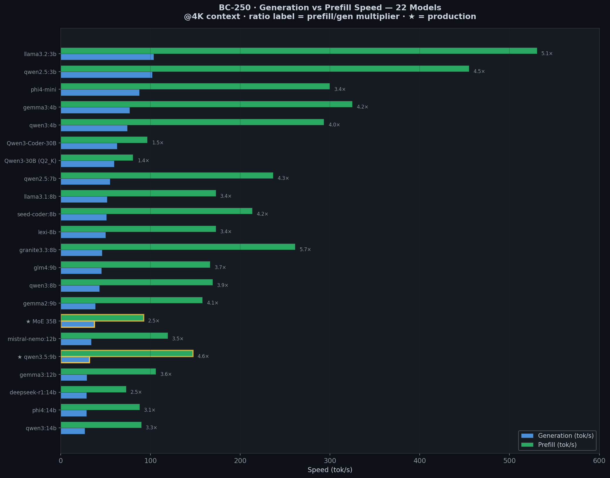

> **Note on the Gemma 4 prefill outlier:** Gemma 4 26B reaches ~1238 tok/s prefill — far above any other model on the chart. This likely reflects its unusual MoE design: 128 experts with only 8 active + 1 shared per token (~3.8B active out of 26B total, ~15% activation). During prefill (which tends to be compute-bound), the router may only need to evaluate a small fraction of the model per token, allowing much higher throughput. The other MoE models here — Qwen3-Coder-30B (A14B, ~47% activation) and Qwen3-30B Q2_K (A3B but aggressively quantized to ~8 GiB) — appear to benefit less from sparsity, either because they activate a larger share of experts or because their small memory footprint already reduces the compute advantage. That said, this is a plausible explanation rather than a confirmed one — the actual dispatch behavior depends on the Ollama Vulkan backend, which has not been profiled.

### 4.3 Context window experiments

> **Historical note:** The experiments below were conducted with FP16 KV cache before Q4_0 KV was deployed. With Q4_0 KV deployed (see §4.4), these memory constraints no longer apply — qwen3:14b now reaches **128K** context without deadlocks. This section is preserved to document the FP16 behavior for reference.

The context window directly controls KV cache size, and on 16 GB unified memory, every megabyte counts. After v7 (OpenClaw removal freed ~700 MB, GTT tuned — see §3.3), all context sizes were re-tested systematically:

**Context window vs memory (qwen3:14b Q4_K_M, flash attention, 16 GB GTT)**

| Context | RAM Used | Free | Swap | Speed | Status |
|--------:|---------:|-----:|-----:|------:|--------|
| 8192 | ~9.5 GB | 6.5 GB | — | ~27 tok/s | ✅ Safe |
| 12288 | ~10.3 GB | 5.7 GB | — | ~27 tok/s | ✅ Conservative |
| 16384 | ~11.1 GB | 4.9 GB | — | ~27 tok/s | ✅ Comfortable |
| 18432 | ~13.2 GB | 2.7 GB | 0.9 GB | 26.8 tok/s | ✅ Works |
| 20480 | ~13.7 GB | 2.3 GB | 0.9 GB | 26.8 tok/s | ✅ Works |
| 22528 | ~14.0 GB | 2.0 GB | 0.9 GB | 26.7 tok/s | ✅ Works |
| **24576** | **~14.4 GB** | **1.5 GB** | **0.9 GB** | **26.7 tok/s** | **✅ Max for qwen3:14b** |
| 26624 | ~14.6 GB | 1.3 GB | 1.0 GB | 23.9 tok/s | ⚠️ 10% slower |
| 28672 | ~14.2 GB | — | 1.7 GB | timeout | ❌ Deadlocks |
| 32768 | ~15.7 GB | 0.2 GB | 2.1 GB | timeout | ❌ Deadlocks |
| 40960 | ~16.0 GB | 0 | — | — | 💀 TTM fragmentation¹ |

> **24K is the sweet spot** — full speed (~27 tok/s), leaves ~1.5 GB for OS/services with stable swap at 0.9 GB. 26K works but inference drops 10% due to swap pressure. 28K+ deadlocks under Vulkan.
>
> ¹ **Why 40K fails isn't raw OOM.** The math: 9.3 GB weights + 2 GB KV cache + 1 GB OS ≈ 12.3 GB < 16 GB available. The failure is consistent with **TTM fragmentation** — the kernel's TTM memory manager likely can't allocate a contiguous block large enough for the KV cache because physical pages are fragmented across GPU and CPU consumers. This is a UMA-specific problem: on discrete GPUs with dedicated VRAM, fragmentation doesn't cross the PCIe boundary.

> **History:** The original 24K experiment deadlocked because OpenClaw gateway consumed ~700 MB. After v7 removed OpenClaw and bumped GTT to 14 GB, 24K became stable. Flash attention (`OLLAMA_FLASH_ATTENTION=1`) was required in this configuration — without it, 24K did not fit.

### 4.4 KV cache quantization — breaking the context ceiling

Just as model weights can be quantized (16-bit → 4-bit) to save memory, the KV cache can be quantized too. The KV cache stores intermediate attention state for every token in the context window — at FP16, this dominates memory usage at large context sizes. Quantizing it to Q4_0 (4-bit) shrinks KV memory ~4× with negligible quality impact on this hardware.

**Q4_0 KV cache is now deployed in production.** This raised the BC-250 from 16–64K usable context (FP16) to **128K+ allocation for all models**.

| KV Type | Context Ceiling (14B) | Context Ceiling (Qwen MoE 35B) | KV Size @24K | Gen tok/s | Notes |
|---------|:---------------------:|:--------------------:|:------------:|:---------:|-------|
| **FP16** (old default) | 24K (40K deadlocked) | 16K | ~3.8 GiB | 27.2 | Previous production |
| **Q8_0** | 64K+ | 64K+ | ~2.0 GiB | 27.3 | Conservative |
| **Q4_0** (current) | **128K** | **256K** | **~1.1 GiB** | **27.3** | **← deployed** |

**Q4_0 KV cache scaling:** ~45 MiB per 1K tokens (vs ~400 MiB/1K for FP16). At 128K context, KV cache is ~5.8 GiB — fits alongside 8.9 GiB 14B model weights within the 16.5 GiB Vulkan pool.

**Quantization impact test (qwen3:8b):**

| Model Quant | KV Type | tok/s | Prefill | Max Ctx | VRAM @4K |
|:-----------:|:-------:|:-----:|:-------:|:-------:|:--------:|
| Q4_K_M | Q4_0 | 43.2 | 158 | 128K | 5.1 GiB |
| Q8_0 | Q4_0 | 30.6 | 184 | 128K | 8.5 GiB |

> Q8_0 model weights are 29% slower with 67% more VRAM but higher precision. Both reach 128K context with Q4_0 KV.

<details>
<summary><b>Historical: FP16 KV context experiments (qwen3:14b, pre-Q4_0)</b></summary>

These earlier measurements show the FP16 KV limitations that Q4_0 eliminated:

| Context | KV Type | Speed | Status |
|--------:|:-------:|------:|--------|
| 24576 | FP16 | 26.7 tok/s | ✅ Max for qwen3:14b |
| 28672 | FP16 | timeout | ❌ Deadlocks |
| 32768 | FP16 | timeout | ❌ Deadlocks |
| 24576 | Q4_0 | 27.3 tok/s | ✅ |
| 48000 | Q4_0 | 27.3 tok/s | ✅ |
| 128000 | Q4_0 | 27.3 tok/s | ✅ |

</details>

**Generation speed degrades with context fill (Q4_0, all layers on GPU):**

| Tokens in context | Gen tok/s | Prefill tok/s | Notes |
|:-----------------:|:---------:|:-------------:|-------|
| ~100 (empty) | 27.2 | 58 | Headline number |
| 3,300 | 24.6 | 113 | Typical Signal chat |
| 10,000 | 20.7 | 70 | Long job output |
| 30,000 | **13.4** | 53 | Heavy document analysis |
| 40,960 (max fill) | **~10*** | ~42 | Theoretical, near KV limit |

\* *Estimated from degradation curve. One test at 41K showed 1.2 tok/s, but that was caused by model partial offload (21/41 layers spilled to CPU), not normal operation.*

```bash
# Production config (in /etc/systemd/system/ollama.service.d/override.conf):
Environment=OLLAMA_KV_CACHE_TYPE=q4_0
Environment=OLLAMA_CONTEXT_LENGTH=65536
# Default 64K — verified filled-context ceiling (see §4.5)
```

### 4.5 Extended context benchmark — filled context verification

> Previous context ceiling tests used tiny prompts with large `num_ctx` — this tests KV cache *allocation*, not actual *utilization*. The extended re-benchmark fills context to 80% with real tokens, verifies `prompt_eval_count` matches expected token count, and monitors system resources.

**Methodology:**
- Context filled to 80% of `num_ctx` with repeated English text blocks (~500 tokens each)
- Two phases per context size: (1) allocation test (tiny prompt), (2) filled test (80% real tokens)
- `prompt_eval_count` verified against expected token count to detect silent truncation
- System RAM and swap monitored via `/proc/meminfo` before/after each test
- Timeout: 20 minutes per request. OLLAMA_CONTEXT_LENGTH set to 524288 (uncapped)
- Services stopped for clean measurements. Single run per configuration.

**Results — generation speed with filled context (tok/s):**

| Model | 4K | 8K | 16K | 32K | 64K | 96K | 128K | Notes |
|-------|:--:|:--:|:---:|:---:|:---:|:---:|:----:|-------|
| **MoE 35B-A3B** | 35.7 | 34.2 | 31.9 | 27.9 | 22.5 | 18.9 | TIMEOUT | Ceiling at 96K filled |
| **qwen3.5:9b** | 31.2 | 30.4 | 29.0 | 26.6 | 22.6 | 19.6 | TIMEOUT | Ceiling at 96K filled |
| **🏆 gemma4-26b-q3** | 35.2 | 33.3 | 31.1 | 27.7 | TIMEOUT | — | — | Ceiling at 48K filled (40K=26.4, 48K=25.0) |
| qwen2.5:3b | 93.6 | 87.9 | 77.8 | 62.0 | **32K³** | **32K³** | **32K³** | Truncated above 32K |
| phi4-mini | 72.5 | 61.5 | 46.8 | 31.1 | 18.7 | 13.2 | TIMEOUT | Ceiling at 96K filled |
| qwen3:8b | 39.1 | 35.4 | 29.5 | 21.6 | 14.3 | TIMEOUT | — | Ceiling at 64K filled |
| qwen3:14b | 24.9 | 23.4 | 20.4 | 15.7 | 11.0 | TIMEOUT | — | Ceiling at 64K filled |
| phi4:14b | 25.7 | 23.1 | 19.0 | **16K³** | **16K³** | **16K³** | **16K³** | Truncated above 16K |
| mistral-nemo:12b | 31.2 | 28.5 | 24.0 | 18.1 | 12.1 | TIMEOUT | — | Ceiling at 64K filled |

> ³ Silent truncation: Ollama processes only the model's native context limit worth of tokens, silently discarding the rest. The allocation test always passes.

**Key findings:**

1. **Silent truncation discovered:** Ollama silently caps context to the model's native limit. qwen2.5:3b → 32K, phi4:14b → 16K. No error reported — only `prompt_eval_count` reveals the cap. The old allocation-only benchmark would never catch this.

2. **128K fill impossible on this hardware:** No model completed 128K filled context within 20 minutes. The Qwen MoE's (qwen3.5-35b-a3b) 96K fill took 581 seconds (9.7 min TTFT), and prefill rate degrades from 234 tok/s (4K) to 105 tok/s (96K). At 128K, estimated TTFT would be ~17-25 minutes.

3. **Speed degrades 37-63% from 4K to 64K filled:** Qwen MoE goes from 35.7 → 22.5 tok/s (37% drop). Dense 8B models drop 63%. Within 4K–64K, degradation tracks roughly linear in log(context_length), suggesting memory bandwidth (not quadratic attention compute) is the dominant cost at these scales. The old benchmark masked this by not filling context.

4. **Practical ceiling is 32K-64K for interactive use:** At 32K, TTFT is 2-3 minutes (acceptable for batch jobs). At 64K, TTFT is 5-12 minutes. Above 64K, only batch processing (not interactive chat) is practical.

5. **OLLAMA_CONTEXT_LENGTH set to 65536 (64K):** This is the verified universal ceiling where all models can process a filled context. Higher values still work for chat with short prompts.

6. **Re-benchmark confirmation:** The multi-run re-benchmark reproduced all initial context scaling data within ±1 tok/s. Qwen MoE at 64K filled: 22.9 tok/s (initial: 22.5). qwen3:14b at 32K filled: 16.4 tok/s (initial: 15.7).

### 4.5a Quality & statistical validation

> Follow-up benchmark with repeated measurements and quality assessment.

**Statistical validation** — 3 runs × 8 models supports single-run reliability:

| Model | Gen median | Range | CV% |
|-------|:---------:|:-----:|:---:|
| llama3.2:3b | 102.2 | [101.3 – 103.9] | 1.3% |
| phi4-mini | 86.1 | [85.0 – 87.4] | 1.4% |
| Qwen3-30B-A3B (Q2_K) | 58.5 | [57.9 – 58.9] | 0.9% |
| qwen3:8b | 42.8 | [42.8 – 43.0] | 0.3% |
| qwen3.5-35b-a3b-iq2m (MoE) | 37.5 | [37.3 – 37.6] | 0.4% |
| mistral-nemo:12b | 34.0 | [33.9 – 34.0] | 0.2% |
| qwen3.5:9b | 31.7 | [31.7 – 31.9] | 0.4% |
| qwen3:14b | 26.6 | [26.6 – 26.7] | 0.2% |

CV <1.5% across all 8 models tested. Single-run measurements are reliable on this thermally steady UMA system.

**Quality assessment** — 5 tasks × 3 runs, scored by Python script (keyword match, JSON parse, regex):

| Task | MoE 35B-A3B | qwen3.5:9b |
|------|:---:|:---:|
| Summarization | 3/3 ✅ | 3/3 ✅ |
| JSON extraction | 3/3 ✅ | 3/3 ✅ |
| Fact recall | 3/3 ✅ | 3/3 ✅ |
| Instruction following | 2/3 ⚠️ | 3/3 ✅ |
| Arithmetic (17 × 23) | 3/3 ✅ | 3/3 ✅ |
| **Total** | **14/15 (93%)** | **15/15 (100%)** |

The MoE's one miss was adding preamble before a numbered list — the list itself was correct. These tasks confirm basic functionality (text manipulation, structured output, factual recall) but are too simple to differentiate model quality — even 3B models score 93%. They do not test reasoning depth, nuance, or generation quality where larger models are expected to have real advantages.

**Cold-start TTFT** — model fully unloaded → first token:

| Model | Median | Load time |
|-------|:------:|:---------:|
| MoE 35B-A3B | **18.0s** | 16.2s (~660 MB/s from NVMe) |
| qwen3.5:9b | **7.0s** | 5.6s (~1.1 GB/s from NVMe) |

With `OLLAMA_KEEP_ALIVE=30m`, cold start (18.0s) occurs only after 30 minutes of inactivity. Warm TTFT at short prompts: 0.3–1.7s.

### 4.6 Prefill (prompt evaluation) benchmarks

On UMA, both prefill and generation share memory bandwidth. Prefill is the time the model spends "reading" the prompt before generating the first token.

> **For embedded engineers:** Think of LLM inference as two phases — like a bootloader and a main loop. **Prefill** is the "bootloader": the model processes the entire input prompt in one burst (parallel, compute-bound — like DMA-ing a firmware image into SRAM). **Token generation** is the "main loop": the model produces output tokens one at a time, sequentially (memory-bandwidth-bound — like polling a UART at a fixed baud rate). MoE (Mixture of Experts) is like having 35 specialized ISRs but only routing to 3 of them per interrupt — you get the routing intelligence of knowing all 35, but only pay the execution cost of 3. This is the likely reason the 35B MoE measured faster than the 14B dense model on this hardware (see §4.9 for caveats).

**Prefill rate vs prompt size — production models (Q4_0 KV cache, warm):**

**qwen3.5-35b-a3b-iq2m (MoE 35B/3B active, UD-IQ2_M):**

| Prompt Size | Tokens | Prefill | Gen tok/s | TTFT (warm) |
|-------------|:------:|--------:|----------:|------------:|
| Tiny | 17 | 53 tok/s | 39.3 | 0.3s |
| Short | 42 | 68 tok/s | 39.6 | 0.6s |
| Medium | 384 | 231 tok/s | 38.5 | 1.7s |
| Long | 1,179 | 228 tok/s | 38.3 | 5.2s |

**qwen3.5:9b (Q4_K_M, dense 9.7B):**

| Prompt Size | Tokens | Prefill | Gen tok/s | TTFT (warm) |
|-------------|:------:|--------:|----------:|------------:|
| Tiny | 17 | 61 tok/s | 33.2 | 0.3s |
| Short | 42 | 118 tok/s | 33.0 | 0.4s |
| Medium | 384 | 229 tok/s | 33.0 | 1.7s |
| Long | 1,179 | 225 tok/s | 32.5 | 5.2s |

> **Observations:** Both production models converged to ~230 tok/s prefill at medium-to-long prompts in this testing — an observed pattern whose underlying cause remains unclear (could be Vulkan dispatch overhead, memory controller bandwidth, or another bottleneck; see §4.9). At tiny prompts (<50 tokens), GPU compute overhead dominates and prefill drops to 53–61 tok/s. Generation rate was stable across prompt sizes in this testing: MoE held 38–39 tok/s, 9B held 32–33 tok/s. TTFT scales linearly: at 384 tokens it's ~1.7s, at 1.2K tokens it's ~5.2s. For real-world Signal chat (3K system prompt + conversation), expect TTFT of ~15–20s on cold start, <2s when the model is warm (prompt cached via `OLLAMA_KEEP_ALIVE=30m`).

<details>
<summary><b>Historical: qwen3:14b Q4_K_M (previous primary, 24K context)</b></summary>

| Prompt Size | Tokens | Prefill | Gen tok/s | TTFT (warm) |
|-------------|:------:|--------:|----------:|------------:|
| Tiny | 86 | 88 tok/s | 27.2 | ~1s |
| Short | 353 | 67 tok/s | 27.2 | ~5s |
| Medium | 1,351 | 128 tok/s | 26.1 | ~11s |
| Long | 3,354 | 113 tok/s | 24.6 | ~30s |
| XL | 6,686 | 88 tok/s | 22.5 | ~76s |
| Massive | 10,014 | 70 tok/s | 20.7 | ~143s |

> Generation rate degrades with context: 27.2 tok/s @small → 20.7 tok/s @10K tokens.

</details>

**Graphical: prefill rate and generation rate vs prompt size:**

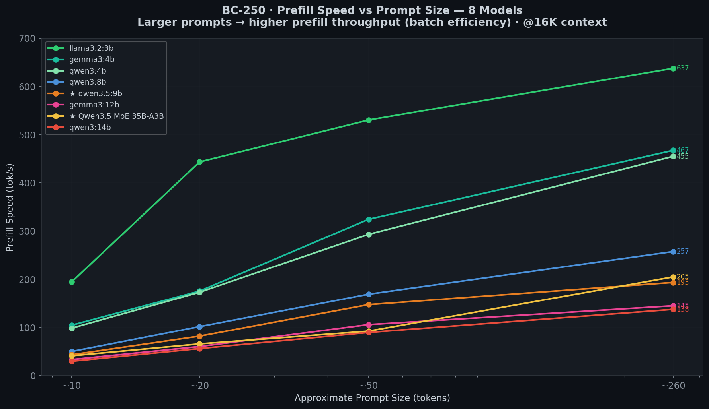

**Model Landscape Bubble Chart** — generation speed × prefill speed × max context (bubble size = context window, unique color per model). Single-run data; relative positions are representative but absolute numbers may differ slightly from the multi-run re-benchmark (B2–B3).

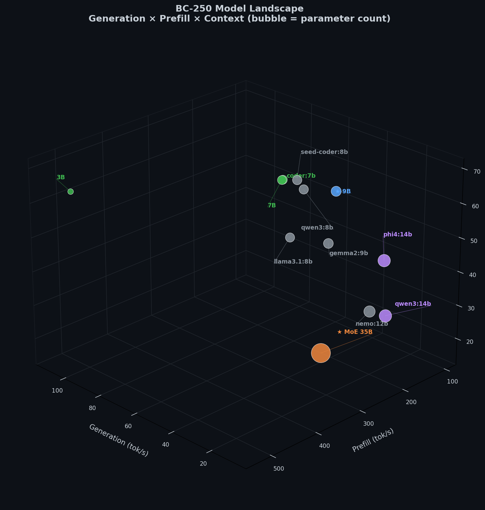

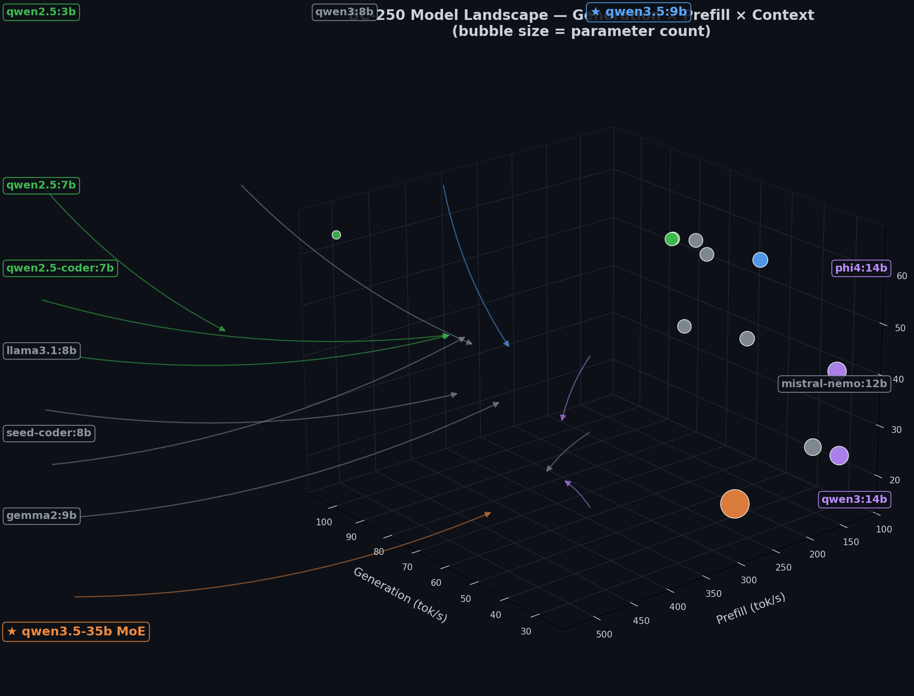

### 4.7 Memory budget

**qwen3.5-35b-a3b-iq2m · headless server (from Ollama logs)**

| Component | Qwen MoE @4K ctx | Qwen MoE @16K ctx | Notes |
|-----------|:----------:|:------------:|-------|
| Model weights (GPU) | 10.3 GiB | ~8.2 GiB | 41/41 layers on Vulkan at 4K; spills to CPU at higher ctx |
| Model weights (CPU) | 0.3 GiB | ~0.4 GiB | Spilled layers + embeddings |
| KV cache (GPU) | **1.6 GiB** | **~3.8 GiB** | Measured from Ollama logs at each ctx size |
| Compute graph | ~0.2 GiB | ~0.2 GiB | GPU-side |
| **Ollama total** | **12.3 GiB** | **~12.5 GiB** | Ollama dynamically spills weights to make room for KV |
| OS + services | ~0.9 GiB | ~0.9 GiB | Headless Fedora 43 |
| **Free (of 16.5 Vulkan)** | **~4.2 GiB** | **~4.0 GiB** | |
| NVMe swap | 16 GiB | | Safety net |

> **Qwen MoE memory dynamics:** As context grows, Ollama spills weight layers from GPU to CPU to maintain a ~12.5 GiB total. The qwen3.5-35b-a3b's total weight (11 GB GGUF) is larger than qwen3:14b (9.3 GB), but only 3B params activate per token — so non-selected expert layers may reduce the penalty relative to a dense model, though this was not isolated experimentally. At 24K+ context, the KV cache exceeds what can fit alongside the weights, causing OOM or timeout.

### 4.8 Model recommendations

The primary chat model is **gemma4-26b-q3** (Gemma 4 26B MoE, UD-Q3_K_M — 26B total params, ~3.8B active per token, 39 tok/s, 48K verified filled context, 100% quality). This is the largest model that runs at 100% GPU offload on BC-250 (13.5 GiB). It achieves the highest prefill throughput of any fully-offloaded model (1238 tok/s at 4K) — likely because its 128-expert MoE architecture activates only ~15% of weights per token during the compute-bound prefill phase. Filled-context verified at all sizes from 4K to 48K with no truncation: 35.2 tok/s at 4K → 25.0 tok/s at 48K (−29% degradation). Prefill remains strong even at 48K (148 tok/s), though TTFT reaches 3.2 min. Context is limited to 48K (65K times out), and VRAM headroom is tight. Also used by all 25+ automated LLM scripts and scrapers (typical prompt sizes 2–14K tokens, well within the 48K ceiling) — sharing the same model with the chat bot avoids Ollama model-swap overhead.

The fallback model is **qwen3.5-35b-a3b-iq2m** (MoE — 35B total params, 3B active per token, 37.5 tok/s, 32K practical filled context, 93% quality) — used when prompts exceed 40K tokens, where gemma4's 48K ceiling leaves insufficient headroom. Chosen for the largest knowledge capacity that fits in 16 GB UMA while maintaining practical speed, likely benefiting from only 3B parameters activating per token on this scalar GPU (see §4.9 for caveats). 64K filled context has been achieved (22.9 tok/s) but showed severe regression on a later retest after extended uptime (0.7 tok/s — likely UMA memory fragmentation; see B5.2). For vision and multimodal tasks, **qwen3.5:9b** (dense 9B, 31.7 tok/s, 64K, 100%) provides native image understanding. For the fastest inference, **phi4-mini** (dense 3.8B, 86.1 tok/s, 64K, 93%) is the fastest model that passes all basic quality checks.

All tok/s figures are Phase 2 medians (3 runs; B3) except gemma4-26b-q3 (measured via §4.9 Ollama comparison, not in Phase 2). Filled context ceilings are verified with 80% real-token fill and `prompt_eval_count` truncation detection (B5). Quality scores are 5 tasks × 3 runs, deterministic scoring (B4).

The full recommendation table — including reasoning, batch, speed-critical, and image generation picks — is in [B10. Model Recommendations](#b10-model-recommendations).

**Production triple-model config:** `gemma4-26b-q3` as primary chat model (≤40K tokens, 49152 ctx) with `qwen3.5-35b-a3b-iq2m` as fallback for prompts >40K tokens (65536 ctx). For vision, switch to `qwen3.5:9b`. All use `OLLAMA_KV_CACHE_TYPE=q4_0`.

```bash
# Primary chat model (26B MoE, 100% GPU, 48K verified filled ctx) — custom GGUF via Modelfile
ollama create gemma4-26b-q3 -f Modelfile-gemma4-26b-q3

# Fallback model (35B MoE, >40K tokens) — custom GGUF via Modelfile
ollama create qwen3.5-35b-a3b-iq2m -f Modelfile-qwen35-35b-a3b

# Vision model (dense 9B, official Ollama)
ollama pull qwen3.5:9b
```

> **Why not a bigger MoE?** All 35B params must reside in memory even though only 3B activate per token — the router decides at runtime which expert sub-networks to fire. At IQ2_M (~2.5 bits/param), 35B = 11 GB GGUF. The next MoE up — Qwen3-235B-A22B — would be ~44 GB at IQ2_M (2.7× too large). Going below IQ2_M (e.g. IQ1_S at ~1.5 bits) caused severe quality degradation in testing.

### 4.9 Benchmark limitations

The benchmark campaign measures this specific BC-250 board under one software stack. The following boundaries apply:

- **Quality coverage is partial.** 32 models attempted, 31 produced usable results. qwen2.5:7b scored 20% (corrupted by 72% loading bug; only fact recall passes). qwen3.5-27b-iq2m scored 0% (all 15 tasks timed out). Two models scored low due to `think:false` not being honored — thinking tokens consumed the output budget.
- **Filled-context coverage is partial.** 32 models attempted at 4K–64K with 80% real-token fill. 25 reach 64K, 5 have lower native ceilings (32K or 16K), 1 broken (qwen2.5-coder:7b, pec=0), 1 too large to load (qwen3.5-27b-iq2m). All 32 were tested; not all produced usable data.
- **Long-context quality is limited in scope.** Tested on 4 production models at 16K and 32K. Embedded fact retrieval: 24/24 pass. Multi-hop reasoning: 8/32 pass. Long-range synthesis: 31/32 pass. Not tested at 64K, not tested on non-production models.
- **Reasoning/thinking token overhead not benchmarked.** Several models support "think mode" (extended chain-of-thought before responding), but no dedicated benchmark compares thinking-on vs thinking-off speed or measures thinking token generation rates. The main related observation: two models scored low in quality tests because `think:false` was not honored — thinking tokens consumed the output budget. A dedicated reasoning benchmark would help quantify the practical throughput impact of thinking tokens on this hardware.
- **Ollama backend lag.** As documented in §4.10, Ollama bundles a llama.cpp Vulkan backend that lags upstream HEAD. Building llama.cpp from HEAD yields **+45% generation speed on Qwen MoE at 4K context** and **+7% on dense models** (measured against Ollama 0.18; likely similar on 0.20 since generation speeds are unchanged). The Qwen MoE-specific gap suggests newer Vulkan shader optimizations may not yet be in Ollama's vendored copy. However, recent llama.cpp versions (b8400+) crash the system at 32K context due to increased Vulkan memory usage — the speed optimizations that roughly doubled TG also increased memory footprint beyond the 16 GB UMA limit. Older versions (b8200) handle the full range up to 64K and are 10–58% faster than Ollama at large contexts, but ~45% slower at 4K. See §4.10/§4.10a for the full version comparison. All tok/s numbers in this document are Ollama measurements — actual hardware potential varies by llama.cpp version and context size.
- **llama.cpp b8200 model support is limited.** The b8200 build predates architecture support for gemma3, gemma4, and qwen3.5 model families. Of the 8 representative models tested, 3 failed to load entirely. Quality, vision, cold-start, and filled-context-with-real-text tests are Ollama-only and cannot be directly replicated with llama-bench (which measures raw PP/TG speed, not chat quality or API behavior).

### 4.10 Ollama vs upstream llama.cpp — Vulkan overhead analysis

A controlled comparison was performed between Ollama 0.18.0 and upstream llama.cpp HEAD (commit `6b949d1`) built from source on-device with `-DGGML_VULKAN=ON`. All tests run on fresh reboot with services disabled, caches dropped between tests, OOM protection enabled (`oom_score_adj=-1000`). *Note: this comparison predates the Ollama 0.20 upgrade. The 0.20 re-benchmark (§4.1) shows generation speeds unchanged from 0.18 (±0.1% average), so the overhead gap likely persists.* Gemma 4 was tested separately with llama.cpp HEAD `b7ad48e` (Gemma 4 architecture support added in #21406).

**Update:** The 32K crash appears to be **version-specific** rather than an inherent limitation. Testing llama.cpp b8200 (`541bf37`) showed 32K context works without crashing — the system stays stable with ~300 MiB free. Between b8200 and b8400 (~85 commits), Vulkan backend optimizations roughly doubled 4K generation speed (43→78 tok/s) but increased memory usage enough to exceed 16 GB UMA at 32K. This appears to be a speed-vs-memory trade-off rather than an inherent Ollama advantage.

**Methodology:** llama-bench with `-r 1 -fa 1 -ctk q4_0 -ctv q4_0 -ngl 99` (single repetition, flash attention, quantized KV cache). Ollama with matching settings: `OLLAMA_FLASH_ATTENTION=1 OLLAMA_KV_CACHE_TYPE=q4_0 OLLAMA_CONTEXT_LENGTH=65536`. Same model files (hardlinks to Ollama blobs). Fresh reboot, no other processes running.

**Generation speed (tok/s):**

| Model | Context | llama.cpp TG | Ollama TG | Overhead |
|-------|--------:|-------------:|----------:|---------:|
| Qwen3 MoE 30B-A3B IQ2_M (10.1 GB) | 4K | **84.3** | 58.3 | 1.45× |
| Qwen3 MoE 30B-A3B IQ2_M | 16K | **84.7** | 49.0 | 1.73× |
| Qwen3 MoE 30B-A3B IQ2_M | 32K | ☠ crash† | 39.2 | — |
| Qwen3 MoE 30B-A3B IQ2_M | 64K | ☠ crash† | 28.7 | — |
| Qwen3.5 MoE 35B-A3B IQ2_M (b8200) | 4K | **43.0** | 58.3 | 0.74× |
| Qwen3.5 MoE 35B-A3B IQ2_M (b8200) | 32K | **43.0** | 39.2 | **1.10×** |
| Qwen3.5 MoE 35B-A3B IQ2_M (b8200) | 64K | **43.0** | 28.7 | **1.50×** |
| DeepSeek-R1 14B Q4_K_M (8.4 GB) | 4K | **29.0** | 27.2 | 1.07× |
| DeepSeek-R1 14B | 16K | **29.0** | — | — |
| DeepSeek-R1 14B | 32K | ☠ crash† | 20.9 | — |
| Gemma 4 26B Q3_K_M (11.6 GiB) | 4K | 0.07†† | **39.0** | 0.002× |

† With llama.cpp HEAD (b8400+) — the 32K crash is version-specific. See b8200 rows and the update note above.

†† Vulkan GPU offload appears non-functional — llama.cpp produces 0.07 tok/s TG vs 11.4 tok/s on CPU-only (ngl=0). See finding 6 below.

**Prompt processing speed (tok/s):**

| Model | Context | llama.cpp PP | Ollama PP | Ratio |
|-------|--------:|-------------:|----------:|------:|
| Qwen3 MoE 30B-A3B IQ2_M | 4K | 285.0 | **316.4** | 0.90× |
| Qwen3 MoE 30B-A3B IQ2_M | 16K | 152.8 | **228.1** | 0.67× |
| Qwen3 MoE 30B-A3B IQ2_M | 32K | ☠ crash† | **157.4** | — |
| Qwen3 MoE 30B-A3B IQ2_M | 64K | ☠ crash† | **96.8** | — |
| Qwen3.5 MoE 35B-A3B IQ2_M (b8200) | 4K | 306.6 | **316.4** | 0.97× |
| Qwen3.5 MoE 35B-A3B IQ2_M (b8200) | 32K | **206.9** | 157.4 | **1.31×** |
| Qwen3.5 MoE 35B-A3B IQ2_M (b8200) | 64K | **152.5** | 96.8 | **1.58×** |
| DeepSeek-R1 14B | 4K | **133.9** | 127.5 | 1.05× |
| DeepSeek-R1 14B | 16K | **82.6** | — | — |
| DeepSeek-R1 14B | 32K | ☠ crash† | **83.2** | — |
| Gemma 4 26B Q3_K_M | 4K | 1.15†† | **1238** | 0.001× |

**Key findings:**

| # | Finding | Summary |
|:-:|---------|--------|
| 1 | TG overhead | b8200: 1-17% faster than Ollama. HEAD: 45-73% faster (MoE) but crashes at 32K |
| 2 | PP overhead | Ollama 7-32% faster at prefill (4K-16K) |
| 3 | Large context | b8200 handles full 64K; HEAD crashes at 32K (speed-vs-memory trade-off) |
| 4 | TG vs context | llama-bench: <0.3% TG change 128-64K. Ollama: ~51% degradation |
| 5 | 64K regression | Fresh-reboot: 28.7 tok/s at 64K (vs 0.7 on stale system) |
| 6 | Gemma 4 | llama.cpp Vulkan broken (0.07 tok/s). Only works via Ollama (39 tok/s) |

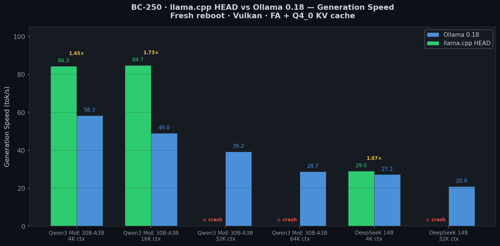

<details><summary><b>Detailed findings (click to expand)</b></summary>

1. **Generation overhead is model- and version-dependent.** HEAD: Qwen MoE 1.45-1.73x (growing with context), dense only 1.07x. b8200: 1-17% faster across 6 models, larger gap on smaller/faster models (17% for qwen3:4b vs 1% for deepseek-r1:14b). Three architectures (gemma3, gemma4, qwen3.5) cannot load on b8200. Pattern suggests a fixed Vulkan dispatch cost.

2. **Prompt processing: Ollama is sometimes faster.** At 4K-16K, Ollama's PP is 7-32% faster for Qwen MoE, suggesting different batch scheduling or prompt caching.

3. **32K-64K context: version-dependent.** HEAD (b8400+) crashes at 32K. b8200 handles the full range to 64K: 10-31% faster than Ollama at 32K, ~50% faster at 64K. The ~85 commits between b8200 and b8400 roughly doubled 4K speed but pushed memory past 16 GB UMA. See 4.10a for the full sweep.

4. **llama-bench TG shows minimal context sensitivity.** b8200: 42.9-43.0 tok/s from 128 to 64K tokens (variance <0.3%). Dense models confirm: llama3.2:3b and qwen3:8b show <0.2% TG change at 32K. Ollama degrades ~51% over the same range (58 to 29 tok/s), likely from pre-allocating 65K KV slots regardless of actual usage.

5. **Fresh-reboot 64K regression resolved.** 28.7 tok/s at 64K (vs 0.7 on stale system). Likely UMA memory fragmentation, not a software bug.

6. **Gemma 4 MoE: llama.cpp Vulkan non-functional on GFX1013.** 0.07 tok/s TG with ngl=99 vs 11.4 tok/s CPU-only (ngl=0). Ollama achieves 39 tok/s via its vendored shaders. Gemma 4 is Ollama-only on this hardware for now.

</details>

**Reproducibility:** 3 fresh boots, TG variance <1%, PP variance up to 12% (Vulkan shader compilation). 32K crashes deterministic with b8400+ but absent on b8200.

### 4.10a Comprehensive b8200 benchmark — context scaling and limits

A full context sweep was performed with llama.cpp b8200 (`541bf37`) to characterize the older Vulkan backend across the entire context range. All tests: single run, flash attention, Q4_0 KV cache, full GPU offload, services stopped, fresh boot.

> **Why llama-bench, not Ollama API?** Ollama bundles its own llama.cpp binary — there is no straightforward way to swap it for b8200. These benchmarks use llama-bench directly against the same GGUF model files (hardlinked to Ollama's blob store). llama-bench is not synthetic: `pp65536` processes 65,536 real tokens through the full model forward pass. The key difference from Ollama's filled-context tests (§4.5) is likely memory management: llama-bench allocates KV cache on demand for each test, while Ollama appears to pre-allocate the full 65K-slot KV window regardless of actual prompt size. This may explain why llama-bench TG shows negligible context sensitivity (42.9 tok/s at all tested sizes) while Ollama TG degrades from 58→29 tok/s — if Ollama pays the memory bandwidth cost of 65K KV slots even at 4K context.

**Context sweep — Qwen3.5 MoE 35B-A3B IQ2_M (10.6 GiB):**

| Context | PP (tok/s) | TG (tok/s) | Free RAM | Time |
|--------:|-----------:|-----------:|---------:|-----:|
| 128 | 183.9 | 42.9 | 10 GiB | 21s |
| 256 | 263.7 | 42.9 | 10 GiB | 22s |
| 512 | 325.8 | 42.9 | 11 GiB | 23s |
| 1K | 326.0 | 42.9 | 11 GiB | 26s |
| 2K | 315.7 | 42.9 | 11 GiB | 33s |
| 4K | 306.6 | 42.9 | 11 GiB | 47s |
| 8K | 286.6 | 43.0 | 11 GiB | 77s |
| 16K | 253.8 | 43.0 | 11 GiB | 149s |
| 32K | 206.9 | 43.0 | ~300 MiB | ~2h |
| **48K** | **175.5** | **43.0** | **~200 MiB** | ~3h |
| **64K** | **152.5** | **43.0** | **~190 MiB** | ~4h |
| 80K | ☠ OOM crash | — | — | system freeze |

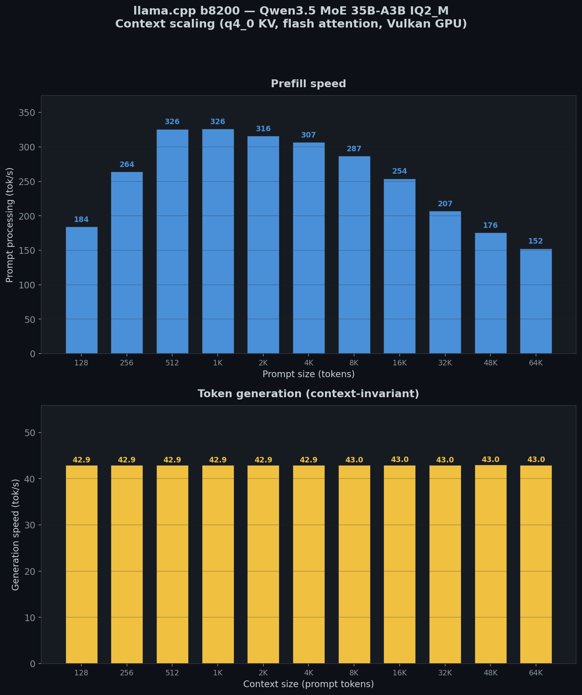

**Key observations:**

| # | Observation | Data |
|:-:|-------------|------|
| 1 | TG context-invariant | 42.9–43.0 tok/s from 128→64K (variance <0.3%) |
| 2 | PP peaks at 512–1K | 326 tok/s peak → 152 at 64K (−53%), linear in log(ctx) |
| 3 | 64K = practical ceiling | 80K → OOM crash. At 64K: ~190 MiB free of 14.3 GiB |
| 4 | Speed-memory trade-off | b8200: slow but stable to 64K. HEAD: 2× faster but crashes at 32K |

**1. TG is context-invariant** — 42.9–43.0 tok/s across all tested sizes, 128 to 64K. Ollama shows ~51% TG degradation over the same range (58→29 tok/s, measured with 80% real-token fill in §4.5). The likely cause: llama-bench allocates KV cache per-test, while Ollama pre-allocates the full 65K window. At 64K both use similar KV cache sizes, yet b8200 is still ~50% faster (43 vs 29 tok/s) — suggesting Ollama's overhead is not solely allocation-related.

**2. PP peaks at 512–1K tokens** (~326 tok/s), then declines as memory bandwidth becomes the bottleneck. PP drops 53% from peak to 64K (326→152 tok/s). The curve is approximately linear in log(context).

**3. 64K is the practical ceiling.** 80K crashes the system (OOM, full freeze). At 64K: ~190 MiB free — no margin for 80K's additional ~0.7 GiB KV cache. b8200 at 64K is ~50% faster than Ollama on both PP and TG.

**4. Speed vs memory trade-off:**

| Version | TG @4K | TG @32K | Max context | PP @4K |
|---------|-------:|--------:|:-----------:|-------:|
| b8200 (Mar 5) | 43 | 43 | **64K** | 326 |
| HEAD (Apr 4) | 78 | ☠ crash | 16K | 379 |
| Ollama 0.18 | 58 | 39 | 64K | 316 |

b8200 is the only tested llama.cpp version that handles large contexts on this hardware, but is ~45% slower than HEAD at small contexts.

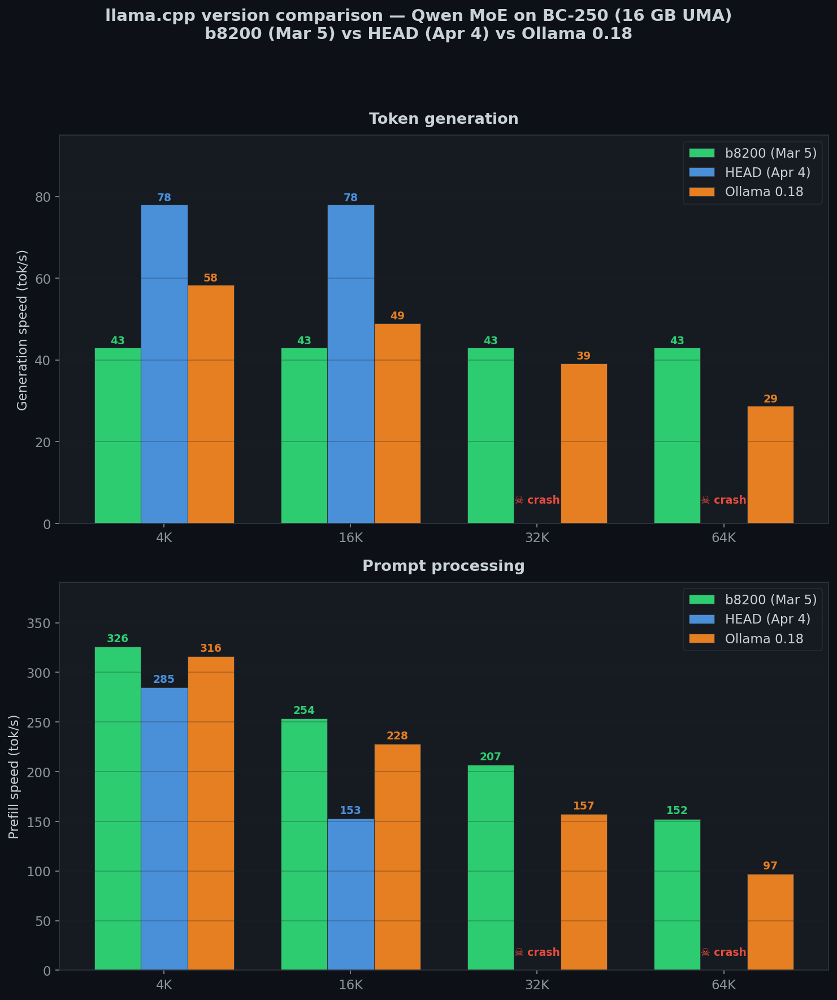

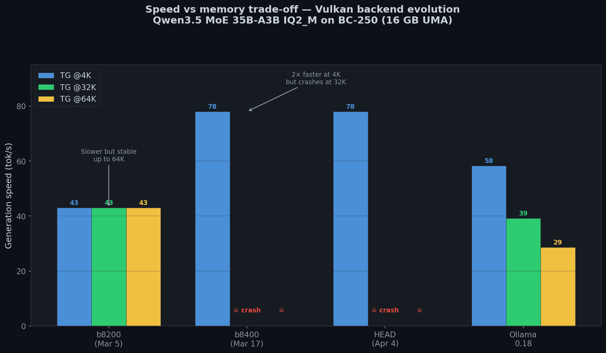

**KV cache quantization — no speed impact on b8200:**

| KV Type | PP @512 | TG @128 | PP @32K | TG @32K |
|---------|--------:|--------:|--------:|--------:|
| Q4_0 | 325.8 | 42.9 | 206.9 | 43.0 |
| Q8_0 | 326.7 | 43.0 | **225.2** | 42.9 |
| F16 | 327.4 | 43.2 | — | — |

Q8_0 is slightly *faster* than Q4_0 at 32K (225 vs 207 PP) — the dequantization overhead from Q4_0 exceeds the memory savings. All three KV types produce identical TG. F16 was not tested at 32K (would likely OOM due to 4× larger KV cache). **Flash attention is mandatory** — Q4_0 KV fails to create a context without FA enabled.

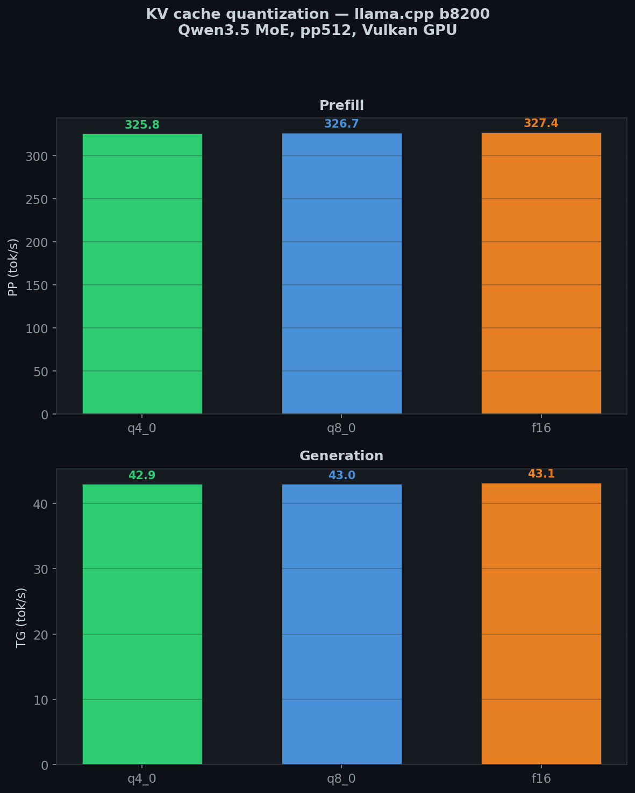

**Additional findings:**

- **CPU-only (ngl=0):** TG=6.1 tok/s — GPU provides 7× acceleration.
- **Flash attention:** No measurable speed difference in this test (42.9 tok/s both with and without FA at f16 KV). FA is required for quantized KV cache support.
- **Gemma 4:** Cannot load on b8200 — architecture support was added later (post-#21406).

**Multi-model b8200 comparison — Ollama vs llama-bench at 4K context:**

To check whether the b8200 overhead pattern generalizes beyond the Qwen MoE, the same llama-bench configuration was tested on several additional models. Three architectures (gemma3, gemma4, qwen3.5) could not load on b8200 — their GGUF format requires architecture support added after b8200's build date.

| Model | Size | Ollama TG | b8200 TG | Ratio | Notes |
|-------|-----:|----------:|---------:|------:|-------|
| llama3.2:3b | 1.9 GiB | 103.8 | 109.5 | 1.05× | Dense, fastest model |
| qwen3:4b | 2.3 GiB | 73.6 | 86.4 | 1.17× | Dense |
| qwen3:8b | 4.9 GiB | 43.1 | 48.3 | 1.12× | Dense |
| deepseek-r1:8b | 4.9 GiB | 43.2 | 48.4 | 1.12× | Dense (DeepSeek-R1 distill) |
| deepseek-r1:14b | 8.4 GiB | 29.0 | 29.2 | 1.01× | Dense |
| Qwen3.5 MoE 35B-A3B | 10.6 GiB | 37.5 | 42.9 | 1.14× | MoE (from context sweep) |
| gemma3:4b | 3.2 GiB | — | — | — | Architecture not supported in b8200 |
| qwen3.5:9b | 6.2 GiB | — | — | — | Architecture not supported in b8200 |
| gemma3:12b | 7.6 GiB | — | — | — | Architecture not supported in b8200 |

b8200 is 1–17% faster than Ollama on models it can load. The pattern — larger gap on smaller/faster models (17% for 4B vs 1% for 14B) — suggests a fixed Vulkan dispatch cost. Ollama TG values from §4.1 under comparable conditions (fresh boot, 4K, single run).

**Context scaling — dense models at 32K (b8200):**

| Model | TG @4K | TG @32K | Change | PP @4K | PP @32K |
|-------|-------:|--------:|-------:|-------:|--------:|
| llama3.2:3b (1.9 GiB) | 109.5 | 109.4 | −0.1% | 702.0 | 201.2 |
| qwen3:8b (4.9 GiB) | 48.3 | 48.4 | +0.1% | 290.4 | 99.8 |
| deepseek-r1:14b (8.4 GiB) | 29.2 | — | OOM | 154.9 | — |

Context-invariant TG holds for dense models too: <0.2% TG change between 4K and 32K. PP degrades as expected (66–71% drop). deepseek-r1:14b (8.4 GiB) could not complete 32K — total with KV cache exceeds UMA budget.

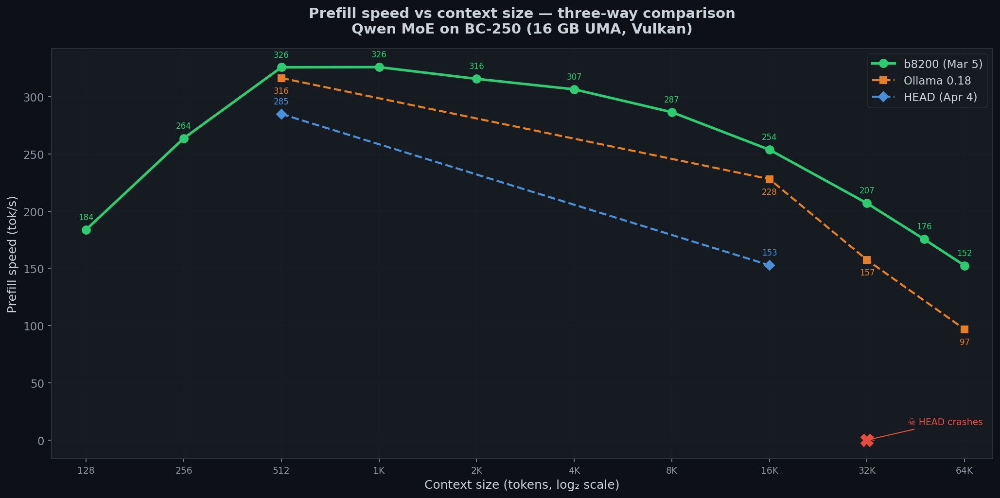

### 4.10b llama-server b8200 — quality and filled-context verification

The benchmarks in §4.10a used `llama-bench`, which measures raw inference speed but cannot evaluate output quality or use filled-context prompts. To close this gap, `llama-server` (also from b8200, `541bf37`) was used to run the same quality tasks (§4.5a) and filled-context tests (§4.5) against 3 models. Quality was tested via both the raw `/completion` API and the OpenAI-compatible `/v1/chat/completions` endpoint.

> **Why b8200?** This build was pinned because it is the last llama.cpp version that handles 64K context on this hardware without crashing (§4.10). Newer builds (~b8400+) roughly doubled generation speed but exceed 16 GB UMA at 32K. llama.cpp Vulkan performance changes meaningfully across versions — these results are specific to b8200 and may not reflect current upstream.

**Setup:** llama-server on port 18080, `-ngl 99 --flash-attn on -ctk q4_0 -ctv q4_0`, single slot (`-np 1`). Ollama stopped during tests. Server restarted per model and per context size for fill tests.

**Quality comparison — `/completion` (raw, no chat template) vs Ollama chat API:**

| Task | MoE 35B (Ollama) | MoE 35B (server) | Qwen3-8B (Ollama) | Qwen3-8B (server) | Llama3.2-3B (Ollama) | Llama3.2-3B (server) |
|------|:---:|:---:|:---:|:---:|:---:|:---:|
| Summarize | 3/3 | 0/3 | 3/3 | 0/3 | 3/3 | 3/3 |
| JSON extract | 3/3 | 2/3 | 3/3 | 0/3 | 3/3 | 0/3 |
| Fact recall | 3/3 | 3/3 | 3/3 | 3/3 | 3/3 | 3/3 |
| Instruction follow | 2/3 | 2/3 | 3/3 | 0/3 | 2/3 | 3/3 |
| Arithmetic | 3/3 | 3/3 | 3/3 | 3/3 | 3/3 | 3/3 |
| **Total** | **14/15** | **10/15** | **15/15** | **6/15** | **14/15** | **12/15** |

> Qwen3-8B's original test run crashed the server mid-benchmark; scores are from a separate re-run under the same configuration.

**Why quality drops:** Qwen3 and Qwen3.5 are thinking models. Without a chat template, the raw `/completion` endpoint triggers `<think>` blocks that inflate sentence counts (summarize fails at 11–18 sentences instead of 3), wrap JSON in reasoning preamble (extraction fails to parse), and generate pseudo-numbered items during reasoning (instruction following miscounts). Tasks checking for keywords or numbers (fact recall, arithmetic) pass regardless — the correct answer appears in the output.

Llama3.2-3B is not a thinking model and scores 12/15. The only failure is JSON extraction: the model appends explanatory text after the JSON object, making the response unparseable.

**Quality comparison — `/v1/chat/completions` (with chat template, `/no_think` for thinking models):**

To check whether the quality gap is purely a template issue, the same tasks were re-run using the `/v1/chat/completions` endpoint. Thinking models received a `/no_think` system message to suppress chain-of-thought.

| Task | MoE 35B (Ollama) | MoE 35B (chat) | Qwen3-8B (Ollama) | Qwen3-8B (chat) | Llama3.2-3B (Ollama) | Llama3.2-3B (chat) |
|------|:---:|:---:|:---:|:---:|:---:|:---:|
| Summarize | 3/3 | 0/3 | 3/3 | 3/3 | 3/3 | 3/3 |
| JSON extract | 3/3 | 0/3 | 3/3 | 3/3 | 3/3 | 3/3 |
| Fact recall | 3/3 | 0/3 | 3/3 | 3/3 | 3/3 | 3/3 |
| Instruction follow | 2/3 | 0/3 | 3/3 | 3/3 | 2/3 | 3/3 |
| Arithmetic | 3/3 | 1/3 | 3/3 | 3/3 | 3/3 | 1/3 |
| **Total** | **14/15** | **1/15** | **15/15** | **15/15** | **14/15** | **13/15** |

Qwen3-8B scores 15/15, matching Ollama exactly. Llama3.2-3B scores 13–15/15 (arithmetic varies across runs). The chat template fully restores quality for both.

MoE 35B-A3B still scores only 1/15 despite `/no_think`. The b8200 binary pre-dates Qwen3.5's release, and its embedded chat template does not suppress thinking for this model architecture. Ollama handles MoE correctly because it maintains its own template library, updated independently of the llama.cpp binary.

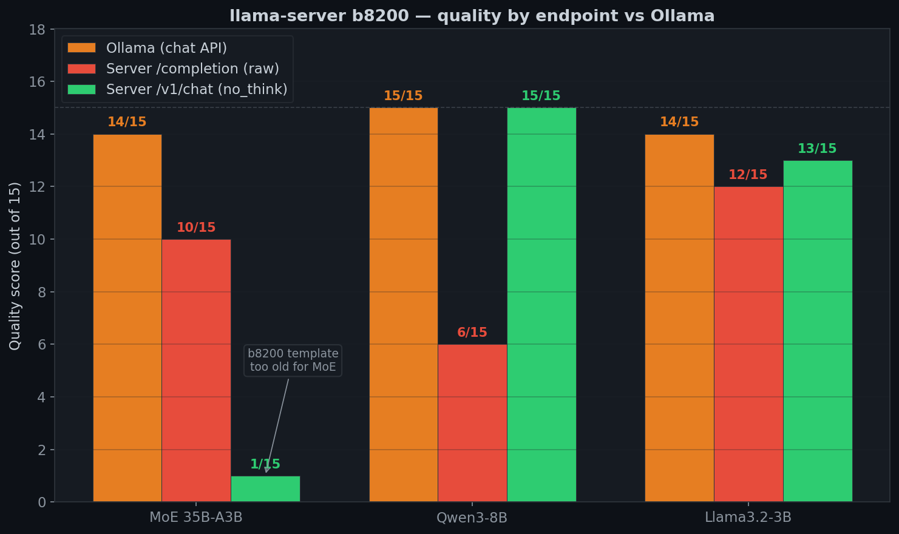

The raw `/completion` endpoint fails thinking models due to missing templates. `/v1/chat/completions` restores full quality for Qwen3-8B and Llama3.2-3B. MoE is a limitation of the b8200 build's outdated template, not the Vulkan backend itself.

**Filled-context speed — llama-server vs Ollama (TG tok/s, 80% fill, Q4_0 KV):**

| Model | Ctx | Ollama TG | Server TG | Change | Notes |
|-------|----:|:---------:|:---------:|:------:|-------|
| MoE 35B-A3B | 4K | 35.7 | 39.8 | **+11%** | |
| MoE 35B-A3B | 8K | 34.2 | 39.4 | **+15%** | |
| MoE 35B-A3B | 16K | 31.9 | 37.6 | **+18%** | Max for server |
| MoE 35B-A3B | 32K | 27.9 | ☠ OOM | — | Server pre-allocates KV → OOM |
| Qwen3-8B | 4K | 39.1 | 41.8 | **+7%** | |
| Qwen3-8B | 8K | 35.4 | 37.8 | **+7%** | |
| Qwen3-8B | 16K | 29.5 | 30.8 | **+4%** | |
| Qwen3-8B | 32K | 21.6 | 22.7 | **+5%** | Server handles 32K |

> All server values measured after a warm-up request to avoid cold-start Vulkan shader compilation affecting results.

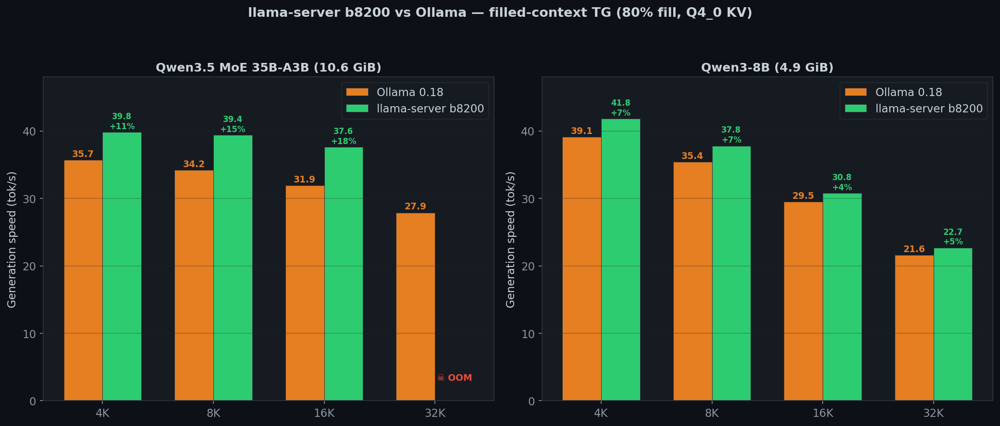

> MoE 35B-A3B llama-server fails to start at 32K/64K context: the 10.6 GiB model + pre-allocated 32K Q4_0 KV cache exceeds the 14.3 GiB usable UMA budget. Ollama manages 64K with the same model (§4.5), likely through lazy KV allocation. llama-bench (§4.10a) also handles 64K — it allocates KV per-test rather than upfront. This confirms the KV pre-allocation hypothesis from §4.10a.

> Llama3.2-3B omitted: showed anomalously low TG (~20 tok/s vs Ollama's 88 tok/s at 4K fill). During quality tests on the same server instance, TG started at 105 tok/s but degraded to ~21 tok/s after several prompts — likely a server state issue in b8200's single-slot `/completion` endpoint. The model itself is not affected (llama-bench shows 109.5 tok/s).

**Prefill (PP tok/s) — llama-server vs Ollama:**

| Model | 4K fill | 8K fill | 16K fill | 32K fill | Degradation |
|-------|--------:|--------:|---------:|---------:|:-----------:|
| MoE 35B (server) | 280 | 277 | 261 | — | −7% (4K→16K) |
| MoE 35B (Ollama) | 239 | — | 215 | 182 | −24% (4K→32K) |
| Qwen3-8B (server) | 266 | 238 | 195 | 136 | −49% (4K→32K) |
| Qwen3-8B (Ollama) | 225 | — | 158 | 111 | −51% (4K→32K) |

> Ollama PP values from §B5.4. MoE PP via server is 17% higher than Ollama at 4K (280 vs 239), consistent with the overhead pattern in §4.10. Qwen3-8B server PP is 18% higher at 4K (266 vs 225). Both degrade monotonically with context size.

**Key findings:**

| # | Finding | Impact |
|:-:|---------|--------|
| 1 | llama-server TG 4–18% faster than Ollama | Confirms §4.10a overhead measurement with real workloads |
| 2 | MoE gap widens with context (11%→18%) | 3 data points; Ollama overhead appears partially context-dependent |
| 3 | MoE max context is 16K on llama-server | Pre-allocated KV cache limits large contexts. Ollama handles 64K+ |
| 4 | Chat API restores quality | `/v1/chat/completions` + `/no_think`: Qwen3-8B 15/15, Llama 13–15/15. MoE limited by b8200 template |
| 5 | Qwen3-8B handles 32K on llama-server | Smaller model (4.9 GiB) leaves room for KV cache |

**Should llama.cpp replace Ollama for scripts and chats?**

Not on this hardware. The `/v1/chat/completions` endpoint restores quality for Qwen3-8B (15/15) and Llama3.2-3B (13–15/15), but MoE still fails on b8200's outdated template. Ollama provides:
- **Chat template management** — b8200's templates pre-date Qwen3.5; Ollama handles all models correctly
- **Lazy KV allocation** — enables 64K context with MoE (llama-server caps at 16K)
- **Model management** — automatic download, switching, keep-alive, unload timers
- **Daemon mode** — systemd integration, health monitoring, hot reload

The 11–18% TG speed advantage is real but insufficient to offset these features. b8200 also cannot load newer architectures (gemma3, gemma4, qwen3.5) — any llama.cpp deployment on this build would be limited to models released before it. The HEAD build supports these models but crashes above 16K context (§4.10).

For batch processing at 4K–16K with supported models, llama-server b8200 offers a measurable speed advantage. For general-purpose chat and scripting, Ollama remains the practical choice.

> **Revisiting these benchmarks.** llama.cpp's Vulkan backend is under active development. Between b8200 and HEAD (~200 commits apart), generation speed roughly doubled while memory usage increased enough to break large contexts. Performance on GFX1013 has changed meaningfully across this range. Re-benchmarking after a few months of upstream development would be worthwhile — especially if newer builds resolve the memory-vs-speed trade-off or improve architecture coverage.

---

# `PART II` — AI Stack

## 5. Signal Chat Bot

The BC-250 runs a personal AI assistant accessible via Signal messenger — no LLM gateway, no agent framework. signal-cli runs as a standalone systemd service exposing a JSON-RPC API, and queue-runner handles all LLM interaction directly.

```
  Signal --> signal-cli (JSON-RPC :8080) --> queue-runner --> Ollama --> GPU (Vulkan)
```

> **Software:** signal-cli v0.13.24 (native binary) · Ollama 0.18+ · queue-runner v7

### 5.1 Why not OpenClaw

OpenClaw was the original gateway (v2026.2.26, Node.js). It was replaced because:

| Problem | Impact |
|---------|--------|
| **~700 MB RSS** | On a 16 GB system, that's 4.4% of RAM consumed by a routing layer |
| **15+ second overhead per job** | Agent turn setup, tool resolution, system prompt injection — for every cron job |
| **Unreliable model routing** | Fallback chains and timeout cascades caused 5-min "fetch failed" errors |
| **No subprocess support** | Couldn't run Python/bash scripts directly — had to shell out through the agent |
| **9.6K system prompt** | Couldn't be trimmed below ~4K tokens without breaking tool dispatch |
| **Orphan processes** | signal-cli children survived gateway OOM kills, holding port 8080 |

The replacement: queue-runner talks to signal-cli and Ollama directly via HTTP APIs. No agent framework in between.

> See [Appendix A](#appendix-a--openclaw-archive) for the original OpenClaw configuration.

### 5.2 signal-cli service

signal-cli runs as a standalone systemd daemon with JSON-RPC ([signal-cli manpage](https://github.com/AsamK/signal-cli/blob/master/man/signal-cli-jsonrpc.5.adoc)). The port, flags, and systemd unit configuration below are local implementation choices — the JSON-RPC API is an upstream feature, but the specific service layout is custom:

```ini
# /etc/systemd/system/signal-cli.service
[Unit]
Description=signal-cli JSON-RPC daemon
After=network.target

[Service]
Type=simple
ExecStart=/opt/signal-cli/bin/signal-cli --output=json \
  -u +<BOT_PHONE> jsonRpc --socket http://127.0.0.1:8080
Restart=always
RestartSec=5

[Install]
WantedBy=multi-user.target
```

Register a separate phone number for the bot via `signal-cli register` or `signal-cli link`.

### 5.3 Chat architecture

Between every queued job, `queue-runner.py` polls the signal-cli journal for incoming messages. Messages are routed based on content type:

```
queue-runner v7 — continuous loop

  job N  →  check Signal inbox  →  route message  →  job N+1
                    |                     |
                    v                     |
            journalctl -u          ┌──────┼──────┐
            signal-cli             │      │      │
                                audio  image   text
                                   │      │      │
                                   v      v      v
                              whisper  qwen3.5  choose_chat_model()
                              -cli     :9b       │
                              (Vulkan) vision    ├─ ≤40K → gemma4-26b-q3
                                   │      │     └─ >40K  → MoE 35B fallback
                                   │      │      │
                                   v      v      v
                              signal-cli: send reply
```

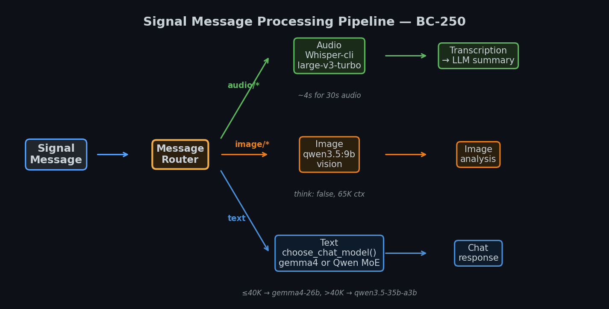

**Key parameters:**

| Setting | Value | Purpose |
|---------|:-----:|---------|
| `SIGNAL_CHAT_MODEL` | gemma4-26b-q3 | Primary chat model (26B MoE, 100% GPU, 100% quality) |
| `SIGNAL_CHAT_CTX` | 49152 | Gemma 4 context ceiling (48K verified filled) |
| `SIGNAL_FALLBACK_MODEL` | qwen3.5-35b-a3b-iq2m | Qwen MoE fallback for prompts >40K tokens |
| `SIGNAL_FALLBACK_CTX` | 65536 | Fallback context (64K) |
| `VISION_MODEL` | qwen3.5:9b | Vision analysis model (multimodal) |
| `VISION_CTX` | 65536 | Vision context — matches global 64K ceiling |
| `ROUTING_GEMMA4_LIMIT` | 40000 | Switch to qwen3.5-35b-a3b-iq2m fallback above this token count |
| `SIGNAL_CHAT_MAX_EXEC` | 3 | Max shell commands per message |
| `SIGNAL_EXEC_TIMEOUT_S` | 30 | Per-command timeout |
| `SIGNAL_MAX_REPLY` | 1800 | Signal message character limit |

### 5.4 Tool use — EXEC

The LLM can request shell commands via `EXEC(command)` in its response. queue-runner intercepts these, runs them, feeds stdout back into the conversation, and lets the LLM synthesize a final answer:

```
  User: "what's the disk usage?"
  LLM:  [thinking...] EXEC(df -h /)
  Runner: executes → feeds output back
  LLM:  "Root is 67% full, 148G free on your 475GB NVMe."
```

Supported patterns: web search (`ddgr`), file reads (`cat`, `head`), system diagnostics (`journalctl`, `systemctl`, `df`, `free`), data queries (`jq` on JSON files). Up to 3 commands per turn.

### 5.5 Image generation via chat

When the LLM detects an image request, it emits `EXEC(/opt/stable-diffusion.cpp/generate-and-send "prompt")`. queue-runner intercepts this pattern and handles it synchronously:

1. Stop Ollama (free GPU VRAM)
2. Run sd-cli with FLUX.2-klein-9B (4 steps, 512×512, ~105s)
3. Send image as Signal attachment
4. Restart Ollama

Bot is offline during generation (~3 minutes total including ESRGAN upscale and model reload).

**Image editing (Kontext):** Send a photo to Signal with an edit instruction ("make it cyberpunk", "add a hat"). The LLM emits `EXEC(/opt/stable-diffusion.cpp/edit-image "instruction")`, queue-runner runs FLUX.1-Kontext-dev with the photo as reference, and sends back the edited image (~5–10 min @512²). Input images are automatically resized to 512×512. See §6.2 for a demo (Sonic → Shadow the Hedgehog).

**Video generation:** Ask for a video/animation. Uses WAN 2.1 T2V 1.3B (~38 min for 17 frames @480×320).

**ESRGAN upscale:** Every generated image is automatically upscaled 4× with RealESRGAN_x4plus (512²→2048² in ~25s). Both versions sent via Signal — thumbnail + full-res. You can also send any photo to chat for a standalone 4× upscale.

> ⚠️ **GFX1013 bug:** sd-cli hangs after writing the output image (Vulkan cleanup). queue-runner polls for the file and kills the process.

### 5.6 Personality — "Clawd"

The system prompt defines a cynical, darkly funny personality ("House MD meets a sysadmin lobster"). Key traits:
- Direct, no corporate speak, no disclaimers
- Dark humor about the hardware constraints
- Full access to `/opt/netscan/data/` for grounded answers
- Knows AK's professional context (embedded Linux, camera drivers, V4L2/libcamera)
- Uncensored creative generation (abliterated model)

The personality is baked into `queue-runner.py`'s `SYSTEM_PROMPT` — no external workspace files needed.

### 5.7 Response times

| Scenario | Latency |
|----------|:-------:|
| Text reply (warm) | 10–30s |
| Complex reasoning with tool use | 1–5 min |
| Image generation (FLUX.2-klein-9B 512²) | ~105s |
| Image generation + auto-upscale 4× | ~130s |
| Image editing (Kontext 512²) | ~5–10 min |
| Video generation (WAN 2.1 480×320) | ~38 min |
| ESRGAN 4× upscale (on-demand) | ~25s |
| Cold start (model reload) | 30–60s |
| Voice note transcription (≤40s) | 3–5s |
| Vision analysis (photo → description) | ~40–80s |

### 5.8 Vision analysis

Send a photo to Signal **without** an edit keyword (no "draw", "generate", "create") and the bot analyzes it using `qwen3.5:9b`'s native multimodal vision. The 9B model processes base64-encoded images via Ollama's `/api/chat` endpoint.

```
  User: [photo of a circuit board] "what chip is this?"
  Router: image + non-edit text → vision analysis (9B)
  9B:    "That's an STM32F407 — the LQFP-100 package, 168 MHz Cortex-M4."
```

**How edit vs. analysis is decided:**

| Input | Keywords detected | Action |
|-------|:-----------------:|--------|
| Photo + "make it cyberpunk" | ✓ edit | → Kontext image editing (§5.5) |
| Photo + "what is this?" | ✗ | → qwen3.5:9b vision analysis |
| Photo (no text) | ✗ | → qwen3.5:9b vision analysis |

**Example — real vision output from the Signal chatbot:**


This photo was sent to the bot with no text. The `qwen3.5:9b` model produced the following description (lightly edited for formatting):

> This is a charming and nostalgic photo featuring two small figurines placed on a blue 3.5-inch floppy disk, which is resting on a gray outdoor table.
>
> **Figurines:**
> - On the left: a black hedgehog with red stripes on his head and yellow muzzle — **Shadow the Hedgehog** from the *Sonic the Hedgehog* series, standing on a small black circular base.
> - On the right: a white Dalmatian puppy wearing a red firefighter helmet and a yellow collar with a red heart tag — **Marshall** from *PAW Patrol*, sitting upright.
>
> **Floppy Disk:** A classic 3.5-inch disk labeled "2HD 1.44 MB" and "INDEX" (upside down in the image). The label area has horizontal lines like lined paper, adding to the retro aesthetic.
>
> **Background:** A blurred garden with green grass, bushes, and string lights with clear glass bulbs hanging above.
>
> **Overall Vibe:** The combination of modern pop culture characters (Shadow and Marshall) with retro tech (floppy disk) creates a fun, geeky, and slightly whimsical display. It's a great blend of nostalgia and fandom!

This is raw model output from a 9.7B parameter model running on the BC-250's Vulkan GPU — no cloud APIs, no preprocessing.

**Second example — vintage laptop in a garden:**

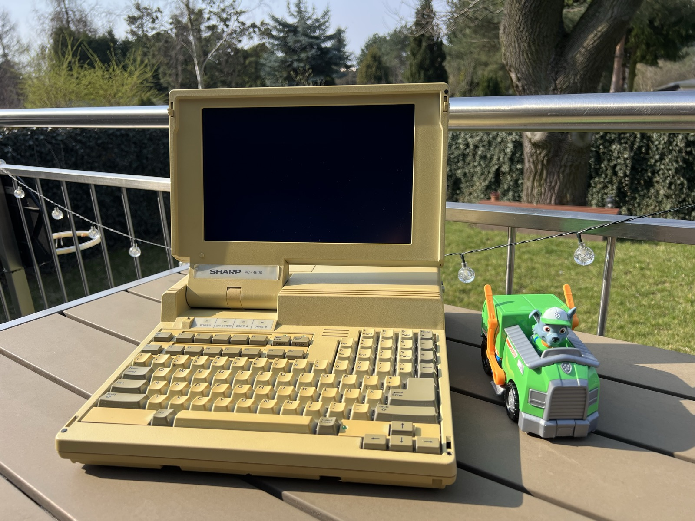

Same model, same hardware, different photo — sent with "Describe this photo in detail":

> This is a carefully composed, sunlit outdoor photograph featuring vintage technology and playful whimsy on a balcony or patio.
>
> **Main Subject — The Vintage Laptop:**
> Centered in the frame is a **Sharp PC-4600**, a rare and highly collectible 1980s Japanese laptop computer. It's housed in a bulky, rectangular chassis with rounded corners, rendered in a muted beige or tan plastic — typical of that era's design aesthetic. The screen is black and turned off, framed by a thick bezel. Below the screen, a silver label reads "SHARP PC-4600." The keyboard layout includes standard QWERTY keys plus function keys, number pad, and system controls like POWER, LOW BATTERY, DRIVE A/B.
>
> **Secondary Object — Paw Patrol Toy Car:**
> To the right of the laptop rests a colorful toy car from the children's show *Paw Patrol*. It's Rocky, the green recycling pup, seated inside his signature garbage truck. The toy features bright green and orange plastic, with gray accents and small wheels. Rocky wears his characteristic white helmet with a paw logo. This juxtaposition creates an amusing contrast between high-tech nostalgia and childhood playthings.
>
> **Setting — Outdoor Balcony/Patio:**
> The scene is set outdoors on a wooden deck or table with slatted planks. Behind the subjects runs a modern metal railing with vertical bars and a horizontal handrail strung with clear, crystal-like bulb lights — some glowing softly, others unlit. Beyond the railing lies a lush garden: green grass, leafy bushes, and tall evergreen trees under a pale blue sky.
>
> **Mood & Atmosphere:**
> The image evokes a sense of quiet nostalgia mixed with lighthearted fun. The vintage computer speaks to the dawn of personal computing — clunky but pioneering — while the Paw Patrol toy injects innocence and humor. The natural backdrop adds serenity and warmth, making it feel like a relaxed afternoon spent admiring curiosities.

**Key detail:** qwen3.5:9b requires `"think": false` in the API call. With thinking enabled, the model produces only hidden thinking tokens and returns an empty visible response. Discovered via 7 iterative tests (tests 1–6 all returned empty content).

> The MoE model (qwen3.5-35b-a3b-iq2m) **did not handle images through the local Ollama/GGUF deployment path** — image requests returned HTTP 500 in this configuration. Although upstream Qwen3.5-35B-A3B is described as a multimodal model ([HuggingFace model card](https://huggingface.co/Qwen/Qwen3.5-35B-A3B), [Ollama library](https://ollama.com/library/qwen3.5)), the local Ollama/GGUF deployment path did not expose working vision capability. Based on this, model routing delegates all image tasks to qwen3.5:9b.

### 5.9 Audio transcription

Send a voice note to Signal and the bot transcribes it using [whisper.cpp](https://github.com/ggml-org/whisper.cpp) with Vulkan GPU acceleration:

```
  User: [voice note, 15 seconds, Polish]
  Router: audio/* → whisper-cli (auto language detection)
  Whisper: "Hej, sprawdź mi pogodę na jutro" (pl, 15.2s audio)
  Router: → feed transcription to LLM for response
  LLM:   "Jutro 18°C, częściowe zachmurzenie..."
```

**Whisper setup on BC-250:**

| Component | Value |
|-----------|-------|
| Runtime | whisper.cpp (Vulkan, built from source) |
| Model | ggml-large-v3-turbo (1.6 GB) |
| Binary | `/opt/whisper.cpp/build/bin/whisper-cli` |
| Threads | 6 (all Zen 2 cores) |
| Language | Auto-detect (EN/PL confirmed) |

#### Why large-v3-turbo, not large-v3?

Both models were benchmarked with real English TTS speech (flite) at three durations. The speed difference is modest (~2×), but **memory is the dealbreaker** — the larger model doesn't fit alongside Ollama in 16 GB.

**Speed comparison:**


| Audio | large-v3-turbo | large-v3 | Speedup |
|:-----:|:--------------:|:--------:|:-------:|
| 3.6s | 3.3s | 7.9s | 2.4× |
| 18.2s | 3.5s | 8.9s | 2.6× |
| 39.2s | 4.3s | 8.1s | 1.9× |

**The memory problem:**

The BC-250 has 16 GB total (UMA — shared between CPU and GPU). The qwen3.5-35b-a3b-iq2m (Qwen MoE) takes 10.6 GB. OS and buffers need ~3.5 GB. That leaves the memory budget looking like this:


| Scenario | Ollama | Whisper | OS/buffers | Total | Fits 16 GB? |
|----------|:------:|:-------:|:----------:|:-----:|:-----------:|
| Ollama only | 10.6 GB | — | 3.5 GB | 14.1 GB | ✅ 1.9 GB free |
| + large-v3-turbo | 10.6 GB | 1.6 GB | 3.5 GB | 15.7 GB | ✅ 0.3 GB free |
| + large-v3 | 10.6 GB | 2.9 GB | 3.5 GB | 17.0 GB | ❌ 1.0 GB overflow → swap |

When the total exceeds 16 GB, the kernel pushes pages to NVMe swap. This shows up as a measurable swap delta:


large-v3 pushes ~1 GB into swap on first load. large-v3-turbo caused no measurable swap increase in testing. Once pages are evicted, subsequent large-v3 runs may show 0 swap delta (the 39s test) because those pages were already swapped out by earlier runs — but the damage (swap pressure, latency spikes) already happened.

**Quality is comparable.** Both models tested on a 39s embedded-systems passage (flite TTS). Both made the same synthesis artifacts ("kilobots" for "kilobytes", "Wipcomer" for "libcamera"). Both showed comparable performance on robotic TTS.

**Verdict:** large-v3-turbo — 2× faster, 45% smaller, no observable swap pressure in testing on this setup. The quality difference was not distinguishable in this testing.

### 5.10 Smart model routing

queue-runner automatically selects the appropriate model for each message based on content:

```python
def choose_chat_model(user_text, has_image=False):
    if has_image:
        return "qwen3.5:9b", 65536      # vision + full 64K context
    if estimate_tokens(user_text) > ROUTING_GEMMA4_LIMIT:
        return "qwen3.5-35b-a3b-iq2m", 65536  # Qwen MoE fallback for >40K
    return "gemma4-26b-q3", 49152              # Gemma MoE primary, 48K ctx
```

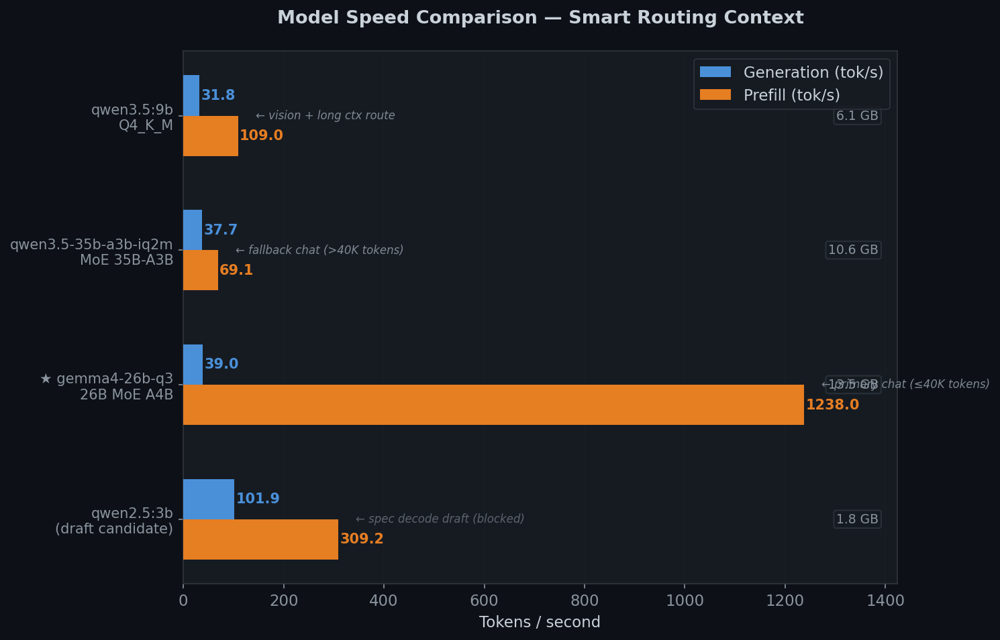

| Route | Model | Speed | When |
|-------|-------|:-----:|------|
| **Default** | gemma4-26b-q3 | 39.0 tok/s | Normal chat (≤40K tokens, most messages) |
| **Fallback** | qwen3.5-35b-a3b-iq2m | 37.5 tok/s | Prompt > 40K tokens |
| **Vision** | qwen3.5:9b | 31.7 tok/s | Photo attached (no edit keywords) |

The gemma4-26b-q3 (Gemma MoE, 128 experts, 8+1 active, ~3.8B active/token) is the primary chat model — fastest at 39.0 tok/s, 100% GPU offload, 100% quality score. The qwen3.5-35b-a3b-iq2m (Qwen MoE, 35B total, 3B active/token, 37.5 tok/s) serves as fallback when prompts exceed 40K tokens, where gemma4's 48K ceiling leaves insufficient headroom. Both are MoE architectures, but with very different expert configurations. The 9B is reserved for vision — a capability neither MoE exposes in local Ollama runtime.

---

## 6. Image Generation

Stable Diffusion via [stable-diffusion.cpp](https://github.com/leejet/stable-diffusion.cpp) with native Vulkan backend.

<details>
<summary>▸ Build from source</summary>

```bash
sudo dnf install -y vulkan-headers vulkan-loader-devel glslc git cmake gcc g++ make
cd /opt && sudo git clone --recursive https://github.com/leejet/stable-diffusion.cpp.git
sudo chown -R $(whoami) /opt/stable-diffusion.cpp && cd stable-diffusion.cpp
mkdir -p build && cd build && cmake .. -DSD_VULKAN=ON -DCMAKE_BUILD_TYPE=Release
make -j$(nproc)
```

</details>

### 6.1 Models

**FLUX.2-klein-9B** — recommended, best visual quality observed in side-by-side testing, Apache 2.0:

```bash
mkdir -p /opt/stable-diffusion.cpp/models/flux2 && cd /opt/stable-diffusion.cpp/models/flux2
# Diffusion model (9B, Q4_0, 5.3 GB)
curl -L -O "https://huggingface.co/leejet/FLUX.2-klein-9B-GGUF/resolve/main/flux-2-klein-9b-Q4_0.gguf"
# Qwen3-8B text encoder (Q4_K_M, 4.7 GB)
curl -L -o qwen3-8b-Q4_K_M.gguf "https://huggingface.co/unsloth/Qwen3-8B-GGUF/resolve/main/Qwen3-8B-Q4_K_M.gguf"
# FLUX.2 VAE (321 MB) — different from FLUX.1 VAE!
curl -L -o flux2-vae.safetensors "https://huggingface.co/Comfy-Org/vae-text-encorder-for-flux-klein-4b/resolve/main/split_files/vae/flux2-vae.safetensors"
```

> Memory: 5.3 GB VRAM (diffusion) + 6.2 GB VRAM (Qwen3-8B encoder) + 95 MB (VAE) = ~11.8 GB total. Uses 11.8 of the 16.5 GB Vulkan pool.

**FLUX.2-klein-4B** — fast alternative, Apache 2.0:

```bash
cd /opt/stable-diffusion.cpp/models/flux2
# Diffusion model (4B, Q4_0, 2.3 GB)
curl -L -O "https://huggingface.co/leejet/FLUX.2-klein-4B-GGUF/resolve/main/flux-2-klein-4b-Q4_0.gguf"
# Qwen3-4B text encoder (Q4_K_M, 2.4 GB)
curl -L -o qwen3-4b-Q4_K_M.gguf "https://huggingface.co/unsloth/Qwen3-4B-GGUF/resolve/main/Qwen3-4B-Q4_K_M.gguf"
# Reuses same flux2-vae.safetensors from above
```

> Memory: 2.3 GB VRAM (diffusion) + 3.6 GB VRAM (Qwen3-4B encoder) + 95 MB (VAE) = ~6 GB total. 7× faster than 9B but lower quality. Good for quick previews.

**FLUX.1-schnell** — previous default, Apache 2.0:

```bash
mkdir -p /opt/stable-diffusion.cpp/models/flux && cd /opt/stable-diffusion.cpp/models/flux
curl -L -O "https://huggingface.co/second-state/FLUX.1-schnell-GGUF/resolve/main/flux1-schnell-q4_k.gguf"
curl -L -O "https://huggingface.co/second-state/FLUX.1-schnell-GGUF/resolve/main/ae.safetensors"
curl -L -O "https://huggingface.co/second-state/FLUX.1-schnell-GGUF/resolve/main/clip_l.safetensors"
curl -L -O "https://huggingface.co/city96/t5-v1_1-xxl-encoder-gguf/resolve/main/t5-v1_1-xxl-encoder-Q4_K_M.gguf"
```

> Memory: 6.5 GB VRAM (diffusion) + 2.9 GB RAM (T5-XXL Q4_K_M) = ~10 GB total.

**Chroma flash Q4_0** — alternative, open-source:

> Download from [Chroma-GGUF repo](https://huggingface.co/leejet/Chroma-GGUF/tree/main) — exact filenames may change between versions. Reuses existing T5-XXL and FLUX.1 ae.safetensors from above.

> Memory: 5.1 GB VRAM (diffusion) + 3.2 GB RAM (T5-XXL) = ~8.4 GB total.

**SD-Turbo** — fast fallback, lower quality:

```bash
cd /opt/stable-diffusion.cpp/models
curl -L -o sd-turbo.safetensors \
  "https://huggingface.co/stabilityai/sd-turbo/resolve/main/sd_turbo.safetensors"
```

### 6.2 Performance

*sd.cpp master-504-636d3cb, Vulkan GFX1013 (16.5 GiB), Ollama stopped.*

> **Important:** FLUX GGUF files must use `--diffusion-model` flag, not `-m`. The `-m` flag fails with "get sd version from file failed" because GGUF metadata is empty after tensor name conversion. FLUX.2-klein models must use `--llm` (not `--t5xxl`) for the Qwen3 encoder — the tensor naming differs between LLM and T5 architectures.

**🏆 FLUX.2-klein-9B Q4_0 — default (best visual quality observed in side-by-side testing):**

| Resolution | Steps | Time | s/step | Notes |
|:----------:|:-----:|:----:|:------:|-------|
| 512×512 | 4 | **67s** | 16.8 | Default, ~11.8 GB VRAM total |
| 768×768 | 4 | **97s** | 24.2 | VAE tiling |
| 1024×1024 | 4 | **147s** | 36.8 | VAE tiling |
| 512×512 | 8 | ❌ FAIL | — | OOM at higher step count |

> FLUX.2-klein-9B uses a Qwen3-8B LLM as text encoder — in this testing, it showed better prompt following and finer detail than the 4B variant. Uses 11.8 GB of the 16.5 GB Vulkan pool. The `--offload-to-cpu` and `--llm` flags are required.

**FLUX.2-klein-4B Q4_0 — fast alternative:**

| Resolution | Steps | Time | s/step | Notes |
|:----------:|:-----:|:----:|:------:|-------|
| 512×512 | 4 | **37s** | 9.2 | Fast preview, ~6 GB VRAM total |
| 768×768 | 4 | **52s** | 13.0 | VAE tiling |
| 1024×1024 | 4 | **82s** | 20.5 | VAE tiling |
| 512×512 | 8 | **42s** | 5.2 | GPU warm, more quality |
| 1024×1024 | 8 | **122s** | 15.2 | VAE tiling |

> 2× faster than 9B. Good for quick previews or batch generation. 1024² works reliably at both 4 and 8 steps.

**FLUX.1-schnell Q4_K — previous default:**

| Resolution | Steps | Time | Notes |
|:----------:|:-----:|:----:|-------|
| 512×512 | 4 | **107s** | ~10 GB VRAM (6.5 diffusion + 3.4 encoders) |
| 768×768 | 4 | **92s** | VAE tiling |
| 1024×1024 | 4 | **148s** | VAE tiling, good quality |

**FLUX.1-kontext-dev Q4_0 — image editing:**

| Resolution | Steps | Time | Notes |
|:----------:|:-----:|:----:|-------|
| 512×512 | 20 | **132s** | Uses `-r` flag for reference image, CLIP+T5 |
| 768×768 | 20 | **282s** | VAE tiling |

> Kontext is a dedicated image editing model. Takes a reference image via `-r` and a text instruction to produce an edited version.

**Chroma flash Q4_0 — quality alternative (reuses T5+VAE from FLUX.1):**

| Resolution | Steps | Time | Notes |
|:----------:|:-----:|:----:|-------|
| 512×512 | 4 | **67s** | T5-XXL encoder |
| 512×512 | 8 | **97s** | Better quality |
| 768×768 | 8 | **158s** | VAE tiling |

**FLUX.1-dev Q4_K_S — high-quality, slow (city96/FLUX.1-dev-gguf, 6.8 GB):**

| Resolution | Steps | Time | Notes |
|:----------:|:-----:|:----:|-------|
| 512×512 | 20 | **167s** | ~6.6 GB VRAM |
| 768×768 | 20 | ❌ FAIL | Guidance model compute graph exceeds VRAM |

**SD3.5-medium Q4_0:**

| Resolution | Steps | Time | Notes |
|:----------:|:-----:|:----:|-------|
| 512×512 | 28 | **102s** | CLIP-L + CLIP-G + T5-XXL |
| 768×768 | 28 | **192s** | VAE tiling |
| 1024×1024 | 28 | **337s** | VAE tiling |

**SD-Turbo — fast fallback:**

| Resolution | Steps | Time | Notes |
|:----------:|:-----:|:----:|-------|
| 512×512 | 1 | **22s** | Minimum viable, ~2 GB VRAM |
| 512×512 | 4 | **27s** | |
| 768×768 | 4 | **32s** | Decent for quick previews |
| 1024×1024 | 4 | **62s** | VAE tiling — newly tested, works |

**Head-to-head comparison (512×512, same prompt, seed 42):**

| Model | Time @512² | Steps | VRAM | Encoder |
|-------|:----------:|:-----:|:----:|:-------:|
| **SD-Turbo** | **27s** | 4 | 2 GB | built-in |
| **FLUX.2-klein-4B** | **37s** | 4 | 6 GB | Qwen3-4B (`--llm`) |
| **FLUX.2-klein-9B** | **67s** | 4 | 11.8 GB | Qwen3-8B (`--llm`) |
| **Chroma flash** | **67s** | 4 | 8.4 GB | T5-XXL |
| **SD3.5-medium** | **102s** | 28 | 6 GB | CLIP+T5 |
| **FLUX.1-schnell** | **107s** | 4 | 10 GB | CLIP+T5 |
| **FLUX.1-kontext-dev** | **132s** | 20 | 10 GB | CLIP+T5 (+ ref image) |
| **FLUX.1-dev** | **167s** | 20 | 10 GB | CLIP+T5 |

> FLUX.2-klein-9B replaces schnell as the preferred default: **faster** (67s vs 107s @512²) and subjectively better in prompt following and fine detail during side-by-side tests. klein-4B is the speed champion (37s) when quality can be traded.

**Summary: recommended settings for production**

| Use case | Model | Resolution | Steps | Time |
|----------|-------|:----------:|:-----:|:----:|
| **Default (Signal)** | **FLUX.2-klein-9B** | **512×512** | **4** | **~67s** |
| **High quality** | **FLUX.2-klein-9B** | **768×768** | **4** | **~97s** |
| Quick preview | FLUX.2-klein-4B | 512×512 | 4 | ~37s |
| Poster/wallpaper | FLUX.2-klein-4B | 1024×1024 | 8 | ~122s |
| Highest quality (slow) | Chroma flash | 512×512 | 8 | ~97s |

```bash
# FLUX.2-klein-9B — recommended production command:
/opt/stable-diffusion.cpp/build/bin/sd-cli \
  --diffusion-model models/flux2/flux-2-klein-9b-Q4_0.gguf \
  --vae models/flux2/flux2-vae.safetensors \
  --llm models/flux2/qwen3-8b-Q4_K_M.gguf \
  -p "your prompt here" \
  --cfg-scale 1.0 --steps 4 -H 512 -W 512 \
  --offload-to-cpu --diffusion-fa -v \
  -o output.png
```

### 6.2.1 Upgrade roadmap — beyond the current stack

sd.cpp (master-504+) supports more models. The BC-250 has ~16.5 GB with Ollama stopped (post-GTT migration). All models use `--offload-to-cpu` (UMA — no PCIe penalty).

**Image generation — tested models:**

| Model | Params | GGUF Size | Total RAM¹ | Steps | Quality | Status |
|-------|:------:|:---------:|:----------:|:-----:|:-------:|--------|
| **FLUX.2-klein-9B Q4_0** | **9B** | **5.3 GB** | **~11.8 GB** | **4** | **★★★★** | **✅ Current default, 67s @512²** |
| FLUX.2-klein-4B Q4_0 | 4B | 2.3 GB | ~6 GB | 4 | ★★★ | ✅ Fast alternative, 37s @512² |
| FLUX.1-schnell Q4_K | 12B | 6.5 GB | ~10 GB | 4 | ★★ | ✅ Previous default, 107s @512² |
| Chroma flash Q4_0 | 12B | 5.1 GB | ~8.4 GB | 4–8 | ★★★ | ✅ Tested — 67s @512², good quality |
| FLUX.1-dev Q4_K_S | 12B | 6.8 GB | ~10 GB | 20 | ★★★★ | ✅ Tested — 167s @512², ❌768²+ |
| SD-Turbo | 1.1B | ~2 GB | ~2.5 GB | 1–4 | ★ | ✅ Fast preview, 22s @512² |
| SD3.5-medium Q4_0 | 2.5B | 1.7 GB | ~6 GB | 28 | ★★★ | ✅ Tested — 102s @512², scales to 1024² (337s) |

> ¹ Total RAM includes diffusion model + text encoder(s) + VAE.
>
> ³ BF16 VAE gotcha — see SD3.5 section below.

**Video generation — tested models:**

| Model | Params | GGUF Size | Total RAM¹ | Frames | Time | Status |
|-------|:------:|:---------:|:----------:|:------:|:----:|--------|
| **WAN 2.1 T2V 1.3B Q4_0** | **1.3B** | **826 MB** | **~5 GB** | **17 @480×320** | **~38 min** | **✅ Works on BC-250** |

> WAN requires umt5-xxl text encoder (3.5 GB Q4_K_M) + WAN VAE (243 MB). Outputs raw AVI (MJPEG). No matrix cores = slow but works.

**Video generation — tested (OOM):**

| Model | Params | GGUF Size | Total RAM¹ | Notes |
|-------|:------:|:---------:|:----------:|-------|
| WAN 2.2 TI2V 5B Q4_0 | 5B | 2.9 GB | **~9 GB** | **❌ OOM crash at Q4_0.** Model (2.9G) + VAE (1.4G) + T5 (4.7G) = 9 GB — exceeds UMA budget during video denoising. May work with Q2_K model + Q2_K T5 (~6 GB) but untested. |

**Image editing — FLUX.1-Kontext-dev:**

| Model | Params | GGUF Size | Total RAM¹ | Status |
|-------|:------:|:---------:|:----------:|--------|
| FLUX.1-Kontext-dev Q4_0 | 12B | 6.8 GB | ~10 GB | ✅ Tested — 132s @512² (20 steps), 282s @768². Uses `-r` flag, reuses FLUX.1 T5/CLIP/VAE |

> Kontext is a dedicated image editing model by Black Forest Labs. It takes a reference image via `-r` and a text instruction to produce an edited version. Uses existing FLUX.1 encoders (T5-XXL, CLIP_L) and VAE (ae.safetensors) from `/opt/stable-diffusion.cpp/models/flux/`.
> ```bash
> # Edit an existing image with Kontext:
> sd-cli --diffusion-model models/flux/flux1-kontext-dev-Q4_0.gguf \
>   --vae models/flux/ae.safetensors --clip_l models/flux/clip_l.safetensors \
>   --t5xxl models/flux/t5-v1_1-xxl-encoder-Q4_K_M.gguf --clip-on-cpu \
>   -r input.png -p "change the sky to sunset" --cfg-scale 3.5 --steps 28 \
>   --sampling-method euler --offload-to-cpu --diffusion-fa -o output.png
> ```

**Kontext demo — "turn Sonic into Shadow the Hedgehog":**

| Input (1200×1600 → resized to 512×512) | Output (512×512, 647s) | Output + ESRGAN 4× (2048×2048, +25s) |
|:---:|:---:|:---:|
| 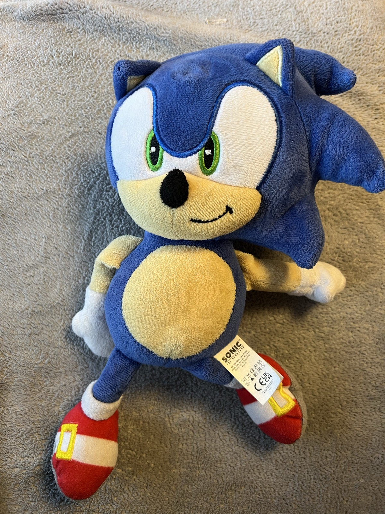 |  |  |

> The 4× upscaled version (right) is generated automatically by the ESRGAN auto-upscale pipeline — every generated/edited image gets a 2048×2048 version sent alongside the 512×512 original. Total overhead: ~25s with tile 192. See ESRGAN benchmarks below.

#### SD3.5-medium benchmark details

**Timing breakdown (512×512, 28 steps, seed 42):**

| Phase | Time | Notes |
|-------|:----:|-------|
| CLIP + T5 encoding | ~4s | clip_l + clip_g + t5-v1_1-xxl Q4_K_M |
| Diffusion sampling | ~95s | 28 steps × ~3.4s/it (mmdit 2.1 GB on Vulkan) |
| VAE decode | ~3s | F16-converted VAE (94.6 MB) |
| **Total** | **102s** | |

**Resolution scaling:**

| Resolution | Steps | Time | s/step |
|:----------:|:-----:|:----:|:------:|
| 512×512 | 28 | **102s** | 3.6 |
| 768×768 | 28 | **192s** | 6.9 |
| 1024×1024 | 28 | **337s** | 12.0 |

**Model stack on disk:**

| Component | File | Size |
|-----------|------|:----:|
| Diffusion | sd3.5_medium-q4_0.gguf | 1.7 GB |
| CLIP-L | clip_l.safetensors (shared with FLUX) | 246 MB |
| CLIP-G | clip_g.safetensors | 1.3 GB |
| T5-XXL | t5-v1_1-xxl-encoder-Q4_K_M.gguf (shared with FLUX) | 2.9 GB |
| VAE | sd3_vae_f16.safetensors (converted from BF16) | 160 MB |
| **Total on disk** | | **~6.3 GB** |

```bash
# SD3.5-medium generation command:
sd-cli --diffusion-model models/sd3/sd3.5_medium-q4_0.gguf \
  --vae models/sd3/sd3_vae_f16.safetensors \
  --clip_l models/flux/clip_l.safetensors \
  --clip_g models/sd3/clip_g.safetensors \
  --t5xxl models/flux/t5-v1_1-xxl-encoder-Q4_K_M.gguf \
  -p "prompt" --cfg-scale 4.5 --sampling-method euler --steps 28 \
  -W 512 -H 512 --diffusion-fa --offload-to-cpu -o output.png
```

> **⚠ BF16 VAE gotcha:** The upstream SD3 VAE (`diffusion_pytorch_model.safetensors`) uses BF16 tensors. In this setup (RADV Mesa 25.3.4), GFX1013 Vulkan did not handle BF16 tensors — the output was a solid blue/yellow rectangle. Fix: convert to F16 with `python3 convert_vae_bf16_to_f16.py input.safetensors output.safetensors` (script in `/tmp/`).

#### WAN 2.1 T2V 1.3B benchmark details

**Timing breakdown (480×320, 17 frames, 50 steps, seed 42):**

| Phase | Time | Notes |
|-------|:----:|-------|
| umt5-xxl encoding | ~4s | 3.5 GB Q4_K_M text encoder |
| Diffusion sampling | ~35 min | 17 frames × 50 steps. No matrix cores → pure scalar Vulkan |
| VAE decode | ~30s | WAN VAE (243 MB), decodes all 17 frames |
| **Total** | **~38 min** | |

**Model stack on disk:**

| Component | File | Size |
|-----------|------|:----:|
| Diffusion | Wan2.1-T2V-1.3B-Q4_0.gguf | 826 MB |
| Text encoder | umt5-xxl-encoder-Q4_K_M.gguf | 3.5 GB |
| VAE | wan_2.1_vae.safetensors | 243 MB |
| **Total on disk** | | **~4.5 GB** |

```bash
# WAN 2.1 text-to-video generation:
sd-cli -M vid_gen \
  --diffusion-model models/wan/Wan2.1-T2V-1.3B-Q4_0.gguf \
  --vae models/wan/wan_2.1_vae.safetensors \
  --t5xxl models/wan/umt5-xxl-encoder-Q4_K_M.gguf \
  -p "A cat walking across a sunny garden" \
  --cfg-scale 6.0 --sampling-method euler \
  -W 480 -H 320 --diffusion-fa --offload-to-cpu \
  --video-frames 17 --flow-shift 3.0 -o output.mp4
```

> **Output format:** sd.cpp produces raw AVI (MJPEG) regardless of the `-o` extension. The 17-frame clip plays at 16 fps (~1 second). Quality is recognizable but noisy — expected at Q4_0 with scalar-only Vulkan compute.
>
> **Why so slow?** Each video frame is a full diffusion pass through the 1.3B model. With 17 frames × 50 steps × no matrix cores, every multiply is scalar. A GPU with tensor/matrix units (RDNA3+, Turing+) would likely be substantially faster.

**WAN 2.1 demo — "A cat walking across a sunny garden":**

<p align="center">
  
</p>

> 17 frames @480×320, 50 steps, Q4_0 quantization, EUR scheduler, cfg-scale 6.0. Generated in **~38 minutes** on GFX1013 scalar Vulkan — no matrix/tensor cores. Noisy but recognizable — generated by a 1.3B parameter model on a secondhand BC-250.

#### ESRGAN 4× upscale benchmarks

All generated images are automatically upscaled with RealESRGAN_x4plus (64 MB model, 4× scaling). Runs immediately after generation while Ollama is still stopped — no additional GPU memory contention.

**ESRGAN tile size benchmark (512² input → 2048² output):**

| Tile Size | Time | Output | Notes |
|:---------:|:----:|:------:|-------|
| 128 (default) | **22s** | 2048×2048 | Fastest |
| **192 (production)** | **22s** | 2048×2048 | **Best observed quality/speed** |
| 256 | **22s** | 2048×2048 | No visible difference at this input size |
| 128 ×2 passes (16×!) | **4m 50s** | **8192×8192, 67 MB** | 512²→8192² in under 5 min |

> Production uses tile 192: larger tiles mean fewer seam boundaries → cleaner upscale. The 16× mode (two ESRGAN passes) produces **67-megapixel images from 512² input** — available on-demand via `EXEC(upscale ...)` but not automatic (too large for Signal).

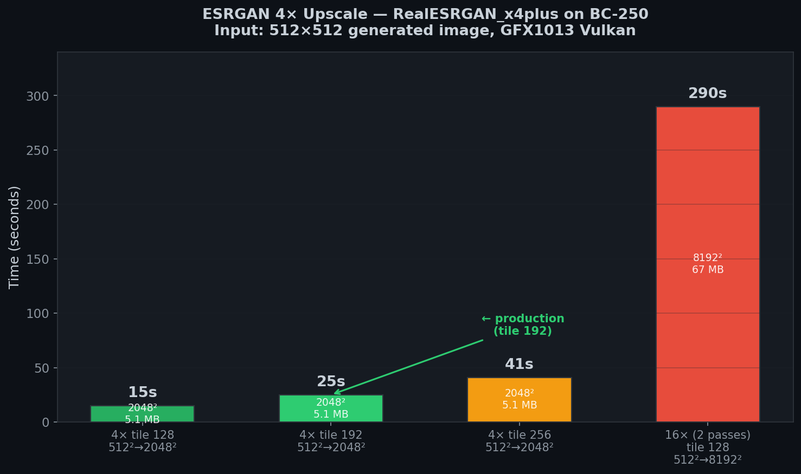

> **Chart note:** The ESRGAN chart above was generated from an earlier benchmark run. Current tile-size timings are in the table above; the chart's per-tile times are stale.

#### Image/video pipeline timing

> **Chart note:** The three charts below were generated against sd.cpp master-525. Production was reverted to master-504 due to a FLUX.2-klein tensor naming regression (see §12). The tables in §6.2 and B9 reflect master-504 timings and are authoritative; the charts are preserved for relative comparison only.

End-to-end timing (sd.cpp master-525, not current production):

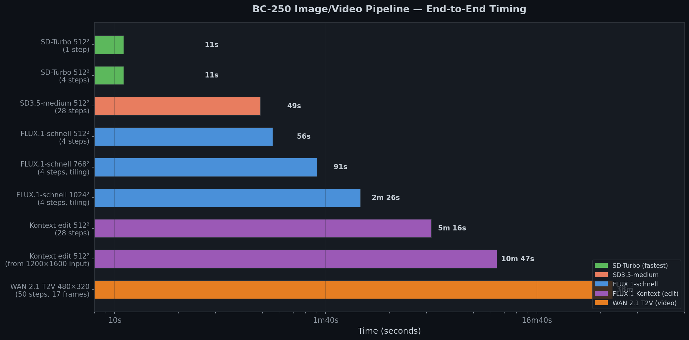

**Phase breakdown** — where the time goes in each pipeline:

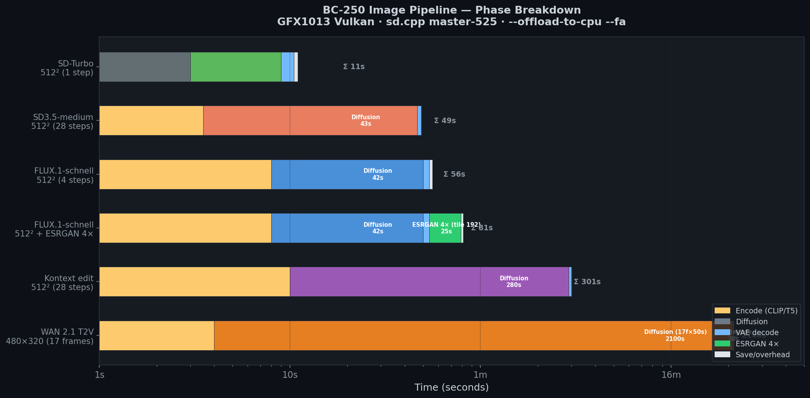

**FLUX.1-schnell resolution scaling** — time vs pixel count (FLUX.1-schnell only; does not include FLUX.2-klein, the current production default):

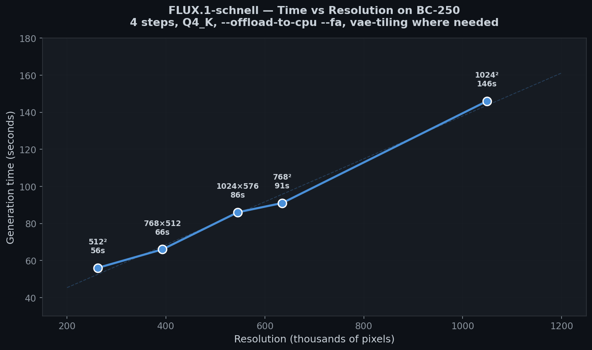

---

# `PART III` — Monitoring & Intelligence

## 7. Netscan Ecosystem

A research, monitoring, and data collection system with **330 autonomous jobs** running on a GPU-constrained single-board computer. Dashboard at `http://<LAN_IP>:8888` — 29 main pages + 101 per-host detail pages.

### 7.1 Architecture — queue-runner v7

The BC-250 has 16 GB GTT shared with the CPU — only **one LLM job can run at a time**. `queue-runner.py` (systemd service) orchestrates all 330 jobs in a continuous loop, with Signal chat between every job:

```
queue-runner v7 -- Continuous Loop + Signal Chat

Cycle N:
  330 jobs sequential, ordered by category:
  scrape -> infra -> lore -> academic -> repo -> company -> career
         -> think -> csi -> meta -> market -> report
  HA observations interleaved every 50 jobs
  Signal inbox checked between EVERY job
  Chat processed with LLM (EXEC tool use + image gen)
  Crash recovery: resumes from last completed job

Cycle N+1:
  Immediately starts -- no pause, no idle windows
  No nightly/daytime distinction
```

**Key design decisions (v5 → v7):**

| v5 (OpenClaw era) | v7 (current) |
|--------------------|--------------|
| Nightly batch + daytime fill | Continuous loop, no distinction |
| 354 jobs (including duplicates) | 330 jobs (deduped, expanded) |
| LLM jobs routed through `openclaw cron run` | All jobs run as direct subprocesses |
| Signal via OpenClaw gateway (~700 MB) | signal-cli standalone (~100 MB) |
| Chat only when gateway available | Chat between every job |
| Async SD pipeline (worker scripts, 45s delay) | Synchronous SD (stop Ollama → generate → restart) |
| GPU idle detection for user chat preemption | No preemption needed — chat is interleaved |

**All jobs run as direct subprocesses** — `subprocess.Popen` for Python/bash scripts, no LLM agent routing. In testing, this was roughly 3–10× faster than the old `openclaw cron run` path, eliminating the gateway dependency entirely.

### 7.1.1 Queue ordering

The queue prioritizes **data diversity** — all dashboard tabs get fresh data even if the cycle is interrupted. See §7.3 for the full category breakdown with GPU times. HA observations are interleaved every 50 jobs, and Signal chat is checked between every job.

### 7.1.2 GPU idle detection

GPU idle detection is used for legacy `--daytime` mode and Ollama health checks:

```python
# Three-tier detection:
# 1. Ollama /api/ps → no models loaded → appears idle
# 2. sysfs pp_dpm_sclk → clock < 1200 MHz → model loaded but not computing
# 3. Ollama expires_at → model about to unload → idle for 3+ min
```

In continuous loop mode (default), GPU detection is only used for pre-flight health checks — not for yielding to user chat, since chat is interleaved between jobs.

### 7.2 Scripts

**GPU jobs** (queue-runner — sequential, one at a time):

| Script | Purpose | Jobs |
|--------|---------|:----:|
| `career-scan.py` | Two-phase career scanner (§8) | 1 |
| `career-think.py` | Per-company career deep analysis | 65 |
| `salary-tracker.py` | Salary intel — NoFluffJobs, career-scan extraction | 1 |
| `company-intel.py` | Deep company intel — GoWork, DDG news, layoffs (43 entities) | 1 |
| `company-think-*` | Focused company deep-dives | 106 |
| `patent-watch.py` | IR/RGB camera patent monitor — Google Patents, EPO OPS, DuckDuckGo | 1 |
| `event-scout.py` | Meetup/conference tracker — Poland, Europe | 1 |
| `leak-monitor.py` | CTI: 11 OSINT sources — HIBP, Hudson Rock, GitHub dorks, Ahmia dark web, CISA KEV, ransomware, Telegram | 1 |
| `idle-think.sh` | Research brain — 8 task types → JSON notes | 34 |
| `ha-journal.py` | Home Assistant analysis (climate, sensors, anomalies) | 2 |
| `ha-correlate.py` | HA cross-sensor correlation | 2 |
| `city-watch.py` | SkyscraperCity local construction tracker | 1 |
| `csi-sensor-watch.py` | CSI camera sensor patent/news monitor | 1 |
| `csi-think.py` | CSI camera domain analysis (drivers, ISP, GMSL) | 6 |
| `lore-digest.sh` | Kernel mailing list digests (8 feeds) | 8 |
| `repo-watch.sh` | Upstream repos (GStreamer, libcamera, v4l-utils, FFmpeg, LinuxTV) | 8 |
| `repo-think.py` | LLM analysis of repo changes | 26 |
| `market-think.py` | Market sector analysis + synthesis | 19 |
| `life-think.py` | Cross-domain life advisor | 2 |
| `system-think.py` | GPU/security/health system intelligence | 3 |
| `radio-scan.py` | Radio hobbyist forum tracker | 1 |
| `career-digest.py` | Weekly career digest → Signal (Sunday) | 1 |
| `daily-summary.py` | End-of-cycle summary → dashboard + Signal | 2 |
| `academic-watch.py` | Academic publication monitor (4 topics × 3 types) | 12 |
| `book-watch.py` | Book/publication tracker (11 subjects) | 11 |
| `news-watch.py` | Tech news aggregation + RSS | 2 |
| `weather-watch.py` | Weather forecast + HA sensor correlation | 2 |
| `car-tracker.py` | GPS car tracker (SinoTrack API) | 1 |
| `frost-guard.py` | Frost/freeze risk alerter | 1 |

**CPU jobs** (system crontab — independent of queue-runner):

| Script | Frequency | Purpose |
|--------|-----------|---------|
| `gpu-monitor.sh` + `.py` | 1 min | GPU utilization sampling (3-state) |
| `presence.sh` | 5 min | Phone presence tracker |
| `syslog.sh` | 5 min | System health logger |
| `watchdog.py` | 30 min (live), 06:00 (full) | Network security — ARP, DNS, TLS, vulnerability scoring |
| `scan.sh` + `enumerate.sh` | 04:00 | Network scan + enumeration (nmap) |
| `vulnscan.sh` | Weekly (Sun) | Vulnerability scan |
| `repo-watch.sh` | 08:00, 14:00, 18:00 | Upstream repo data collection |
| `report.sh` | 08:30 | Morning report rebuild |
| `generate-html.py` | After each queue-runner job | Dashboard HTML builder (6900+ lines) |
| `gpu-monitor.py chart` | 22:55 | Daily GPU utilization chart |

### 7.3 Job scheduling — queue-runner v7

**Job categories** (auto-classified by name pattern):

| Category | Jobs | Typical GPU time | Examples |
|----------|:----:|:----------------:|---------|
| `scrape` | 29 | 0.1h | career-scan, salary, patents, book-watch, repo-scan (no LLM) |
| `infra` | 6 | 0.6h | leak-monitor, netscan, watchdog, frost-guard, radio-scan |
| `lore` | 8 | 0.5h | lore-digest per mailing list feed |
| `academic` | 12 | — | academic-watch per topic × type |
| `repo` | 27 | 0.3h | LLM analysis of repo changes + weekly digest |
| `company` | 107 | 0.9h | company-intel + competitive/financial/strategy deep-dives |
| `career` | 66 | 1.9h | career-think per company + weekly digest |
| `think` | 34 | 2.0h | research, trends, crawl, crossfeed |
| `csi` | 6 | 0.3h | CSI camera domain analysis |
| `meta` | 5 | — | life-think, system-think |
| `market` | 19 | 0.9h | market-think per asset + synthesis |
| `ha` | 4 | 1.0h | ha-correlate, ha-journal (interleaved) |
| `report` | 4 | — | daily-summary, news + weather analysis |
| `weekly` | 3 | — | vulnscan, csi-sensor-discover/improve |
| **Total** | **330** | **~9h** | |

**Data flow:**

```
jobs.json (330 jobs)
  |
  v
queue-runner.py
  |
  |-- All jobs -> subprocess.Popen -> python3/bash /opt/netscan/...
  |                                         |
  |       JSON results <--------------------+
  |         |
  |         |-- /opt/netscan/data/{category}/*.json
  |         |
  |         +-- generate-html.py -> /opt/netscan/web/*.html -> nginx :8888
  |
  |-- Signal chat (between every job)
  |     via JSON-RPC http://127.0.0.1:8080/api/v1/rpc
  |
  +-- Signal alerts (career matches, leaks, events, daily summary)
```

### 7.4 Data flow & locations

All paths relative to `/opt/netscan/`:

| Data | Path | Source |
|------|------|--------|
| Research notes | `data/think/note-*.json` + `notes-index.json` | idle-think.sh |
| Career scans | `data/career/scan-*.json` + `latest-scan.json` | career-scan.py |
| Career analysis | `data/career/think-*.json` | career-think.py |
| Salary | `data/salary/salary-*.json` (180-day history) | salary-tracker.py |
| Company intel | `data/intel/intel-*.json` + `company-intel-deep.json` | company-intel.py |
| Patents | `data/patents/patents-*.json` + `patent-db.json` | patent-watch.py |
| Events | `data/events/events-*.json` + `event-db.json` | event-scout.py |
| Leaks / CTI | `data/leaks/leak-intel.json` | leak-monitor.py |
| City watch | `data/city/city-watch-*.json` | city-watch.py |
| CSI sensors | `data/csi-sensors/csi-sensor-*.json` | csi-sensor-watch.py |
| HA correlations | `data/correlate/correlate-*.json` | ha-correlate.py |
| HA journal | `data/ha-journal-*.json` | ha-journal.py |
| Mailing lists | `data/{lkml,soc,jetson,libcamera,dri,usb,riscv,dt}/` | lore-digest.sh |
| Repos | `data/repos/` | repo-watch.sh, repo-think.py |
| Market | `data/market/` | market-think.py |
| Academic | `data/academic/` | academic-watch (LLM) |
| GPU load | `data/gpu-load.tsv` | gpu-monitor.sh |
| System health | `data/syslog/health-*.tsv` (30-day retention) | syslog.sh |
| Network hosts | `data/hosts-db.json` | scan.sh |
| Presence | `data/presence-state.json` | presence.sh |
| Radio | `data/radio/` | radio-scan.py |
| Queue state | `data/queue-runner-state.json` | queue-runner.py |

### 7.5 Dashboard — 29 main pages + 101 host detail pages

Served by nginx at `:8888`, generated by `generate-html.py` (6900+ lines):

| Page | Content | Data source |
|------|---------|-------------|
| `index.html` | Overview — hosts, presence, latest notes, status | aggregated |
| `home.html` | Home Assistant — climate, energy, anomalies | ha-journal, ha-correlate |
| `career.html` | Career intelligence — matches, trends | career-scan, career-think |
| `market.html` | Market analysis — sectors, commodities, crypto | market-think |
| `advisor.html` | Life advisor — cross-domain synthesis | life-think |
| `notes.html` | Research brain — all think notes | idle-think |
| `leaks.html` | CTI / leak monitor | leak-monitor |
| `issues.html` | Upstream issue tracking | repo-think |
| `events.html` | Events calendar — Poland, Europe | event-scout |
| `lkml.html` | Linux Media mailing list digest | lore-digest (linux-media) |
| `soc.html` | SoC bringup mailing list | lore-digest (soc-bringup) |
| `jetson.html` | Jetson/Tegra mailing list | lore-digest (jetson-tegra) |
| `libcamera.html` | libcamera mailing list | lore-digest (libcamera) |
| `dri.html` | DRI-devel mailing list | lore-digest (dri-devel) |
| `usb.html` | Linux USB mailing list | lore-digest (linux-usb) |
| `riscv.html` | Linux RISC-V mailing list | lore-digest (linux-riscv) |
| `dt.html` | Devicetree mailing list | lore-digest (devicetree) |
| `academic.html` | Academic publications | academic-watch |
| `hosts.html` | Network device inventory | scan.sh |
| `security.html` | Host security scoring | vulnscan.sh |
| `presence.html` | Phone detection timeline | presence.sh |
| `load.html` | GPU utilization heatmap + schedule | gpu-monitor |
| `radio.html` | Radio hobbyist activity | radio-scan.py |
| `car.html` | Car tracker | car-tracker |
| `weather.html` | Weather forecast + HA sensor correlation | weather-watch.py |
| `news.html` | Tech news aggregation + RSS | news-watch.py |
| `health.html` | System health assessment (services, data freshness, LLM quality) | bc250-extended-health.py |
| `history.html` | Changelog | — |
| `log.html` | Raw scan logs | — |
| `host/*.html` | Per-host detail pages (101 hosts) | scan.sh, enumerate.sh |

> **Mailing list feeds** are configured in `digest-feeds.json` — 8 feeds from `lore.kernel.org`, each with relevance scoring keywords.

### 7.6 GPU monitoring — 3-state

Per-minute sampling via `pp_dpm_sclk`:

| State | Clock | Temp | Meaning |
|-------|:-----:|:----:|---------|
| `generating` | 2000 MHz | ~77°C | Active LLM inference |
| `loaded` | 1000 MHz | ~56°C | Model in VRAM, idle |
| `idle` | 1000 MHz | <50°C | No model loaded |

### 7.7 Configuration & state files

| File | Purpose |
|------|---------|
| `profile.json` | Public interests — tracked repos, keywords, technologies |
| `profile-private.json` | Career context — target companies, salary expectations *(gitignored)* |
| `watchlist.json` | Auto-evolving interest tracker |
| `digest-feeds.json` | Mailing list feed URLs (8 feeds from lore.kernel.org) |
| `repo-feeds.json` | Repository API endpoints |
| `sensor-watchlist.json` | CSI camera sensor tracking list |
| `queue-runner-state.json` | Cycle count, resume index *(in data/)* |
| `/opt/netscan/data/jobs.json` | All 330 job definitions |

### 7.8 Resilience

| Mechanism | Details |
|-----------|---------|
| **Systemd watchdog** | `WatchdogSec=14400` (4h) — queue-runner pings every 30s during job execution |
| **Crash recovery** | State file records batch progress; on restart, resumes from last completed job |
| **Midnight crossing** | Resume index valid for both today and yesterday's date (batch starts 23:00 day N, may crash after midnight day N+1) |
| **Atomic state writes** | Write to `.tmp` file, `fsync()`, then `rename()` — survives SIGABRT/power loss |
| **Ollama health checks** | Pre-flight check before each job; exponential backoff wait if unhealthy |
| **Network down** | Detects network loss, waits with backoff up to 10min |
| **GPU deadlock protection** | If GPU busy for > 60min continuously, breaks and moves on |
| **OOM protection** | Ollama `OOMScoreAdjust=-1000`, 16 GB NVMe swap, zram limited or disabled |
| **Signal delivery** | `--best-effort-deliver` flag — delivery failures don't mark job as failed |

---

## 8. Career Intelligence

Automated career opportunity scanner with a two-phase anti-hallucination architecture.

### 8.1 Two-phase design

```
  HTML page
    +-> Phase 1: extract jobs (NO candidate profile) -> raw job list
                                                            |
  Candidate Profile + single job ---------------------------+
    +-> Phase 2: score match -> repeat per job
                                   +-> aggregate -> JSON + Signal alerts
```

**Phase 1** extracts jobs from raw HTML without seeing the candidate profile — reducing the risk of the LLM hallucinating matching jobs. **Phase 2** scores each job individually against the profile.

### 8.2 Alert thresholds

| Category | Score | Alert? |
|----------|:-----:|:------:|
| ⚡ Hot match | ≥70% | ✅ (up to 5/scan) |
| 🌍 Worth checking | 55–69% + remote | ✅ (up to 2/scan) |
| Good / Weak | <55% | Dashboard only |

> Software houses (SII, GlobalLogic, Sysgo…) appear on the dashboard but **never trigger alerts**.

### 8.3 Salary tracker · `salary-tracker.py`

Runs once per cycle (scrape category). Sources: career-scan extraction, NoFluffJobs API, JustJoinIT, Bulldogjob. Tracks embedded Linux / camera driver compensation in Poland. 180-day rolling history.

### 8.4 Company intelligence · `company-intel.py`

Runs once per cycle (company category). Deep-dives into 43 tracked companies across 8 sources: GoWork.pl reviews, DuckDuckGo news, Layoffs.fyi, company pages, 4programmers.net, Reddit, SemiWiki, Hacker News. LLM-scored sentiment (-5 to +5) with cross-company synthesis.

> **GoWork.pl:** New Next.js SPA breaks scrapers. Scanner uses the old `/opinie_czytaj,{entity_id}` URLs (still server-rendered).

### 8.5 Patent watch · `patent-watch.py`

Runs once per cycle (scrape category). Monitors 6 search queries (MIPI CSI, IR/RGB dual camera, ISP pipeline, automotive ADAS, sensor fusion, V4L2/libcamera) across Google Patents, EPO OPS, and DuckDuckGo. Scored by relevance keywords × watched assignee bonus.

### 8.6 Event scout · `event-scout.py`

Runs once per cycle (scrape category). Discovers tech events with geographic scoring (local 10, nearby 8, Poland 5, Europe 3, Online 9). Sources: Crossweb.pl, Konfeo, Meetup, Eventbrite, DDG, 14 known conference sites.

---

# `PART IV` — Comprehensive Benchmarks

> 32 LLM models, 5 measurement phases, 8 image generation models. All measurements on a single BC-250 board. Statistically validated (CV <1.5% across 8 models at 4K). Quality scored by Python script (keyword match, JSON parse, regex).

<div align="center">

| Metric | Value |
|--------|:-----:|
| **LLM models tested** | 32 |
| **Quality score (median)** | 100% (benchmark ceiling — even 3B models score 93%) |
| **Models reaching 64K filled context** | 25 of 32 |
| **Fastest model** | 103.8 tok/s (llama3.2:3b) |
| **Primary chat speed** | 39.0 tok/s (gemma4-26b-q3, 26B MoE at Q3_K_M) |
| **Statistical reliability** | CV < 1.5% (8 models, 3 runs each) |
| **Image gen models** | 8 (27s–167s @ 512²) |

</div>

## B1. Methodology

### B1.1 Benchmark suite

Five measurement phases:

| Phase | Validated scope | Prompt | Runs | Key metric |
|:-----:|-----------------|--------|:----:|------------|
| **Perf** | 32 models @ 4K | Standard ~400 tok | 1 | gen, prefill, TTFT, VRAM, GPU%, layers, swap |
| **Stats** | 8 models @ 4K | Standard ~400 tok | 3 | Median, min, max, coefficient of variation |
| **Context** | 30 models with usable data (of 32 attempted — 1 broken, 1 failed to load) | 80% fill block | 1–2 | Gen degradation, prefill scaling, TTFT, swap, truncation detection |
| **Quality** | All 32 models | 5 task types | 3 | Summarization, JSON, fact recall, instruction, arithmetic |
| **Cold** | 2 production models | Standard ~400 tok | 3 | Cold-start TTFT (unload → first token) |

**Platform:** Fedora 43, kernel 6.18.9, Mesa 25.3.4 RADV, Vulkan 1.4.328, Ollama 0.18.0. Q4_0 KV cache. All services stopped during measurement. Model unloaded between tests.

**Environment controls:**
- **Swap:** NVMe-backed only (16 GiB file on NVMe). zram was set to `disksize=0` (device exists but inactive — see §3.5). Swap usage recorded via `/proc/meminfo` before and after each test.
- **Software versions:** All five phases ran on the identical software stack listed above. No package updates between phases.
- **Page cache:** OS page cache was **not** dropped between runs. After the first model load, GGUF file pages remain in the Linux page cache, so subsequent cold-start loads read from RAM rather than NVMe. This explains the qwen3.5:9b Run 1 → Run 2 gap in B7 (11.9s → 6.8s). Prefill and generation measurements are unaffected because they are GPU-compute-bound, not I/O-bound.
- **KV state:** Ollama discards all KV cache when a model is unloaded (`ollama stop` or `OLLAMA_KEEP_ALIVE` expiry). Repeated runs start with a cold KV cache. Prefill timings therefore reflect full prompt processing, not cached attention state.

### B1.2 How we measure

<p align="center"></p>

- **Prompt standardization:** All performance tests use a single ~400-token prompt (RISC vs CISC architectures) with `num_predict=100`
- **Filled context:** Context scaling fills 80% of `num_ctx` with real English text (~500 tok per block) and verifies `prompt_eval_count` matches expected tokens — catches silent truncation
- **Quality scoring:** 5 tasks with deterministic pass/fail checks, executed by a Python scoring script:
  - **Summarization** — keyword presence + sentence count
  - **JSON extraction** — valid parse + keys + values
  - **Fact recall** — target keywords present
  - **Instruction following** — correct number of items
  - **Arithmetic** — correct answer for 17 × 23
- **Statistical validation:** 3 runs per model, CV calculated. Phase 3 context-scaling pairs confirm low variance (mean 0.55%, max 2.4%) across all context levels

### B1.3 What "filled context" means (and why it matters)

> **The single most important finding:** Allocating 128K context (tiny prompt + large `num_ctx`) always succeeds, but **filling** 128K with real tokens times out (TTFT >20 min) for every model tested. Prior Ollama benchmarks that report "128K context" without filling it are misleading.

Ollama also **silently truncates** some models to their native context limit without any error. Verified: qwen2.5:3b → 32K native, phi4:14b → 16K native. The `prompt_eval_count` field appears to be the most reliable indicator.

---

## B2. Statistical Validation

> CV < 1.5% for all models — single-run measurements are reliable on this thermally steady UMA system.

| Model | Gen median | Range | CV% |
|-------|:---------:|:-----:|:---:|
| qwen3:14b | 26.6 | [26.6 – 26.7] | **0.2%** |
| mistral-nemo:12b | 34.0 | [33.9 – 34.0] | **0.2%** |
| qwen3:8b | 42.8 | [42.8 – 43.0] | **0.3%** |
| ★ qwen3.5:9b | 31.7 | [31.7 – 31.9] | **0.4%** |
| ★ MoE 35B-A3B | 37.5 | [37.3 – 37.6] | **0.4%** |
| Qwen3-30B-A3B (Q2_K) | 58.5 | [57.9 – 58.9] | **0.9%** |
| llama3.2:3b | 102.2 | [101.3 – 103.9] | **1.3%** |
| phi4-mini | 86.1 | [85.0 – 87.4] | **1.4%** |

The largest models show the tightest variance (0.2%). Smaller models show slightly more due to measurement granularity at higher speeds.

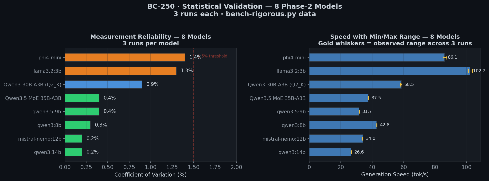

---

## B3. Generation Speed

> Standard prompt (~400 tokens), `num_predict=100`, `num_ctx=4096`, single run. Sorted by generation speed. Two near-duplicate 14B profiles are omitted from this ranking: `qwen3-14b-16k` and `qwen3-14b-abl-nothink` (alternate tag of `huihui_ai/qwen3-abliterated:14b`).

| # | Model | Params | Quant | Gen tok/s | Prefill tok/s | TTFT | VRAM | Quality |
|:-:|-------|:------:|:-----:|:---------:|:-------------:|:----:|:----:|:-------:|
| 1 | **llama3.2:3b** | 3.2B | Q4_K_M | **103.8** | 484.8 | 2.8s | 2.2 GiB | 93% |
| 2 | **qwen2.5:3b** | 3.1B | Q4_K_M | **102.0** | 477.9 | 5.0s | 2.1 GiB | 73% |
| 3 | **phi4-mini** | 3.8B | Q4_K_M | **87.0** | 346.3 | 6.2s | 2.5 GiB | 93% |
| 4 | gemma3:4b | 4B | Q4_K_M | 76.5 | 357.1 | 6.5s | 3.8 GiB | 100% |
| 5 | qwen3:4b | 4B | Q4_K_M | 73.6 | 314.0 | 4.0s | 2.9 GiB | 33%⁶ |
| 6 | **Qwen3-Coder-30B-A3B** | 30.5B/3.3B | UD-IQ2_M | **62.2** | 149.0 | — | 11.0 GiB | 87% |
| 7 | **Qwen3-30B-A3B** (Q2_K) | 30.5B/3B | Q2_K | **59.0** | 131.5 | 17.0s | 10.7 GiB | 27%⁶ |
| 9 | qwen2.5-coder:7b | 7.6B | Q4_K_M | 54.8 | 247.3 | 8.9s | 4.4 GiB | 40% |
| 10 | llama3.1:8b | 8.0B | Q4_K_M | 51.3 | 196.9 | 9.9s | 4.7 GiB | 93% |
| 11 | seed-coder-abliterate:8b | 8.3B | Q4_K_M | 50.8 | 216.7 | 9.8s | 4.8 GiB | 87% |
| 12 | lexi-8b (uncensored) | 8.0B | Q4_0 | 49.9 | 299.0 | 10.2s | 4.5 GiB | 100% |
| 13 | granite3.3:8b | 8B | Q4_K_M | 45.8 | 173.0 | 8.9s | 4.9 GiB | 80% |
| 14 | qwen3-abl-nothink:8b | 8.2B | Q4_K_M | 45.6 | 192.7 | 7.7s | 4.9 GiB | 100% |
| 15 | qwen3-abliterated:8b | 8.2B | Q4_K_M | 45.5 | 208.8 | 3.4s | 4.9 GiB | 100% |
| 16 | glm4:9b | 9B | Q4_K_M | 44.9 | 201.4 | 11.2s | 5.1 GiB | 93% |
| 17 | deepseek-r1:8b | 8B | Q4_K_M | 43.2 | 184.8 | 8.0s | 5.1 GiB | 73% |
| 18 | **qwen3:8b** | 8.2B | Q4_K_M | **43.1** | 192.7 | 7.7s | 5.1 GiB | 100% |
| 19 | qwen3:8b-nothink | 8.2B | Q4_K_M | 43.1 | 209.7 | 3.4s | 5.1 GiB | 100% |
| 20 | gemma2:9b | 9.2B | Q4_0 | 38.2 | 194.8 | 12.5s | 6.9 GiB | 100% |
| 21 | ★ **MoE 35B-A3B** | **35B/3B** | **UD-IQ2_M** | **37.5** | 127.5 | 17.4s | **12.3 GiB** | **93%** |
| 22 | mistral-nemo:12b | 12.2B | Q4_0 | 34.1 | 159.8 | 13.0s | 6.7 GiB | 80% |
| 23 | ★ **qwen3.5:9b** | **9.7B** | **Q4_K_M** | **31.7** | 171.3 | 11.2s | **7.9 GiB** | **100%** |
| 24 | qwen3:8b-q8_0 | 8.2B | Q8_0 | 31.2 | 237.2 | 12.6s | 8.5 GiB | 100% |
| 25 | gemma3:12b | 12B | Q4_K_M | 29.1 | 135.1 | 12.9s | 8.7 GiB | 100% |
| 26 | deepseek-r1:14b | 14B | Q4_K_M | 28.7 | 101.4 | 16.0s | 8.5 GiB | 100% |
| 27 | phi4:14b | 14.7B | Q4_K_M | 28.6 | 108.2 | 15.8s | 8.5 GiB | 100% |
| 28 | qwen3-abliterated:14b | 14.8B | Q4_K_M | 27.4 | 110.6 | 13.2s | 8.7 GiB | 100% |
| 29 | qwen3:14b | 14.8B | Q4_K_M | 26.8 | 108.6 | 13.3s | 8.9 GiB | 100% |
| 30 | qwen2.5:7b | 7.6B | Q4_K_M | 55.0² | 147.9² | —² | 4.4 GiB | 20%² |
| 31 | qwen3.5-27b-iq2m | 26.9B | IQ2_M | 11.0 | 54.2 | 17.6s | 13.4 GiB | 0%⁷ |

> ★ = production model. ² = intermittent loading bug (72% failure rate). ⁶ = think tokens leak into response. ⁷ = all quality tasks timed out.

> **All tested models run at 100% GPU offload** after GTT tuning (16 GiB). The qwen3.5-35b-a3b-iq2m's (Qwen MoE) 850 MB swap is OS pages pushed to NVMe — not model weights.


### Speed vs Quality


> Bubble size = parameter count. Gold = production models. The "sweet spot" is the upper-right quadrant: fast + high quality. Note: the quality benchmark uses simple tasks where most models score 90%+ — it does not measure reasoning depth or generation nuance where larger models are expected to outperform smaller ones.

### VRAM Usage


> All models fit within the 16.5 GiB Vulkan budget. The Qwen MoE fallback (12.3 GiB) leaves ~4 GiB free at 4K context — sufficient for KV cache growth up to 64K filled.

---

## B4. Quality Assessment

> 5 tasks × 3 runs per model. Scored by Python script (keyword match, JSON parse, regex, exact number). All 32 models tested.

| # | Model | Sum | JSON | Fact | Instr | Arith | Total | % |
|:-:|-------|:---:|:----:|:----:|:-----:|:-----:|:-----:|:-:|
| 1 | gemma3:4b | 3/3 | 3/3 | 3/3 | 3/3 | 3/3 | **15/15** | **100** |
| 2 | lexi-8b (uncensored) | 3/3 | 3/3 | 3/3 | 3/3 | 3/3 | **15/15** | **100** |
| 3 | qwen3-abl-nothink:8b | 3/3 | 3/3 | 3/3 | 3/3 | 3/3 | **15/15** | **100** |
| 4 | qwen3-abliterated:8b | 3/3 | 3/3 | 3/3 | 3/3 | 3/3 | **15/15** | **100** |
| 5 | qwen3:8b | 3/3 | 3/3 | 3/3 | 3/3 | 3/3 | **15/15** | **100** |
| 6 | qwen3:8b-nothink | 3/3 | 3/3 | 3/3 | 3/3 | 3/3 | **15/15** | **100** |
| 7 | qwen3:8b-q8_0 | 3/3 | 3/3 | 3/3 | 3/3 | 3/3 | **15/15** | **100** |
| 8 | gemma2:9b | 3/3 | 3/3 | 3/3 | 3/3 | 3/3 | **15/15** | **100** |
| 9 | ★ qwen3.5:9b | 3/3 | 3/3 | 3/3 | 3/3 | 3/3 | **15/15** | **100** |
| 10 | ★ gemma4-26b-q3 | 3/3 | 3/3 | 3/3 | 3/3 | 3/3 | **15/15** | **100** |
| 11 | gemma3:12b | 3/3 | 3/3 | 3/3 | 3/3 | 3/3 | **15/15** | **100** |
| 11 | phi4:14b | 3/3 | 3/3 | 3/3 | 3/3 | 3/3 | **15/15** | **100** |
| 12 | huihui_ai/qwen3-abliterated:14b | 3/3 | 3/3 | 3/3 | 3/3 | 3/3 | **15/15** | **100** |
| 13 | qwen3-14b-abl-nothink (same model, alt tag) | 3/3 | 3/3 | 3/3 | 3/3 | 3/3 | **15/15** | **100** |
| 14 | qwen3-14b-16k | 3/3 | 3/3 | 3/3 | 3/3 | 3/3 | **15/15** | **100** |
| 15 | qwen3:14b | 3/3 | 3/3 | 3/3 | 3/3 | 3/3 | **15/15** | **100** |
| 16 | deepseek-r1:14b | 3/3 | 3/3 | 3/3 | 3/3 | 3/3 | **15/15** | **100** |
| 17 | ★ MoE 35B-A3B | 3/3 | 3/3 | 3/3 | 2/3 | 3/3 | **14/15** | **93** |
| 18 | phi4-mini | 3/3 | 3/3 | 3/3 | 2/3 | 3/3 | **14/15** | **93** |
| 19 | llama3.2:3b | 3/3 | 3/3 | 3/3 | 2/3 | 3/3 | **14/15** | **93** |
| 20 | llama3.1:8b | 3/3 | 3/3 | 3/3 | 2/3 | 3/3 | **14/15** | **93** |
| 21 | glm4:9b | 2/3 | 3/3 | 3/3 | 3/3 | 3/3 | **14/15** | **93** |
| 22 | Qwen3-Coder-30B-A3B | 1/3 | 3/3 | 3/3 | 3/3 | 3/3 | **13/15** | **87** |
| 23 | seed-coder-abliterate:8b | 3/3 | 3/3 | 3/3 | 3/3 | 1/3 | **13/15** | **87** |
| 24 | granite3.3:8b | 3/3 | 3/3 | 3/3 | 3/3 | 0/3 | **12/15** | **80** |
| 25 | mistral-nemo:12b | 3/3 | 3/3 | 3/3 | 3/3 | 0/3 | **12/15** | **80** |
| 26 | qwen2.5:3b | 3/3 | 0/3 | 3/3 | 2/3 | 3/3 | **11/15** | **73** |
| 27 | deepseek-r1:8b | 3/3 | 3/3 | 3/3 | 2/3 | 0/3 | **11/15** | **73** |
| 28 | qwen2.5-coder:7b | 0/3 | 0/3 | 3/3 | 0/3 | 3/3 | **6/15** | **40** |
| 29 | qwen3:4b ⁶ | 1/3 | 0/3 | 3/3 | 0/3 | 1/3 | **5/15** | **33** |
| 30 | Qwen3-30B-A3B (Q2_K) ⁶ | 0/3 | 0/3 | 3/3 | 0/3 | 1/3 | **4/15** | **27** |
| 31 | qwen2.5:7b² | 0/3 | 0/3 | 3/3 | 0/3 | 0/3 | **3/15** | **20** |
| 32 | qwen3.5-27b-iq2m⁷ | 0/3 | 0/3 | 0/3 | 0/3 | 0/3 | **0/15** | **0** |

> ⁶ Think tokens leak into visible response — scores reflect token budget exhaustion, not true capability.
> ² qwen2.5:7b has a 72% intermittent load failure; outputs gibberish when loaded. Only fact recall passes (keyword "W" found).
> ⁷ qwen3.5-27b-iq2m: all 15 tasks timed out at 180s or model failed to load entirely.

**Quality tier summary:**
- **100%** — 17 models (all 14B, all Qwen3 8B, gemma3:4b/12b, gemma2:9b, lexi-8b, qwen3.5:9b, gemma4-26b-q3)
- **93%** — 5 models (35B MoE, phi4-mini, llama3.2:3b, llama3.1:8b, glm4:9b) — each missed one task
- **87%** — 2 models (Qwen3-Coder-30B-A3B missed summarize; seed-coder-abliterate:8b missed arithmetic)
- **80%** — 2 models (granite3.3:8b, mistral-nemo:12b fail arithmetic)
- **73%** — 2 models (qwen2.5:3b JSON fails, deepseek-r1:8b arithmetic fails)
- **≤40%** — 3 models (think-leak or task-specialized)
- **20%** — 1 model (qwen2.5:7b — intermittent loading bug, gibberish output)
- **0%** — 1 model (qwen3.5-27b-iq2m — all tasks timed out or load failure)


> **Arithmetic (17×23)** is the hardest task — 8 models score below 3/3 (5 at 0/3, 3 at 1/3). Fact recall is the easiest — every testable model passes. Failure patterns are model-specific, not hardware-related.

---

## B5. Context Scaling — Filled Context

> **Methodology:** 80% real-token fill with `prompt_eval_count` truncation detection. Testing depth varied: 6 Phase 3 core models (2 runs per config), 2 gap-closer models (1–2 runs), 22 sweep models (1 run, validated by Phase 2 CV <1.5%), 2 models from the extended benchmark (same methodology, 4K–128K range).
>
> **Coverage:** 31 of 33 models completed filled-context testing; 25 reach the 64K ceiling, 1 reaches 48K (gemma4-26b-q3). Two models could not produce results: qwen2.5-coder:7b (pec=0 at all fills) and qwen3.5-27b-iq2m (warmup failure).

### B5.1 Production models — speed vs filled context

**Measurement history:** Three independent measurement rounds show consistent 4K–32K results within ±1 tok/s. At 64K, a significant regression appeared between the initial round and a later retest — documented below as an open investigation item.

| Model | 4K | 16K | 32K | 48K | 64K (initial) | 64K (after uptime) | Degradation (4K→32K) |
|-------|:--:|:---:|:---:|:---:|:---:|:---:|:-----------:|
| ★ **MoE 35B-A3B** | 35.6 | 31.9 | 28.5 | — | **22.9** | **0.7** ⚠️ | **−20%** |
| ★ **qwen3.5:9b** | 31.1 | 29.4 | 27.0 | — | **23.4** | — | **−13%** |
| 🏆 **gemma4-26b-q3** | 35.2 | 31.1 | 27.7 | **25.0** | TIMEOUT | — | **−29%** (4K→48K) |
| phi4-mini | 74.3 | 48.7 | 33.2 | — | 20.3 | — | −55% |
| qwen3:8b | 39.4 | 30.3 | 22.5 | — | 15.4 | — | −43% |
| qwen3:14b | 25.2 | 20.7 | 16.7 | — | 12.0 | — | −34% |
| gemma3:4b | 74.8 | 72.3 | 70.0 | — | **65.1** | — | **−6%** 🏆 |
| gemma3:12b | 28.4 | 27.5 | 26.3 | — | **24.2** | — | **−7%** |

> **⚠️ 64K regression under investigation:** The MoE ran 64K filled context at 22.9 tok/s in the initial round (Phase 3, isolated cold run, 302s TTFT, 38K prompt tokens, 328 MB swap delta). In a later isolated retest (same script methodology), 64K produced only **0.7 tok/s** (596s TTFT, 30K prompt tokens). The system had 19h uptime at retest time. 4K–32K reproduced within ±1 tok/s across all three rounds. Likely cause: UMA memory fragmentation after extended uptime — confirmed by §4.10 fresh-reboot test where Ollama achieved 28.7 tok/s at 64K. The initial value (22.9 tok/s) is preserved as the known-good reference.

> 4K–32K values: median of 3 measurement rounds (initial, batch sweep, isolated retest). **gemma3:4b** shows the least degradation overall. All Qwen MoE 64K data shows 100% GPU offload (41/41 layers) in both tests.


### B5.2 Full filled-context sweep

**Three measurement rounds (R1: initial, R2: batch sweep, R3: isolated retest).** 4K–32K values are consistent within ±1 tok/s across rounds. R2 (19 models sequential, 600s timeout) caused some models to fail due to VRAM contention between models — these are marked. R3 ran Qwen MoE and deepseek-r1:14b in isolation to verify.

| Model | 4K | 16K | 32K | 64K | Ceiling | Rounds |
|-------|:--:|:---:|:---:|:---:|:-------:|:------:|
| llama3.2:3b | 87.8 | 56.3 | 38.3 | 23.3 | **64K** | R1+R2 |
| gemma3:4b | 74.8 | 72.3 | 70.0 | 65.1 | **64K** | R1+R2 |
| qwen3:4b | 61.4 | 40.1 | 28.5 | 17.6 | **64K** | R1+R2 |
| Qwen3-30B-A3B (Q2_K) | 53.6 | 40.1 | 30.0 | 20.4 → —⁵ | **64K** → **32K**⁵ | R1+R2 |
| Qwen3-Coder-30B-A3B | 58.4 | 42.8 | 32.6 | 22.9 | **64K** | R1 |
| llama3.1:8b | 47.0 | 35.6 | 26.5 | 17.6 | **64K** | R1+R2 |
| seed-coder-abliterate:8b | 46.1 | 34.7 | 25.7 | 17.9 | **64K** | R1+R2 |
| lexi-8b | 45.3 | 33.4 | 25.0 | 16.4 | **64K** | R1 |
| qwen3-abl-nothink:8b | 41.4 | 30.6 | 22.7 | 14.2 | **64K** | R1 |
| qwen3-abliterated:8b | 40.9 | 30.4 | 22.7 | 14.8 | **64K** | R1 |
| granite3.3:8b | 40.2 | 27.8 | 19.8 | 12.2 | **64K** | R1 |
| deepseek-r1:8b | 39.5 | 29.7 | 22.3 | 14.8 | **64K** | R1 |
| qwen3:8b | 39.4 | 30.3 | 22.5 | 15.4 | **64K** | R1+R2 |
| qwen3:8b-nothink | 39.7 | 28.6 | 21.2 | 14.8 | **64K** | R1 |
| glm4:9b | 37.0 | 23.3 | 15.5 | 9.2 | **64K** | R1+R2 |
| gemma3:12b | 28.4 | 27.5 | 26.3 | 24.2 | **64K** | R1+R2 |
| mistral-nemo:12b | 31.8 | 24.7 | 19.1 | 13.1 | **64K** | R1+R2 |
| qwen3-abliterated:14b | 25.9 | 20.8 | 16.5 | 11.7 | **64K** | R1 |
| qwen3-14b-16k | 25.9 | 20.8 | 16.6 | 11.7 | **64K** | R1 |
| qwen3:8b-q8_0 | 29.3 | 23.6 | 18.7 | 13.1 | **64K** | R1 |
| qwen3:14b | 25.2 | 20.7 | 16.7 | 11.0 → —⁵ | **64K** → **32K**⁵ | R1+R2 |
| phi4:14b | 26.0 | 19.5 | ✂️ 16K | — | **16K** | R1+R2 |
| gemma2:9b | 29.6 | 17.1 | ✂️ 8K | — | **8K³** | R1+R2 |
| deepseek-r1:14b | 26.5 | 19.7 | 14.8 | ⚠️ 2.3 → 0.1⁶ | **32K** | R1+R3 |
| ★ MoE 35B-A3B | 35.6 | 31.9 | 28.5 | 22.9 → 0.7⁶ | **64K** → **??**⁶ | R1+R2+R3 |
| ★ qwen3.5:9b | 31.1 | 29.4 | 27.0 | 23.4 | **64K** | R2 |
| 🏆 gemma4-26b-q3 | 35.2 | 31.1 | 27.7 | TIMEOUT | **48K** | R4 |

> 🏆 gemma4-26b-q3 tested in R4 (dedicated run, 6 context sizes 4K–48K, SCP payload delivery). 40K=26.4, 48K=25.0 tok/s. 65K allocation times out.

> ✂️ = silently truncated to native limit (prompt_eval_count flat across context sizes). ³ = gemma2:9b truncates at 8K native. ⁵ = R1 measured 64K OK; R2 (sequential batch) failed — likely VRAM contention between models. Individual values shown as "old → new".

> ⁶ **64K regression (Qwen MoE + deepseek):** Both models showed 10–30× speed reduction at 64K between the initial round and a later retest (see table below). 4K–32K data is consistent across rounds (±1 tok/s). The retest was isolated (full unload + 15s sleep between each context size), ruling out VRAM contention. The system had 19h uptime at retest time. Likely UMA memory fragmentation — confirmed by §4.10 where fresh-reboot Ollama achieved 28.7 tok/s at 64K.

**64K regression detail — Qwen MoE and deepseek-r1:14b:**

| Model | Metric | Initial (R1) | Retest (R3) | Change |
|-------|--------|:-----------:|:----------:|:------:|
| MoE 35B-A3B | gen tok/s | **22.9** | **0.7** | −97% |
| MoE 35B-A3B | prefill tok/s | 135 | 58 | −57% |
| MoE 35B-A3B | TTFT (s) | 302 | 596 | +97% |
| MoE 35B-A3B | prompt tokens | 38,348 | 30,614 | −20% |
| MoE 35B-A3B | swap delta | +328 MB | — | — |
| deepseek-r1:14b | gen tok/s | **2.3** | **0.1** | −96% |
| deepseek-r1:14b | TTFT (s) | — | 13,084 | 3.6 hours |
| deepseek-r1:14b | prompt tokens | — | 30,609 | — |

### B5.3 Context ceiling grid


| Ceiling | Models |
|:-------:|:------:|
| **64K** | 22 models (69%) — including Coder-30B, Q2_K, qwen3:14b (initial round data) |
| **64K (degraded)** | 2 models (MoE, deepseek-r1:14b) — 64K works but with severe speed regression in later retest (likely UMA fragmentation)⁶ |
| **48K** | 1 model (★ gemma4-26b-q3) — verified 4K–48K filled, 25.0 tok/s at 48K, no truncation. 65K times out |
| **32K** | 3 models (qwen2.5:3b¹, qwen2.5:7b, ★ MoE practical ceiling) |
| **16K** | 1 model (phi4:14b³) |
| **8K** | 1 model (gemma2:9b³) |
| **Broken** | 2 models (qwen2.5-coder:7b pec=0, qwen3.5-27b too large) |

> ¹ qwen2.5:3b ceiling from extended benchmark. ³ phi4:14b and gemma2:9b silently truncate — actual filled ceilings are 16K and 8K respectively. ⁶ MoE achieved 22.9 tok/s @64K initially but only 0.7 tok/s on retest after extended uptime — likely UMA fragmentation (see B5.2). The **practical ceiling for time-critical workloads is 32K** (28.5 tok/s, stable across all rounds). ⁹ gemma4-26b-q3 verified 4K–48K filled (25.0 tok/s at 48K, TTFT 190.9s); 65K allocation times out.

### B5.4 Prefill rate scaling

| Model | 4K | 16K | 32K | 48K | 64K (initial) | 64K (after uptime) |
|-------|:--:|:---:|:---:|:---:|:---:|:---:|
| ★ MoE 35B-A3B | 239 | 215 | 182 | — | **135** | **58** ⚠️ |
| 🏆 gemma4-26b-q3 | 270 | 219 | 177 | **148** | TIMEOUT | — |
| ★ qwen3.5:9b | 227 | 206 | 182 | — | 145 | — |
| phi4-mini | 452 | 289 | 194 | — | 117 | — |
| qwen3:8b | 225 | 158 | 111 | — | 71 | — |
| qwen3:14b | 125 | 93 | 68 | — | — | — |
| deepseek-r1:14b | 121 | 91 | 69 | — | — | **2.4** ⚠️ |

> Prefill rate (tok/s) at 80% filled context. gemma4-26b-q3 achieves 270 tok/s at 4K (highest among production models), degrading gracefully to 148 tok/s at 48K. Both MoE 35B-A3B and qwen3.5:9b converge to ~230 tok/s prefill at 4K. At 64K, the MoE shows a 2.3× prefill regression between the initial round (135 tok/s) and retest (58 tok/s) — same system, same Ollama version. deepseek-r1:14b prefill collapsed to 2.4 tok/s at 64K on retest (from ~40 tok/s estimated initially). See ⁶ regression note in B5.2.

### B5.5 TTFT at filled context (Phase 3 core, run 1)

| Model | 4K | 16K | 32K | 48K | 64K |
|-------|:--:|:---:|:---:|:---:|:---:|
| ★ MoE 35B-A3B | 26s | 63s | 126s | — | **302s** |
| 🏆 gemma4-26b-q3 | 11s | 43s | 107s | **191s** | TIMEOUT |
| ★ qwen3.5:9b | 117s¹ | 57s | 116s | — | **279s** |
| phi4-mini | 11s | 37s | 105s | — | — |
| qwen3:14b | 30s | 115s | 287s | — | — |

> ¹ Elevated 4K TTFT includes model load time (model was not loaded prior to this test in the sequence). Four of six Phase 3 core models shown (qwen3:8b and mistral-nemo:12b omitted for brevity).

> **For interactive chat**, the practical ceiling is 16K–32K filled (1–2 min TTFT). Above 32K, TTFT exceeds 2 minutes — acceptable only for batch.

---

## B6. Long-Context Quality

> **What this tests and why it matters:**
> B5 measures *speed* at filled context — can the model still generate tokens when the KV cache is full? B6 measures *accuracy* — can the model still *use* what's in that context?
>
> Real workloads (code review on a large diff, summarising a log dump, correlating sensor data) require the model to (1) find a specific fact buried in thousands of tokens, (2) link multiple facts that are far apart, and (3) notice when two pieces of information contradict each other. If context quality degrades before context speed does, the extra context window is useless.
>
> **B6.1** is the baseline: plant a known fact and ask for it back — pure retrieval. **B6.2** raises the bar: the answer requires chaining 3 scattered facts through arithmetic, or spotting a contradiction between two studies separated by thousands of filler tokens. These are the operations that break first when a model's effective attention window is shorter than its advertised context length.

### B6.1 Embedded fact retrieval (16K) — 100% pass

Three unique facts embedded at 25%, 50%, 75% positions in 16K filled context:

| Model | Early (25%) | Middle (50%) | Late (75%) | Total |
|-------|:---:|:---:|:---:|:---:|
| ★ gemma4-26b-q3 | **2/2** ✅ | **2/2** ✅ | **2/2** ✅ | **6/6** |
| ★ MoE 35B-A3B | **2/2** ✅ | **2/2** ✅ | **2/2** ✅ | **6/6** |
| ★ qwen3.5:9b | **2/2** ✅ | **2/2** ✅ | **2/2** ✅ | **6/6** |
| phi4-mini | **2/2** ✅ | **2/2** ✅ | **2/2** ✅ | **6/6** |
| **Total** | | | | **24/24** (100%) |

### B6.2 Multi-hop reasoning & long-range synthesis (16K + 32K)

Four tasks at 16K and 32K filled context (80% fill, 5 diverse text domains). Facts embedded at known positions. Scoring: deterministic string-containment. Two independent runs; full prompts, responses, and scoring saved in `benchmarks/results-longctx/`.

**Four test types:**
- **multihop_budget** — 3 facts → $4.2M × 60% × 50% = $1.26M
- **multihop_population** — 3 facts → 840K × 35% × 20% = 58,800
- **synthesis_contradictions** — identify 2 contradicting ocean temperature studies
- **synthesis_timeline** — order 3 dated biotech events chronologically

**Per-model results (run 1 / run 2):**

| Model | 16K (R1/R2) | 32K (R1/R2) | Combined |
|-------|:---:|:---:|:---:|
| ★ gemma4-26b-q3 | 3/4 / 3/4 | 2/4 / 3/4 | **11/16** |
| ★ MoE 35B-A3B | 3/4 / 2/4 | 3/4 / 2/4 | **10/16** |
| qwen3.5:9b | 2/4 / 3/4 | 3/4 / 2/4 | **10/16** |
| phi4-mini | 1/4 / 3/4 | 2/4 / 2/4 | **8/16** |

**Per-task breakdown (64 trials: 4 models × 2 contexts × 2 runs):**

| Task | Combined | Pattern |
|------|:--------:|---------|
| multihop_budget | **1/16** | Near-universal fail — models write "$1,260,000" but check expects "1.26" |
| multihop_population | **7/16** | Variable — fact linkage sometimes missed at 32K |
| synthesis_contradictions | **15/16** | Strong — contradiction detection reliable across runs |
| synthesis_timeline | **16/16** | Universal pass — temporal ordering easiest task |


> **Key insight:** Synthesis tasks are substantially more reliable than multi-hop arithmetic (31/32 vs 8/32 across both runs). gemma4-26b-q3 leads at 11/16 (perfect on all synthesis tasks), followed by MoE 35B and qwen3.5:9b tied at 10/16, phi4-mini at 8/16. Results vary between runs (LLM sampling variance), but task-level patterns are consistent.

---

## B7. Cold-Start Timing

| Model | Run 1 | Run 2 | Run 3 | Median | Load time |
|-------|:-----:|:-----:|:-----:|:------:|:---------:|
| ★ gemma4-26b-q3 | 19.1s | 17.7s | 17.6s | **17.7s** | 16.7s (~690 MB/s) |
| ★ MoE 35B-A3B | 18.0s | 18.0s | 17.5s | **18.0s** | 16.2s (~660 MB/s) |
| ★ qwen3.5:9b | 11.9s | 6.8s | 7.0s | **7.0s** | 5.6s (~1.1 GB/s) |

> Run 1 of qwen3.5:9b is ~70% slower than Run 2/3 because the GGUF file was not yet in the Linux page cache. Subsequent loads read from cached RAM pages. The MoE shows no gap because its GGUF was already cached from prior tests. Page cache was not dropped between runs (see B1.1).

With `OLLAMA_KEEP_ALIVE=30m`, cold start occurs only after 30 minutes idle. Warm TTFT: 0.3–1.7s.

**Signal chat latency profile (gemma4-26b-q3, primary):**

| State | TTFT | Gen speed |
|-------|:----:|:---------:|
| Warm, short prompt (<1K) | **0.3–1.7s** | 39.0 tok/s |
| Warm, medium prompt (~3K) | **~15s** | 39.0 tok/s |
| Cold start (after 30 min) | **~17.7s** | 39.0 tok/s |
| 16K filled context | **~51s** | 32 tok/s |
| 32K filled context | **~125s** | 28 tok/s |
| 48K filled context (ceiling) | **~191s** | — |
| 64K filled context (MoE fallback) | **~302s** | 22.9 tok/s |

---

## B8. Quantization Impact

| Model quant | Gen tok/s | Prefill | VRAM @4K | Swap | Notes |
|:-----------:|:---------:|:-------:|:--------:|:----:|-------|
| qwen3:8b Q4_K_M | **43.1** | 192.7 | 5.1 GiB | 510 MB | Standard |
| qwen3:8b Q8_0 | **31.2** | 237.2 | 8.5 GiB | 1047 MB | 28% slower, 67% more VRAM |

> Q4_K_M + Q4_0 KV cache is the sweet spot for this hardware — the 28% speed loss from Q8_0 is not worth the marginal precision gain for production tasks.
>
> **Why swap increases:** The BC-250 has only ~14 GiB usable system RAM (kernel and firmware reserve ~2 GiB of the 16 GiB GDDR6). On this UMA system, GPU allocations come from the same physical pool. Even Q4_K_M (5.1 GiB model) shows 510 MB swap — the OS swaps background processes and page cache to make room. At Q8_0 (8.5 GiB), the larger model leaves less headroom for everything else, doubling swap pressure.

---

## B9. Image Generation Benchmarks

> sd.cpp, Vulkan GFX1013. Ollama stopped during image gen tests. All at 512×512 with same prompt and seed 42.

### B9.1 Head-to-head comparison

| Model | Time @512² | Steps | VRAM | Encoder |
|-------|:----------:|:-----:|:----:|:-------:|
| **SD-Turbo** | **27s** | 4 | 2 GB | built-in |
| **FLUX.2-klein-4B** | **37s** | 4 | 6 GB | Qwen3-4B |
| **Chroma flash** | **67s** | 4 | 8.4 GB | T5-XXL |
| **FLUX.2-klein-9B** ★ | **67s** | 4 | 11.8 GB | Qwen3-8B |
| **SD3.5-medium** | **102s** | 28 | 6 GB | CLIP+T5 |
| **FLUX.1-schnell** | **107s** | 4 | 10 GB | CLIP+T5 |
| **FLUX.1-kontext-dev** | **132s** | 20 | 10 GB | CLIP+T5 |
| **FLUX.1-dev** | **167s** | 20 | 10 GB | CLIP+T5 |

★ = production default (highest tested quality at practical speed)


### B9.2 Resolution scaling — FLUX.2-klein

**FLUX.2-klein-9B (production):**

| Resolution | Steps | Time | s/step |
|:----------:|:-----:|:----:|:------:|
| 512×512 | 4 | 67s | 16.8 |
| 768×768 | 4 | 97s | 24.2 |
| 1024×1024 | 4 | 147s | 36.8 |
| 512×512 | 8 | ❌ OOM | — |

**FLUX.2-klein-4B (fast alternative):**

| Resolution | Steps | Time | s/step |
|:----------:|:-----:|:----:|:------:|
| 512×512 | 4 | 37s | 9.2 |
| 768×768 | 4 | 52s | 13.0 |
| 1024×1024 | 4 | 82s | 20.5 |
| 512×512 | 8 | 42s | 5.2 |
| 1024×1024 | 8 | 122s | 15.2 |

### B9.3 Video & Upscaling

| Task | Model | Details | Time |
|------|-------|---------|:----:|
| **Video** | WAN 2.1 T2V 1.3B Q4_0 | 480×320, 17 frames, 50 steps | **~38 min** |
| **Upscale 4×** | ESRGAN (tile 192) | 512² → 2048² | **22s** |
| **Upscale 16×** | ESRGAN (128×2 passes) | 512² → 8192² (67 MP) | **4:50** |

---

## B10. Model Recommendations

This is the single authoritative recommendation table for the BC-250.
Every number below is sourced from the benchmark appendix; provenance footnotes follow.

| Use Case | Model | Gen tok/s | Filled Ctx | Quality | Why |
|----------|-------|:---------:|:----------:|:-------:|-----|
| **🏆 Primary chat** | gemma4-26b-q3 | 39.0 | **48K verified** | 100% | Largest 100% GPU-offloaded model (13.5 GiB); 1238 tok/s prefill; 128-expert MoE with ~3.8B active. 35→25 tok/s (4K→48K), no truncation. Also powers all 25+ automated scripts |
| **🏆 Fallback (>40K)** | qwen3.5-35b-a3b-iq2m | 37.5 | **32K practical** | 93% | Largest knowledge capacity that fits 16 GB UMA; fast due to MoE (only 3B active). 64K works but with severe speed regression (see B5.2 note ⁶) |
| **🏆 Vision / long ctx** | qwen3.5:9b | 31.7 | **64K** | 100% | Multimodal, most resilient context scaling (−13% at 32K, −25% at 64K) |
| **Fast + lightweight** | phi4-mini | 86.1 | **64K** | 93% | Fastest model passing basic quality checks; only 2.5 GiB VRAM |
| **Reasoning** | deepseek-r1:14b | 28.7 | **32K** | 100% | Perfect quality score; chain-of-thought |
| **Speed-critical** | llama3.2:3b | 102.2 | **64K** | 93% | Fastest tested; good enough for simple tasks |
| **Image gen** | FLUX.2-klein-9B | 67s @512² | — | ★ preferred | 4-step, Qwen3-8B encoder; best visual result in side-by-side tests (B9) |

> **Gen tok/s** = Phase 2 median at 4K context where available (B3); gemma4-26b-q3 from §4.9 Ollama comparison (not in Phase 2); Phase 1 single-run for deepseek-r1:14b (B3). **Filled Ctx** = verified ceiling with 80% real-token fill (§4.5, B5.3). MoE 32K practical ceiling — 64K achieved 22.9 tok/s initially but only 0.7 tok/s on retest after extended uptime (likely UMA fragmentation, see B5.2 note ⁶). phi4-mini 64K verified via extended benchmark (§4.5: 20.3 tok/s). llama3.2:3b 64K verified via full sweep (B5.2: 23.3 tok/s). **Quality** = 5 tasks × 3 runs, 32 models (B4). qwen3.5:9b −25% from B5.1 context degradation analysis.

> **Why MoE likely wins on this hardware (hypothesis):** The BC-250 has no tensor cores / matrix accelerators — all compute runs through scalar ALUs on 24 shader CUs. A 35B MoE with 3B active parameters does fewer multiplications per token than a 14B dense model, despite storing more knowledge. Result: 37.5 tok/s (35B MoE) vs 26.8 tok/s (dense 14B) with 93% vs 100% quality. However, this comparison confounds architecture (MoE vs dense), model family (Qwen3.5 vs Qwen3), and quantization (IQ2_M vs Q4_K_M). An isolated test would require same-family, same-quant MoE vs dense models — none were available at time of testing.

---

# `PART V` — Reference

## 9. Repository Structure

<details>
<summary>▸ Full tree</summary>

```
bc250/
├── README.md                       ← you are here
├── netscan/                        → /opt/netscan/
│   ├── queue-runner.py             # v7 — continuous loop + Signal chat (330 jobs)
│   ├── career-scan.py              # Two-phase career scanner
│   ├── career-think.py             # Per-company career analysis
│   ├── salary-tracker.py           # Salary intelligence
│   ├── company-intel.py            # Company deep-dive
│   ├── company-think.py            # Per-entity company analysis
│   ├── patent-watch.py             # Patent monitor
│   ├── event-scout.py              # Event tracker
│   ├── city-watch.py               # SkyscraperCity local construction monitor
│   ├── leak-monitor.py             # CTI: 11 OSINT sources + Ahmia dark web
│   ├── ha-journal.py               # Home Assistant journal
│   ├── ha-correlate.py             # HA cross-sensor correlation
│   ├── ha-observe.py               # Quick HA queries
│   ├── csi-sensor-watch.py         # CSI camera sensor patent/news
│   ├── csi-think.py                # CSI camera domain analysis
│   ├── radio-scan.py               # Radio hobbyist forum tracker
│   ├── market-think.py             # Market sector analysis
│   ├── life-think.py               # Cross-domain life advisor
│   ├── system-think.py             # GPU/security/health system intelligence
│   ├── career-digest.py            # Weekly career digest → Signal (Sunday)
│   ├── daily-summary.py            # End-of-cycle Signal summary
│   ├── frost-guard.py              # Frost/freeze risk alerter
│   ├── repo-think.py               # LLM analysis of repo changes
│   ├── academic-watch.py           # Academic publication monitor
│   ├── news-watch.py               # Tech news aggregation + RSS feeds
│   ├── book-watch.py               # Book/publication tracker
│   ├── weather-watch.py            # Weather forecast + HA sensor correlation
│   ├── car-tracker.py              # GPS car tracker (SinoTrack API, trip/stop detection)
│   ├── bc250-extended-health.py    # System health assessment (services, data freshness, LLM quality)
│   ├── llm_sanitize.py             # LLM output sanitizer (thinking tags, JSON repair)
│   ├── generate-html.py            # Dashboard builder (6900+ lines, 29 main + 101 host pages)
│   ├── gpu-monitor.py              # GPU data collector
│   ├── idle-think.sh               # Research brain (8 task types)
│   ├── repo-watch.sh               # Upstream repo monitor
│   ├── lore-digest.sh              # Mailing list digests (8 feeds)
│   ├── bc250-health-check.sh       # Quick health check (systemd timer, triggers extended health)
│   ├── gpu-monitor.sh              # Per-minute GPU sampler
│   ├── scan.sh / enumerate.sh      # Network scanning
│   ├── vulnscan.sh                 # Weekly vulnerability scan
│   ├── presence.sh                 # Phone presence detection
│   ├── syslog.sh                   # System health logger
│   ├── watchdog.py                 # Network security checker
│   ├── report.sh                   # Morning report rebuild
│   ├── profile.json                # Public interests + Signal config
│   ├── profile-private.json        # Career context (gitignored)
│   ├── watchlist.json              # Auto-evolving interest tracker
│   ├── digest-feeds.json           # Feed URLs (8 mailing lists)
│   ├── repo-feeds.json             # Repository endpoints
│   └── sensor-watchlist.json       # CSI sensor tracking list
├── systemd/
│   ├── queue-runner.service        # v7 — continuous loop + Signal chat
│   ├── queue-runner-nightly.service # Nightly batch trigger
│   ├── queue-runner-nightly.timer
│   ├── signal-cli.service          # Standalone JSON-RPC daemon
│   ├── bc250-health.service        # Health check timer
│   ├── bc250-health.timer
│   ├── ollama.service
│   ├── ollama-watchdog.service     # Ollama restart watchdog
│   ├── ollama-watchdog.timer
│   ├── ollama-proxy.service        # LAN proxy for Ollama API
│   └── ollama.service.d/
│       └── override.conf           # Vulkan + memory settings
├── scripts/
│   └── ollama-proxy.py             # Reverse proxy (injects think:false for qwen3)
├── generate-and-send.sh            → /opt/stable-diffusion.cpp/ (legacy EXEC pattern, intercepted by queue-runner)
└── generate-and-send-worker.sh     → legacy async worker (unused in v7, kept for EXEC pattern match)
```

</details>

### Deployment

| Local | → bc250 |
|-------|---------|
| `netscan/*` | `/opt/netscan/` |
| `systemd/queue-runner.service` | `/etc/systemd/system/queue-runner.service` |
| `systemd/signal-cli.service` | `/etc/systemd/system/signal-cli.service` |
| `systemd/ollama.*` | `/etc/systemd/system/ollama.*` |
| `generate-and-send*.sh` | `/opt/stable-diffusion.cpp/` |

```bash
# Typical deploy workflow
scp netscan/queue-runner.py bc250:/tmp/
ssh bc250 'sudo cp /tmp/queue-runner.py /opt/netscan/ && sudo systemctl restart queue-runner'
```

---

## 10. Troubleshooting

<details>
<summary><b>▸ ROCm initialization appears in Ollama logs</b></summary>

On this deployment, Ollama attempted a ROCm path during startup, failed on GFX1013, and continued with Vulkan. No action is needed unless startup behavior changes on a newer software stack.

</details>

<details>
<summary><b>▸ Only 7.9 GiB GPU memory instead of 16 GiB</b></summary>

GTT tuning not applied. Check: `cat /sys/module/ttm/parameters/pages_limit` (should be 4194304). See §3.3.

</details>

<details>
<summary><b>▸ 14B model loads but inference returns HTTP 500</b></summary>

TTM pages_limit bottleneck. Fix: `echo 4194304 | sudo tee /sys/module/ttm/parameters/pages_limit` (see §3.3).

</details>

<details>
<summary><b>▸ Model loads on CPU instead of GPU</b></summary>

Check `OLLAMA_VULKAN=1`: `sudo systemctl show ollama | grep Environment`

</details>

<details>
<summary><b>▸ Context window OOM kills (the biggest gotcha on 16 GB)</b></summary>

Ollama allocates KV cache based on `num_ctx`. Many models default to 32K–40K context, which on a 14B Q4_K model means 14–16 GB *just for the model* — leaving nothing for the OS.

**Symptoms:** Ollama or queue-runner gets OOM-killed, Ollama journal shows 500 errors, `dmesg` shows `oom-kill`.

**Root cause:** The abliterated Qwen3 14B declares `num_ctx 40960` → 16 GB total model memory.

**Fix:** Create a custom model with context baked in:
```bash
cat > /tmp/Modelfile.16k << 'EOF'
FROM huihui_ai/qwen3-abliterated:14b
PARAMETER num_ctx 16384
EOF
ollama create qwen3-14b-16k -f /tmp/Modelfile.16k
```

This drops memory from ~16 GB → ~11.1 GB. Alternatively, set `OLLAMA_CONTEXT_LENGTH=65536` in the systemd override (see §3.4) — this is the production mechanism used in v7+.

</details>

<details>
<summary><b>▸ signal-cli not responding on port 8080</b></summary>

Check the service: `systemctl status signal-cli`. If it crashed, restart: `sudo systemctl restart signal-cli`. Verify JSON-RPC:
```bash
curl -s http://127.0.0.1:8080/api/v1/rpc \
  -d '{"jsonrpc":"2.0","method":"listAccounts","id":"1"}'
```

</details>

<details>
<summary><b>▸ zram competing with model for physical RAM</b></summary>

Fedora defaults to ~8 GB zram. zram compresses pages but stores them in *physical* RAM — directly competing with the model. On 16 GB systems running large models, disable or limit zram and use NVMe file swap instead:
```bash
sudo mkdir -p /etc/systemd/zram-generator.conf.d
echo -e '[zram0]\nzram-size = 2048' | sudo tee /etc/systemd/zram-generator.conf.d/small.conf
```

</details>

<details>
<summary><b>▸ Python cron scripts produce no output</b></summary>

Stdout is fully buffered under cron (no TTY). Add at script start:
```python
sys.stdout.reconfigure(line_buffering=True)
sys.stderr.reconfigure(line_buffering=True)
```

</details>

<details>
<summary><b>▸ Signal delivery from signal-cli</b></summary>

Signal JSON-RPC API at `http://127.0.0.1:8080/api/v1/rpc`:
```bash
curl -X POST http://127.0.0.1:8080/api/v1/rpc \
  -H "Content-Type: application/json" \
  -d '{"jsonrpc":"2.0","method":"send","params":{
    "account":"+<BOT>","recipient":["+<YOU>"],
    "message":"test"
  },"id":"1"}'
```

</details>

---

## 11. Known Limitations

| Issue | Impact |
|-------|--------|
| Shared VRAM | In this setup, image gen requires stopping Ollama (single 16 GB UMA pool). Bot offline ~1 min (FLUX.2-klein-4B) or ~2 min (FLUX.2-klein-9B). |
| MoE context limit | With Q4_0 KV, MoE 35B-A3B allocates **64K** context (was 256K on Ollama 0.18, regressed after 0.20 upgrade). Practical filled ceiling is **32K** (28.5 tok/s, stable). 64K filled context showed 22.9 tok/s initially but only 0.7 tok/s on retest after extended uptime — possibly UMA fragmentation (B5.2). |
| Signal latency | Messages queue during job execution (typical job 2–15 min). Chat checked between every job. |
| sd-cli hangs on GFX1013 | Vulkan cleanup bug → poll + kill workaround. |
| Cold start latency | 30–60s after Ollama restart (model loading). |
| Chinese thinking leak | Qwen3 occasionally outputs Chinese reasoning. Cosmetic. |
| FLUX.2-klein-9B 8-step OOM | At 8 steps (vs default 4), the 9B model fails — likely compute graph exceeds VRAM. The 4B variant handles 8 steps fine. |
| Prefill rate degrades with context (dense models) | qwen3:14b showed 128 tok/s at 1.3K → 70 tok/s at 10K tokens. MoE primary held ~127 tok/s across prompt sizes in testing. |
| Gen speed degrades with context fill (dense models) | qwen3:14b showed 27 tok/s empty → 13 tok/s at 30K tokens. The MoE degrades too, but less steeply: 35.6 tok/s at 4K filled → 28.5 tok/s at 32K filled (−35%). |
| Speculative decoding not yet available | Ollama 0.18 has no `--draft-model`. Dual-model loading evicts the draft model. May change in future Ollama versions. |
| TTS not currently feasible | CPU-based TTS (Piper, Coqui) competes with GPU for the same 16 GB UMA pool. No practical Vulkan-accelerated TTS path was identified for this deployment as of early 2026. |

---

## 12. Software Versions

Pinned versions as of March 2026. All components built/installed on Fedora 43.

| Component | Version | Notes |
|-----------|---------|-------|
| **OS** | Fedora 43, kernel 6.18.9 | Headless, `performance` governor |
| **Ollama** | 0.18.0 | Vulkan backend, `OLLAMA_FLASH_ATTENTION=1` |
| **Mesa / RADV** | 25.3.4 | Vulkan 1.4.328, `RADV GFX1013` |
| **stable-diffusion.cpp** | master-504 (`636d3cb`) | Built with `-DSD_VULKAN=ON`. Reverted from master-525 due to FLUX.2-klein tensor naming regression. |
| **whisper.cpp** | v1.8.3-198 (`30c5194c`) | Built with Vulkan, large-v3-turbo model |
| **signal-cli** | 0.13.24 | Native binary, JSON-RPC at :8080 |
| **Qwen3.5-35B-A3B** | IQ2_M (GGUF, ~11 GB) | Primary MoE model, via [unsloth](https://huggingface.co/unsloth/Qwen3.5-35B-A3B-GGUF) |
| **qwen3.5:9b** | Q4_K_M (GGUF, 6.1 GB) | Vision + long context model |
| **FLUX.2-klein-9B** | Q4_0 (GGUF, 5.3 GB) | Image generation, via [leejet](https://huggingface.co/leejet/FLUX.2-klein-9B-GGUF) |
| **ggml-large-v3-turbo** | 1.6 GB | Whisper model for audio transcription |
| **ESRGAN** | RealESRGAN_x4plus (64 MB) | 4× image upscaling |
| **Python** | 3.13 | queue-runner, netscan scripts |

---

## 13. References

### Hardware & Drivers

| Resource | URL |
|----------|-----|
| AMD BC-250 community docs (BIOS, setup) | https://elektricm.github.io/amd-bc250-docs/ |
| LLVM AMDGPU processor table (GFX1013) | https://llvm.org/docs/AMDGPUUsage.html#processors |
| Mesa RADV Vulkan driver | https://docs.mesa3d.org/drivers/radv.html |
| Linux TTM memory manager | https://docs.kernel.org/gpu/drm-mm.html |

### LLM Inference

| Resource | URL |
|----------|-----|
| Ollama — local LLM runtime | https://github.com/ollama/ollama |
| Qwen3.5 model family (Alibaba) | https://huggingface.co/Qwen |
| Qwen3.5-35B-A3B GGUF (unsloth) | https://huggingface.co/unsloth/Qwen3.5-35B-A3B-GGUF |
| Qwen3.5-9B (Ollama) | https://ollama.com/library/qwen3.5 |
| GGUF quantization format (llama.cpp) | https://github.com/ggml-org/llama.cpp |

### Image & Video Generation

| Resource | URL |
|----------|-----|
| stable-diffusion.cpp (Vulkan) | https://github.com/leejet/stable-diffusion.cpp |
| FLUX.2-klein-9B GGUF | https://huggingface.co/leejet/FLUX.2-klein-9B-GGUF |
| FLUX.2-klein-4B GGUF | https://huggingface.co/leejet/FLUX.2-klein-4B-GGUF |
| FLUX.1-Kontext-dev (image editing) | https://huggingface.co/black-forest-labs/FLUX.1-Kontext-dev |
| Chroma (flash distilled) | https://huggingface.co/leejet/Chroma-GGUF |
| WAN 2.1 T2V 1.3B (video generation) | https://huggingface.co/Wan-AI/Wan2.1-T2V-1.3B |
| Real-ESRGAN (image upscaling) | https://github.com/xinntao/Real-ESRGAN |

### Audio & Speech

| Resource | URL |
|----------|-----|
| whisper.cpp (Vulkan STT) | https://github.com/ggml-org/whisper.cpp |
| Whisper GGML models (large-v3-turbo) | https://huggingface.co/ggerganov/whisper.cpp |

### Messaging & Integration

| Resource | URL |
|----------|-----|
| signal-cli (Signal messenger CLI) | https://github.com/AsamK/signal-cli |
| Signal Protocol | https://signal.org/docs/ |

---

## Appendix A — OpenClaw Archive

<details>
<summary><b>▸ Historical: OpenClaw gateway configuration (replaced in v7)</b></summary>

OpenClaw v2026.2.26 was used as the Signal ↔ Ollama gateway from project inception through queue-runner v6. It was a Node.js daemon that managed signal-cli as a child process, routed messages to the LLM, and provided an agent framework with tool dispatch.

**Why it was replaced:**
- ~700 MB RSS on a 16 GB system (4.4% of total RAM)
- 15+ second overhead per agent turn (system prompt injection, tool resolution)
- Unreliable fallback chains caused "fetch failed" timeout cascades
- Could not run scripts as direct subprocesses — everything went through the LLM agent
- signal-cli children survived gateway OOM kills, holding port 8080 as orphans
- 9.6K system prompt that couldn't be reduced below ~4K without breaking tools

**What replaced it:** See §5 for the current architecture.

### A.1 Installation (historical)

```bash
sudo dnf install -y nodejs npm
sudo npm install -g openclaw@latest

openclaw onboard \
  --non-interactive --accept-risk --auth-choice skip \
  --install-daemon --skip-channels --skip-skills --skip-ui --skip-health \
  --daemon-runtime node --gateway-bind loopback
```

### A.2 Model configuration (historical)

`~/.openclaw/openclaw.json`:

```json
{
  "models": {
    "providers": {
      "ollama": {
        "baseUrl": "http://127.0.0.1:11434",
        "apiKey": "ollama-local",
        "api": "ollama",
        "models": [{
          "id": "qwen3-14b-16k",
          "name": "Qwen 3 14B (16K ctx)",
          "contextWindow": 16384,
          "maxTokens": 8192,
          "reasoning": true
        }]
      }
    }
  },
  "agents": {
    "defaults": {
      "model": {
        "primary": "ollama/qwen3-14b-16k",
        "fallbacks": ["ollama/huihui_ai/qwen3-abliterated:14b", "ollama/mistral-nemo:12b"]
      },
      "thinkingDefault": "high",
      "timeoutSeconds": 1800
    }
  }
}
```

### A.3 Tool optimization (historical)

```json
{
  "tools": {
    "profile": "coding",
    "alsoAllow": ["message", "group:messaging"],
    "deny": ["browser", "canvas", "nodes", "cron", "gateway"]
  },
  "skills": { "allowBundled": [] }
}
```

### A.4 Agent identity (historical)

Personality lived in workspace markdown files (`~/.openclaw/workspace/`):

| File | Purpose | Size |
|------|---------|:----:|
| `SOUL.md` | Core personality | 1.0 KB |
| `IDENTITY.md` | Name/emoji | 550 B |
| `USER.md` | Human info | 1.7 KB |
| `TOOLS.md` | Tool commands | 2.1 KB |
| `AGENTS.md` | Grounding rules | 1.4 KB |
| `WORKFLOW_AUTO.md` | Cron bypass rules | 730 B |

### A.5 Signal channel (historical)

```json
{
  "channels": {
    "signal": {
      "enabled": true,
      "account": "+<BOT_PHONE>",
      "cliPath": "/usr/local/bin/signal-cli",
      "dmPolicy": "pairing",
      "allowFrom": ["+<YOUR_PHONE>"],
      "sendReadReceipts": true,
      "textChunkLimit": 4000
    }
  }
}
```

### A.6 Service management (historical)

```bash
systemctl --user status openclaw-gateway   # status
openclaw logs --follow                     # live logs
openclaw doctor                            # diagnostics
openclaw channels status --probe           # signal health
```

The gateway service (`openclaw-gateway.service`) ran as a user-level systemd unit. It has been disabled and masked:

```bash
systemctl --user disable --now openclaw-gateway
systemctl --user mask openclaw-gateway
```

</details>

---

<div align="center">

**Artur Andrzejczak** · andrzejczak.artur@gmail.com · March 2026

Development assisted by Claude Opus 4.6.

Code: [AGPL-3.0](LICENSE) · Docs: [CC BY-SA 4.0](https://creativecommons.org/licenses/by-sa/4.0/)

</div>
